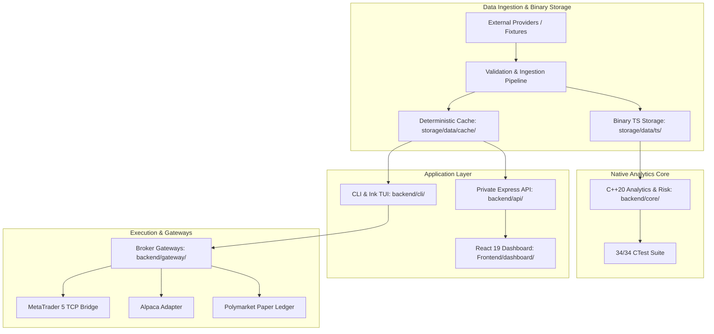

# Contributing to Sovereign Trading Platform

Welcome to the Sovereign Trading Platform contributor guide. Sovereign is an institutional-grade, local-first quantitative research, backtesting, and algorithmic execution platform built with **C++20**, **Node.js (v20+)**, and **React 19**.

This document outlines the zero-key development workflow, subsystem extension points, coding standards, test verification gates, and pull request hygiene.

---

## 1. Zero-Key Development Invariant

Sovereign is built around a **Zero-Key Development Philosophy**:
- **Local Dev & Testing Run Completely Offline**: No external exchange API keys, broker secrets, or cloud database credentials are required to build, test, or backtest.
- **Deterministic Fixtures**: All market data ingestion, backtesting regressions, and strategy replays execute against recorded fixtures (`tests/fixtures/`, `storage/data/cache/last_fetch.json`).
- **Virtual Paper Ledger**: Prediction markets and broker simulations execute against a cryptographic, SHA-256 checksummed virtual ledger (`backend/gateway/src/polymarket/paper_ledger.ts`).
- **Production Isolation**: Real-money trading keys and live broker access reside strictly on the isolated production host (`hpdesk-1`). Pull requests and local test runners never touch production brokers.
- **No Python Virtual Environments (`venv`)**: Python is excluded from the build, test, and runtime lifecycles.

---

## 2. Quickstart & Toolchain Setup

### System Prerequisites
- **Node.js**: `v20.0.0+` (Node `v22+` recommended for native globbing).
- **C++ Compiler**: GCC `10+`, Clang `11+`, or MSVC `19.29+` with **C++20** support.
- **Build System**: CMake `3.15+` and Make/Ninja.
- **Git**: Git `2.25+`.

### Fast Automated Setup
Run the automated onboarding script from the repository root:

```bash
# Automated workspace installation, native C++ build, fixture seeding, and verification
npm run setup:dev
```

### Step-by-Step Manual Setup
Alternatively, set up the workspace manually:

```bash
# 1. Initialize environment configuration
cp .env.example .env

# 2. Install dependencies across all npm workspaces
npm install
npm install --prefix backend/api
npm install --prefix backend/gateway
npm install --prefix backend/mcp_server
npm install --prefix Frontend/dashboard

# 3. Compile native C++20 core engine
npm run native:build

# 4. Seed master offline cache fixture
npm run test:prepare

# 5. Verify core test suites
npm run test:data
npm run test:structure
npm run test:core
```

---

## 3. Repository Architecture & Ownership



### Directory Map
| Path | Ownership & Purpose |
|---|---|
| `backend/core/` | C++20 high-frequency analytics, risk limits, Kalman filter, binary time-series merger, and CTest suite. |
| `backend/gateway/` | Broker adapters (Alpaca, Polymarket CLOB, MetaTrader 5) and cryptographic paper ledger. |
| `backend/cli/` | Sovereign command-line interface, Ink 5 interactive TUI dashboard, and operational tools. |
| `backend/api/` | Private Express REST and WebSocket API bridging backend engines to web clients. |
| `shared/lib/` | Shared domain logic: technical indicators, strategy taxonomy registry, risk checks, Social Alpha. |
| `Frontend/dashboard/` | React 19 + TypeScript + Vite + Tailwind CSS monitoring and backtesting dashboard. |
| `config/` | System environment manifest, risk policies, curated strategy definitions, indicator catalog. |
| `storage/data/` | Runtime local storage: binary time-series indices (`ts/`), JSON caches (`cache/`), paper portfolios. |
| `tests/` | Native Node.js test suites (`run_node_tests.js`), mock fixtures, and architecture verification. |
| `docs/` | Diátaxis 4-quadrant documentation suite, specifications, and architecture deep dives. |
| `workspace/` | Workspace state (`STATE.md`), handoffs, logs, and developer notes. |

---

## 4. Subsystem Contribution Walkthroughs

### 4.1 Native C++20 Core (`backend/core/`)
The native core provides deterministic, low-latency quantitative computing.

- **Header Location**: `backend/core/include/` (public interfaces) and `backend/core/src/` (internal modules).
- **Compilation Standard**: C++20, `-Wall -Wextra -Werror -Wpedantic` (GCC/Clang), `/W4 /WX` (MSVC).

#### Recipe: Adding a C++ Analytical Indicator
1. Create header `backend/core/src/indicators/<name>.hpp`:
   ```cpp
   #pragma once
   #include <vector>
   #include <cstddef>
   #include <limits>

   namespace sovereign::indicators {
   inline std::vector<double> calculateCustomMetric(const std::vector<double>& series, std::size_t period) {
       std::vector<double> out(series.size(), std::numeric_limits<double>::quiet_NaN());
       if (series.size() < period || period == 0U) return out;
       for (std::size_t i = period - 1; i < series.size(); ++i) {
           out[i] = series[i]; // compute indicator metric
       }
       return out;
   }
   } // namespace sovereign::indicators
   ```
2. Integrate with `IndicatorEngine::buildFrame()` in `backend/core/src/indicators/indicator_engine.cpp`:
   ```cpp
   #include "<name>.hpp"
   // In calculation loop:
   row.set("custom:" + std::to_string(period), metric_value);
   ```
3. Register tests in `backend/core/CMakeLists.txt`:
   ```cmake
   add_sovereign_test(<name>_test test/<name>_test.cpp)
   ```
4. Verify using the core test runner:
   ```bash
   npm run test:core
   ```

---

### 4.2 Broker Gateways & Execution (`backend/gateway/`)
All trading venues implement the canonical `BrokerAdapter` interface defined in `backend/gateway/src/adapters/types.ts`:

```typescript
export interface BrokerAdapter {
  placeOrder(order: TradeOrder): Promise<{ orderId: string; status: string }>;
  cancelOrder(orderId: string): Promise<boolean>;
  getPortfolioBalance(): Promise<Record<string, number>>;
  getPositions(): Promise<Position[]>;
  getQuote?(symbol: string): Promise<number>;
}
```

#### Key Invariants:
- **Fail-Closed Gate**: In the absence of validated credentials or non-interactive TTY without Trade PIN, orders fail closed.
- **Sub-Position Tracking**: Live and paper fills record sub-position attribution metadata (`strategyId`, `timeframe`, `submittedAt`).
- **Paper Ledger Integrity**: Events in `backend/gateway/src/polymarket/paper_ledger.ts` must maintain continuous SHA-256 state checksums.

---

### 4.3 Strategy & Technical Indicators (`shared/lib/`)

#### Adding Technical Indicators
1. Implement the mathematical function in `shared/lib/market/indicators.js`.
2. Register the function in `IndicatorMethods`:
   ```javascript
   const IndicatorMethods = {
     rsi: calculateRsiSeries,
     my_indicator: calculateMyIndicatorSeries,
   };
   ```
3. Register default parameters in `config/system/indicator_manifest.yaml`.

#### Adding Curated Strategies
1. Create a strategy manifest YAML under `config/strategies/curated/<strategy_name>.yaml`.
2. Define the strategy hypothesis, indicators, entry/exit signal rules, and risk constraints.
3. Test using the backtest CLI:
   ```bash
   node backend/cli/sovereign_cli.js bt --strategy config/strategies/curated/<strategy_name>.yaml
   ```

---

### 4.4 CLI & Ink Interactive TUI (`backend/cli/`)

- **Interactive Dashboard**: `backend/cli/sovereign_dashboard.mjs` renders a 3-pane Ink (React 19) terminal UI.
- **Terminal Clean Exit**: All interactive commands and handlers must respect cursor and mode restoration via `exitTerminal(130)` (`backend/cli/tui/engine/engine.js`):
  ```javascript
  // Restores cursor visibility, ends synchronized updates, resets ANSI codes
  process.stdout.write('\x1b[?2026l\x1b[?25h\x1b[0m\n');
  ```
- **Adding a CLI Command**:
  1. Implement handler under `backend/cli/commands/<category>/<command>.js`.
  2. Wire into command map in `backend/cli/sovereign_cli.js`.
  3. Register command options and flags in `backend/cli/tui/manifest.js`.

---

### 4.5 Web Dashboard (`Frontend/dashboard/`)

The web UI is built with **React 19**, **TypeScript**, **Vite**, and **Tailwind CSS**.

- **Panels**: Stored in `Frontend/dashboard/src/components/panels/`.
- **Zero-Key Headless Testing**: `App.tsx` supports mock session bypass via `window.localStorage.setItem('sovereign_test_mock_session', 'true')` or `data-test-mock-session` attribute.
- **Adding a New Dashboard Panel**:
  1. Create `Frontend/dashboard/src/components/panels/NewFeaturePanel.tsx`.
  2. Add tab key to `TabId` union in `Frontend/dashboard/src/types.ts`.
  3. Lazy load in `Frontend/dashboard/src/App.tsx`.
  4. Add tab item in `Frontend/dashboard/src/components/layout/TopBar.tsx`.

---

## 5. Test Suites & Verification Gates

Always run verification suites before opening a pull request:

```bash
# Ingestion, indicators, backfill regression
npm run test:data

# Repository structure, hygiene, and documentation contracts
npm run test:structure

# Native C++ CTest suite (34/34 passing)
npm run test:core

# REST and WebSocket API contracts
npm run test:api

# Safety & execution guard checks
npm run test:safety

# Full default Node.js test suite
npm test

# Repository hygiene audit
npm run hygiene

# Documentation links and manifest audit
npm run audit:documentation
```

### Zero False-Positive Gate
- **No Speculative Reports**: Never report offline fixture fallbacks, zero-key development defaults, or intentional stubs as system bugs.
- **Empirical Proof Required**: Every defect fix must provide direct trace evidence, a failing test probe, or reproduction logs.
- **No Test Weakening**: Never relax assertions, remove tests, or add artificial mocks merely to pass a check.

---

## 6. Git, PR Workflow & Conventional Commits

### Branch Naming & Worktrees
Use feature branches or isolated git worktrees:

```bash
# Create isolated worktree for feature
git worktree add .claude/worktrees/my-feature -b feat/my-feature
cd .claude/worktrees/my-feature
```

Branch prefix conventions:
- `feat/`: New features, strategies, or adapters.
- `fix/`: Bug fixes and defect remediation.
- `docs/`: Documentation additions and Diátaxis updates.
- `refactor/`: Behavior-preserving structural refactoring.
- `test/`: Test additions or fixture updates.

### Conventional Commit Standards
Format commit messages with structured prefixes:

```text
feat(gateway): add MetaTrader 5 order magic number codec
fix(tui): restore cursor visibility and exit raw mode on SIGINT
docs(community): author comprehensive contributor guide
test(strategy): add deterministic replay test for social alpha
```

Include trailer when collaborating with Claude:
```text
Co-Authored-By: Claude <noreply@anthropic.com>
```

### Pull Request Checklist
When opening a PR, fill out `.github/PULL_REQUEST_TEMPLATE.md`:
1. **Summary**: Concise description of change and impacted scope.
2. **Commands Run**: Exact test and audit commands executed.
3. **Safety Checklist**: Confirm no unauthorized live order routing or credential exposure.
4. **Docs Sync**: Ensure `docs/documentation_manifest.json` and `mkdocs.yml` are synchronized if documentation changed.
5. **Contribution Attestation**: Confirm authority to license contribution under repository `LICENSE`.

---

## 7. Governance, Code of Conduct & Security

- **Governance**: Read [GOVERNANCE.md](workspace/governance/GOVERNANCE.md) for maintainer roles and decision processes.
- **Code of Conduct**: Read [CODE_OF_CONDUCT.md](workspace/governance/CODE_OF_CONDUCT.md) for technical honesty and collaboration standards.
- **Security Policy**: Read [SECURITY.md](workspace/governance/SECURITY.md) for vulnerability disclosure. Never publish credentials, API keys, or live account identifiers in issues or PRs.
