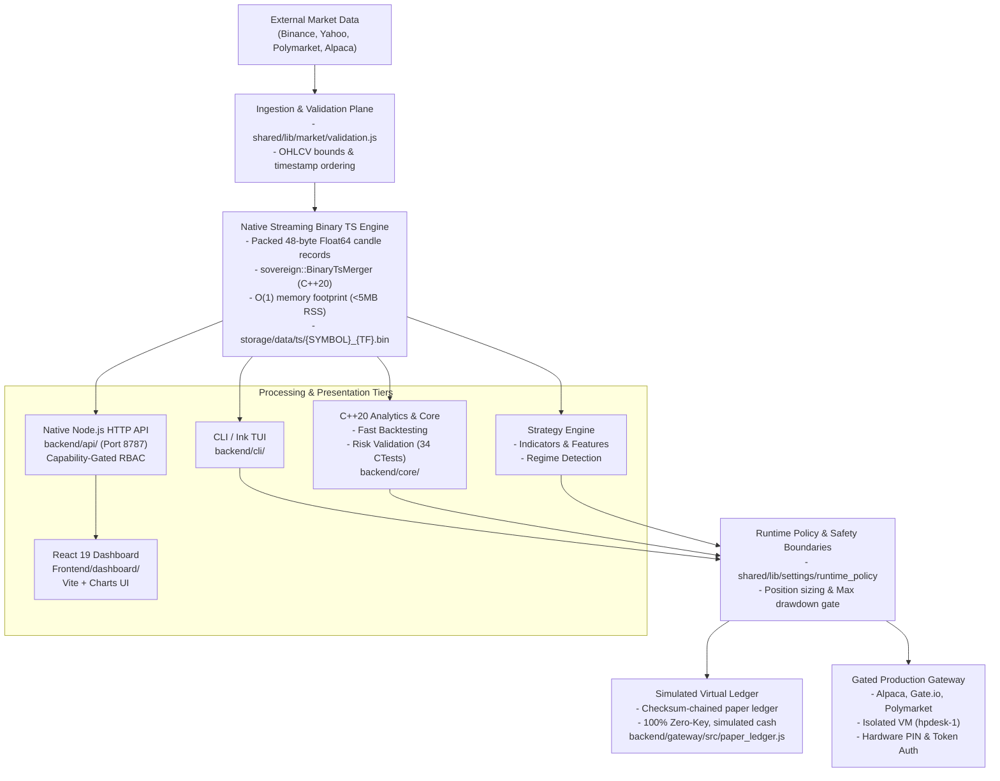

# Sovereign Trading Platform

Sovereign is a local-first trading research and controlled-execution platform. It combines a Node.js CLI/TUI and private API, a C++20 analytics and risk core, a native streaming binary time-series engine, quantitative research/backtesting workflows, simulated paper ledgers, broker gateways, and a React 19 dashboard.

The repository contains real execution adapters, but **execution availability is not permission or qualification**. Research, paper, and live paths remain strictly separated by runtime policy, authentication, explicit authorization, feature/risk gates, and isolated credentials.

---

## 1. System Architecture & Topology



---

## 2. Fast-Start for Developers & Contributors

### Stack & Zero-Key Boundary Truth
- **Runtime Stack**: Pure **Node.js (v20+)** and **C++20 (CMake 3.20+)**.
- **NO Python Virtual Environments (`venv`)**: Python is not part of the runtime or testing lifecycle.
- **Zero-Key Development**: All tests, backtests, and research workflows run **100% locally with zero external API keys** against recorded fixtures and virtual paper ledgers.

### 1-Command Automated Setup Flow

```text
                      git clone <repo>
                             │
                             ▼
                     npm run setup:dev
                             │
            ┌────────────────┼────────────────┐
            │                │                │
            ▼                ▼                ▼
     Generates safe    Installs all     Compiles C++20    Seeds Master Test
     local .env with   workspace deps   native engine     Fixture to cache
     dummy keys        (root, api, UI)  (CMake Release)   (last_fetch.json)
            │                │                │                   │
            └────────────────┼────────────────┴───────────────────┘
                             │
                             ▼
         [Pristine Local Development Environment Ready]
```

```bash
# Automated setup (does everything in one go)
npm run setup:dev
```

### Manual Step-by-Step Alternative

```bash
# 1. Clone the repository
git clone <repository-url>
cd personal_finance_draft

# 2. Copy the default environment template (contains safe local defaults & dummy keys)
cp .env.example .env

# 3. Install packages across workspaces
npm install
npm install --prefix backend/api
npm install --prefix backend/gateway
npm install --prefix backend/mcp_server
npm install --prefix Frontend/dashboard

# 4. Build the native C++ core engine & seed master test fixture
npm run native:build
npm run test:prepare

# 5. Run test verification (all pass with zero external credentials)
npm run test:data
npm run test:structure
npm run test:core
```

---

## 3. Sovereign Ink TUI & CLI Navigation Guide

Sovereign features a terminal cockpit powered by React Ink (`backend/cli/sovereign_cli.js`) alongside a headless CLI interface.

### Interactive Terminal Cockpit (Ink TUI)

Launch the interactive graphical terminal interface:
```bash
node backend/cli/sovereign_cli.js
```

| Pane / Section | Displayed Components | Navigation Controls |
|---|---|---|
| **Header Bar** | Console v1.0, Profile: `local-dev`, Status: `OK`, Auth: `Guest` | `q` / `Ctrl+C`: Quit cockpit |
| **Categories (Left Pane)** | 1. Operational Dashboard<br>2. Data & Backfill<br>3. Backend Tools (C++ Core)<br>4. Research & Backtest<br>5. AI & Machine Learning<br>6. Execution & Trading<br>7. Prediction Markets<br>8. Settings & Preferences<br>9. Account & Auth | `↑`/`↓`: Select category<br>`Tab`: Switch pane |
| **Commands & Parameters (Right Pane)** | `[status]`, `[cockpit]`, `[watch]`, `[cache-clean]`, `[kill-switch]`<br>Config: Symbol `BTC/USDT`, Timeframe `1h`, History `730 days` | `Enter`: Execute command<br>`/`: Filter search<br>`Esc`: Cancel |

#### TUI Keyboard Controls & Navigation
- **`↑` / `↓` Arrow Keys**: Navigate between categories, commands, and parameter selectors.
- **`Enter`**: Select item or execute the configured command.
- **`Tab` / `Shift+Tab`**: Switch focus between category list, command pane, and parameter form fields.
- **`/`**: Open instant fuzzy filter search across all registered platform commands.
- **`Esc`**: Cancel search prompt or back out of sub-menus.
- **`q` / `Ctrl+C` (x2)**: Gracefully disconnect and exit the terminal cockpit.

---

### Headless CLI Subcommand Reference

Every TUI capability can be invoked headlessly in CI/CD pipelines, background scripts, or cron daemons:

```bash
# Pattern: node backend/cli/sovereign_cli.js <command> [subcommand] [flags]
```

| Category | Command | Primary Flags | Purpose & Subsystem |
|---|---|---|---|
| **Operational** | `status` | `--json`, `--debug` | Display health status of API, C++ core, data caches, and gateways. |
| | `cockpit` | `--limit <n>`, `--interval <sec>` | Live console monitoring table of assets, spreads, and indicators. |
| | `doctor` | `--full`, `--fix` | Diagnostic check of toolchains, dependencies, permissions, and caches. |
| | `kill-switch` | `--action engage\|disengage` | Instant safety circuit breaker halting all outbound broker orders. |
| **Data & Feeds** | `ingest` | `--family <fam>`, `--symbol <sym>`, `--timeframe <tf>` | Ingest raw OHLCV market feeds from Binance, Yahoo, or Polymarket. |
| | `backfill` | `--days <n>`, `--symbol <sym>` | Fetch historical market bars and append to binary TS files. |
| | `backfill-daemon` | `--once`, `--concurrency <n>` | Continuous background market data synchronization worker. |
| | `intraday-rollup` | `--family <fam>`, `--timeframes 15m,1h` | Synthesize higher timeframe bars from base 1m/5m binary data. |
| | `cache-clean` | `--dry-run`, `--ts` | Prune expired JSON cache buffers and orphaned temporary files. |
| **C++ Analytics** | `backend status` | `--json` | Query native C++20 Sovereign Core engine status and binary memory footprint. |
| | `risk-check` | `--notional <$>`, `--equity <$>`, `--drawdown <%>` | Microsecond pre-trade risk filter validation against portfolio constraints. |
| | `correlation` | `--timeframe <tf>`, `--max-bars <n>` | Fast Pearson cross-asset correlation matrix calculation. |
| **Research & ML** | `bt` *(or `backtest`)* | `--strategy <yaml>`, `--timeframe <tf>`, `--days <n>` | Native C++20 quantitative backtest with Monte Carlo bootstrap resampling. |
| | `mass-bt` | `--timeframes 5m,1h,1d`, `--position-size-pct 0.1` | Run full strategy matrix cross-evaluations across all timeframes. |
| | `strategy explore` | `--once`, `--interval <mins>` | Autonomous AI alpha discovery: 6D hypercube parameter generation. |
| | `ml-predict` | `--symbol <sym>`, `--model svm` | Run rolling Support Vector Machine (SVM) directional regime classifiers. |
| | `optimize` | `--strategy <yaml>`, `--timeframe <tf>` | Grid/Bayesian parameter optimization over historical feature matrices. |
| | `edge-decay` | `--strategy <yaml>`, `--timeframe <tf>` | Rolling window alpha degradation and parameter stability analysis. |
| **Trading & Gateways** | `positions` | `--json` | Inspect virtual sub-positions ledger and broker reconciliation state. |
| | `paper` | `--strategy <yaml>`, `--symbol <sym>` | Run zero-capital simulated strategy execution against virtual paper ledger. |
| | `trade` | `--symbol <sym>`, `--side buy\|sell`, `--qty <n>` | Gated broker order submission (requires central-host profile and PIN auth). |
| | `polymarket` | `--action order\|cancel\|positions` | Dispatch prediction market probability token trades to Polymarket CLOB. |

---

## 4. Subsystem Feature Matrix & Capabilities Breakdown

### Subsystem Feature Index

| Feature Subsystem | Key Capabilities & Architecture | Primary Files & Owners | Load Index | Spec & Architecture Ref |
|---|---|---|:---:|---|
| **Binary Timeseries Engine** | • Packed 48-byte IEEE-754 binary records (`SOVT` format)<br>• $O(A+B)$ streaming two-pointer merger with $<5\text{MB}$ RSS<br>• Zero-allocation in-memory circular ring buffers<br>• Multi-resolution rollup synthesizer (`1m` $\to$ `5m`, `15m`, `1h`, `1d`) | `backend/core/src/ts_merger.cpp`<br>`shared/lib/market/validation.js`<br>`storage/data/ts/*.bin` | **2/10** | [02. Data Pipeline & Storage](docs/engineering/architecture/02_DATA_PIPELINE_AND_STORAGE.md) |
| **Native Backtester & Monte Carlo** | • `FrameBacktester` dual execution: Binary Bars & Feature Frames<br>• Realistic execution slippage drag ($P_{\text{entry}} = P_{\text{close}} \cdot (1 + \text{cost\_bps}/10000)$)<br>• PRNG bootstrap resampling ($N=10,000$ iterations) for Sharpe, Sortino, VaR<br>• 34/34 native C++ CTest test suite | `backend/core/src/backtest/`<br>`backend/core/src/monte_carlo/`<br>`backend/core/build/sovereign_wealth` | **8/10** | [03. Native Core & Backtester](docs/engineering/architecture/03_NATIVE_CORE_AND_BACKTESTER.md) |
| **Autonomous Alpha & ML Workbench** | • Autonomous parameter space explorer over 6D hypercube $[0, 1]^6$<br>• Normalized Manhattan novelty filter ($D_H \ge 0.50$) & SHA-256 fingerprinting<br>• Rolling feature matrix synthesis with SVM decision boundaries<br>• Model Context Protocol (MCP) JSON-RPC tool interface for Claude / LLMs | `scripts/strategies/auto_strategy_explorer.js`<br>`backend/mcp_server/index.ts`<br>`config/strategies/automated/` | **5/10** | [04. Quantitative Alpha & ML](docs/engineering/architecture/04_QUANTITATIVE_ALPHA_AND_ML_WORKBENCH.md) |
| **Sub-Positions Virtual Ledger** | • Multi-strategy virtual accounting ledger on shared symbols<br>• Deterministic client order signatures (`strat_<id>_<tf>_<ts>_<hex>` / `manual_cli_...`)<br>• Physical-to-virtual broker reconciliation: $Q_{\text{Broker}} = \sum q_k + q_{\text{[MANUAL]}}$<br>• Microsecond ($<15\mu\text{s}$) pre-trade risk circuit breaker & step sizing clamp | `shared/lib/runtime/sub_positions.js`<br>`backend/gateway/src/alpaca.js`<br>`backend/core/src/risk/` | **2/10** | [05. Execution & Risk](docs/engineering/architecture/05_EXECUTION_SUB_POSITIONS_AND_RISK.md) |
| **Prediction Markets & CLOB Archive** | • Dual-stream Polymarket Gamma REST & CLOB WebSocket feeds<br>• Sub-second Level 2 orderbook snapshot JSONL archiving<br>• Double-entry virtual paper ledger with rolling SHA-256 state digest verification<br>• Binary outcome oracle settlement and Kelly criterion staking math | `shared/lib/market/polymarket_history.js`<br>`backend/gateway/src/paper_ledger.js`<br>`storage/data/archive/polymarket/` | **3/10** | [06. Prediction Markets](docs/engineering/architecture/06_PREDICTION_MARKETS_AND_ORDERBOOK_ARCHIVE.md) |
| **Zero-Trust Security & Deployment** | • Scoped RBAC capability model (`research:read`, `research:run`, `execution:paper`)<br>• 4-tier automated test execution DAG (`safety` $\to$ `structure` $\to$ `core` $\to$ `data`)<br>• Multi-container Docker Compose mesh with strict CPU/RAM quotas<br>• HPDesk Proxmox VM deployment topologies and Tailscale networking | `backend/mcp_server/lib/access_control.ts`<br>`infra/docker/docker-compose.yml`<br>`backend/api/server.js` | **2/10** | [07. Security & Deployment](docs/engineering/architecture/07_SECURITY_API_TESTING_DEPLOYMENT.md) |
| **Financial Engineering Primer** | • Distributed systems mental models for quantitative finance<br>• Limit order book (LOB) bid-ask queue depth and market order slippage traces<br>• Candlestick OHLCV anatomy and logarithmic vs arithmetic returns<br>• Portfolio math: Sharpe, Sortino, Calmar, Max Drawdown, and VaR equations | `docs/engineering/architecture/08_FINANCIAL_PRIMER_FOR_ENGINEERS.md` | **1/10** | [08. Financial Primer](docs/engineering/architecture/08_FINANCIAL_PRIMER_FOR_ENGINEERS.md) |

---

## 5. Environment & Secret Tiers

| Environment Tier | Access & Protection | Allowed Credentials / Mode |
|---|---|---|
| `development` (Default) | - Local machine & pull requests<br>- All branches & contributors | - ZERO SECRETS (100% keyless)<br>- Recorded fixtures & mock feeds |
| `hpdesk-paper` (Paper Trading) | - Staging / paper soak<br>- Restricted to main branch | - Free Alpaca Paper sandbox key<br>- Virtual Polymarket paper ledger |
| `production` (Restricted) | - Isolated host (`hpdesk-1`)<br>- Manual review approval required | - Real-money trading keys<br>- NEVER committed or sent to CI |

---

## 6. What You Can Do Immediately (Zero Keys Required)

### A. Run Quantitative Strategy Backtests
Execute local historical backtests with regime detection and feature extraction:
```bash
# Run strategy backtesting CLI
node backend/cli/sovereign_cli.js backtest --symbol BTC/USDT --timeframe 1h

# Run feature generator and data flow verification
npm run test:data
```

### B. Launch the Web Dashboard & Private API
Start the Express backend bridge and the React 19 + Vite dashboard:
```bash
# Terminal 1: Start backend API bridge
npm run api:dev

# Terminal 2: Start frontend dashboard
npm run dashboard:dev
```
Open **`http://localhost:5173`** in your browser.

### C. Launch the Interactive Terminal Cockpit (Ink TUI)
```bash
# Launch interactive TUI
node backend/cli/sovereign_cli.js

# Or inspect status directly
node backend/cli/sovereign_cli.js status --json
node backend/cli/sovereign_cli.js market monitor --limit 20 --json
```

### D. Trade on the Simulated Paper Ledger
Simulate prediction market orders and paper strategies without Polygon wallet credentials or real capital:
```bash
node backend/cli/sovereign_cli.js paper --strategy polymarket_sample
```

### E. Develop & Benchmark the Native C++20 Core
Modify C++ indicators, binary time-series stream mergers, or risk models:
```bash
# Rebuild native engine
npm run native:build

# Run all 34 CTest suites
npm run test:core
```

### F. Run the Autonomous AI Strategy Discovery Daemon
Explore novel strategy parameter spaces and generate validated strategy YAML definitions:
```bash
# Single exploratory cycle
node scripts/strategies/auto_strategy_explorer.js --once

# Or via CLI
node backend/cli/sovereign_cli.js strategy explore --once
```

### G. Docker Quickstart (Zero Local Tooling)
To run the complete platform (API, Web Dashboard, and C++ Core) in isolated containers without installing local compilers:
```bash
docker compose -f infra/docker/docker-compose.yml up -d --build
```

---

## 7. Repository Layout & Directory Taxonomy

| Path | Purpose & Ownership |
|---|---|
| `backend/core/` | C++20 analytics engine, risk checks, binary TS merger, CTest suite. |
| `backend/cli/` | Sovereign CLI entrypoints, Ink TUI, and command handlers. |
| `backend/api/` | Private Express API, route access control, and web dashboard bridge. |
| `backend/gateway/` | Broker gateways (Alpaca, Polymarket, Gate.io) & checksummed paper ledger. |
| `backend/mcp_server/`| Model Context Protocol (MCP) server exposing tools to Claude and AI agents. |
| `shared/lib/` | Shared domain logic: market storage, indicators, strategy runtime, risk models. |
| `Frontend/dashboard/` | React 19 + Vite dashboard (source in `src/`, `dist/` is generated). |
| `config/` | System environment manifest, asset mappings, risk policies, and categorized strategy registry (`curated/`, `automated/`, `fixtures/`). |
| `storage/data/` | Runtime disk storage: binary TS indices (`ts/`), JSON caches (`cache/`), paper trading state. |
| `scripts/` | Domain-organized utilities: `mcp/`, `ml/training/`, `tools/`, and `dev/`. |
| `tests/` | Node.js integration, architecture contract, and safety test suites. |
| `docs/` | Canonical documentation hub (`docs/README.md`), 8-section architecture suite (`docs/engineering/architecture/`), specs, standards, and operational runbooks. |
| `workspace/` | Active project state (`STATE.md`), handoffs (`handoff/`), prompt logs, memory, governance (`governance/`), and protocols (`protocols/`). |

---

## 8. Canonical Skill Protocols for Development & Review

All development, testing, and pull request reviews follow the repository's canonical skill protocols in `skills/manifest.json`:

| Lifecycle Phase | Protocol / Command | Enforced Gate |
|---|---|---|
| **Authoring & Refactoring** | `skills/mass-implement` | Bounded scope, zero-key development preservation. |
| **Test Integrity Audit** | `skills/verify-test-integrity` | Anti-cheating scan, no Release-elided `assert()` calls. |
| **Native Core Verification** | `skills/native-core-verify` | 34/34 CTests pass with sanitizer validation (`npm run test:core`). |
| **Hygiene & Documentation** | `skills/repo-hygiene`<br>`skills/audit-documentation` | `npm run hygiene` (0 noise) + `npm run audit:documentation` (100% manifest match). |
| **PR Review & Audit** | `skills/blast-through` | Single-mode audit (`review`, `security`) with 6-tuple fault attribution. |
| **Failure Triage** | `skills/bayesian-troubleshooter` | Hypothesis ranking and binary probe debugging. |
| **Architecture & Atlas Sync**| `skills/codebase-untangler` | Syncs Code Atlas records in `docs/atlas/`. |

---

## 9. Choose Your Path & Documentation Map

- **Operator:** [Quickstart](docs/operational/guides/QUICKSTART.md) → [CLI Guide](docs/operational/guides/cli_quick_guide.md) → [Operations](docs/operational/guides/operations.md)
- **Contributor:** [Contributing](docs/operational/guides/CONTRIBUTING.md) → [GitHub Rulesets](docs/operational/guides/github_environment_and_rulesets.md) → [Architecture Overview](docs/engineering/architecture/01_ARCHITECTURE_AND_CODEBASE.md) → [Documentation Standard](docs/engineering/standards/documentation_standard.md)
- **Quantitative Researcher:** [Research Overview](docs/research/quant_research.md) → [Financial Primer for Systems Engineers](docs/engineering/architecture/08_FINANCIAL_PRIMER_FOR_ENGINEERS.md) → [Quantitative Alpha & ML Workbench](docs/engineering/architecture/04_QUANTITATIVE_ALPHA_AND_ML_WORKBENCH.md) → [Codebase Tour](docs/codebase_tour/00_START_HERE.md)
- **Core Systems & C++ Engineer:** [Native Core & Backtester Spec](docs/engineering/architecture/03_NATIVE_CORE_AND_BACKTESTER.md) → [Data Pipeline & Binary TS Storage](docs/engineering/architecture/02_DATA_PIPELINE_AND_STORAGE.md) → [Module Catalog](docs/modules/README.md)
- **Execution & Risk Engineer:** [Execution, Sub-Positions Ledger & Risk](docs/engineering/architecture/05_EXECUTION_SUB_POSITIONS_AND_RISK.md) → [Prediction Markets & Orderbook Archive](docs/engineering/architecture/06_PREDICTION_MARKETS_AND_ORDERBOOK_ARCHIVE.md)
- **Maintainer & Infrastructure:** [Maintainer Roster](workspace/governance/MAINTAINERS.md) → [Governance](workspace/governance/GOVERNANCE.md) → [Security & Deployment Spec](docs/engineering/architecture/07_SECURITY_API_TESTING_DEPLOYMENT.md) → [Deployment Guide](docs/operational/guides/DEPLOYMENT.md)

---

## 10. Testing & Verification

```bash
# Run core verification gates
npm run test:data        # Ingestion, indicators, backfill regression
npm run test:structure   # Repo structural contracts, hygiene, skill integrity
npm run test:core        # Native C++ analytics & CTest suite (34/34 tests)
npm run test:api         # Backend REST/WebSocket API contracts

# Full test suite
npm test

# Hygiene & documentation contracts
npm run hygiene
npm run audit:documentation
```

*Note: Tests use Node's native test runner (`tests/run_node_tests.js`). Do not use or install Jest/Mocha.*

---

## 11. Safety Boundary

Do not infer trading permission from the presence of an adapter, credential variable, menu item, test, paper account, or prior session record. Live-capital actions require explicit authorization and current operator review of runtime policy, kill switch, risk limits, credentials, account scope, and provider behavior. Nothing in this README authorizes an order, provider mutation, canonical-data write, host change, or deployment.
