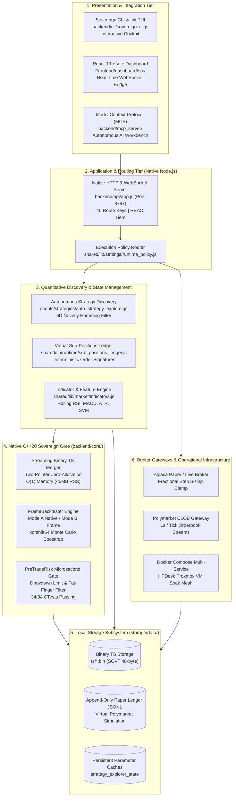

# Sovereign Architecture (SV Console)

Sovereign is a modular, local-first quantitative trading, research, backtesting, and execution platform. This document serves as the master architectural entrypoint and navigation index across all subsystems.

---

## 1. Master System Topology & Modular Architecture

---

## 2. Subsystem Ownership & Directory Taxonomy

| Domain | Canonical Source Owner | Responsibility |
|---|---|---|
| **System Architecture & Codebase** | `backend/cli/`, `backend/api/`, `backend/core/` | Core lifecycle, CLI entrypoints, directory contracts |
| **Data Ingestion & Binary Storage**| `shared/lib/market/` | Binary `SOVT` storage, append-only segments, rollup synthesis |
| **Native C++20 Core & Backtester** | `backend/core/` | Zero-allocation backtesting, streaming TS merger, Monte Carlo, PreTradeRisk |
| **Quantitative Alpha & MCP Workbench**| `scripts/strategies/`, `backend/mcp_server/` | Autonomous AI strategy discovery, 6D novelty filter, MCP tools |
| **Execution & Sub-Positions Ledger**| `shared/lib/runtime/`, `backend/gateway/` | Virtual sub-position accounting, deterministic signatures, broker reconciliation |
| **Prediction Markets & Archiving** | `shared/lib/market/`, `backend/gateway/` | Polymarket Gamma/CLOB ingestion, 1s orderbook snapshots, paper ledger |
| **Security, APIs & Deployment** | `backend/mcp_server/`, `infra/docker/` | RBAC access control, Express REST/WS APIs, test matrix, Proxmox VM soak |

---

## 3. Canonical 8-Section Engineering Documentation Roadmap

The core technical architecture is thoroughly documented across the canonical **8-Section Modular Engineering Suite** (`docs/engineering/`):

1. **[01. System Architecture & Codebase Organization](engineering/architecture/01_ARCHITECTURE_AND_CODEBASE.md)**
   - Master multi-tier topology, module taxonomy, dependency direction, and fundamental invariants (single-writer, fail-closed, zero-key development, sub-position isolation).

2. **[02. Data Pipeline & Binary Storage Architecture](engineering/architecture/02_DATA_PIPELINE_AND_STORAGE.md)**
   - Ingestion lifecycle across equities (5m), crypto (1m from 2017), and prediction markets (1s), binary `SOVT` 48-byte packed format, C++20 zero-allocation streaming merger ($O(1)$ memory, $<5\text{MB}$ RSS), and local rollup synthesis.

3. **[03. Native C++20 Core & Quantitative Backtester](engineering/architecture/03_NATIVE_CORE_AND_BACKTESTER.md)**
   - C++20 Sovereign Core engine (`sovereign_wealth`), `FrameBacktester` (Mode A Native vs Mode B Annotated), execution drag simulation, Monte Carlo bootstrap engine (`xorshift64`), and `PreTradeRisk` microsecond gate.

4. **[04. Quantitative Alpha, ML & AI Agent Workbench](engineering/architecture/04_QUANTITATIVE_ALPHA_AND_ML_WORKBENCH.md)**
   - Autonomous 30-minute AI strategy discovery daemon, 6D normalized parameter hypercube, $\ge 50\%$ novelty distance metric, SHA-256 fingerprinting, rolling feature frames, and Model Context Protocol (MCP) `explore_strategy` workbench tool.

5. **[05. Execution, Sub-Positions Ledger & Risk Management](engineering/architecture/05_EXECUTION_SUB_POSITIONS_AND_RISK.md)**
   - Virtual sub-positions accounting ledger (`sub_positions.json`), deterministic order client IDs (`strat_<id>_<tf>_<ts>_<entropy>` and `manual_cli_<sym>_<ts>_<entropy>`), broker physical reconciliation, and fractional step sizing (`0.001` equity, `0.0001` crypto).

6. **[06. Prediction Markets & Polymarket Orderbook Archiving](engineering/architecture/06_PREDICTION_MARKETS_AND_ORDERBOOK_ARCHIVE.md)**
   - Polymarket Gamma and CLOB ingestion, 1-second L2 orderbook snapshot archiving, virtual prediction paper trading simulator (`paper_ledger.js`), and oracle resolution settlement.

7. **[07. Security Model, APIs, Testing Strategy & Deployment](engineering/architecture/07_SECURITY_API_TESTING_DEPLOYMENT.md)**
   - RBAC capability authorization, Express REST and WebSocket APIs, zero-key local test matrix (`test:safety`, `test:structure`, `test:core` 34 CTests), Docker Compose multi-container topology, and HPDesk Proxmox VM soak runbook.

8. **[08. Financial & Quantitative Primer for Systems Engineers](engineering/architecture/08_FINANCIAL_PRIMER_FOR_ENGINEERS.md)**
   - Quantitative finance primer for systems engineers: Order books, execution drag, OHLCV time series, DSP technical indicators, Sharpe/Sortino ratios, drawdown modeling, and prediction market pricing.

---

## 4. Supporting Runbooks & Guides
- [Operational Soak Runbook & HPDesk Deployment](OPERATIONAL_SOAK_RUNBOOK.md) — Multi-container Docker Compose setup, Proxmox VM soak monitoring, single-writer protocol.
- [Autonomous AI Strategy Research Guide](RESEARCH_STRATEGY_EXPLORER.md) — Step-by-step guide for AI agents interacting with Sovereign via MCP, CLI, and YAML registries.
- [Master Documentation Catalog](index.md) & [Documentation Manifest](documentation_manifest.json) — Complete corpus registry.

---

## 5. Fundamental Architectural Invariants

- **Single Canonical Writer**: Only the designated `central-host` node executes write daemons or updates binary storage.
- **Fail-Closed Execution**: Research and backtest outputs cannot authorize live trading. Live trading requires explicit PIN authentication, environment variable authorization, and pre-trade C++ risk engine clearance.
- **Strict Data Provenance**: Ingestion validates timestamp monotonicity, finite floating-point numbers, and provider ranking priority before persisting binary files.
- **Virtual Sub-Position Isolation**: Automated trading bot strategies cannot mutate, close, or liquidate shares belonging to other strategies or manual operator positions.
