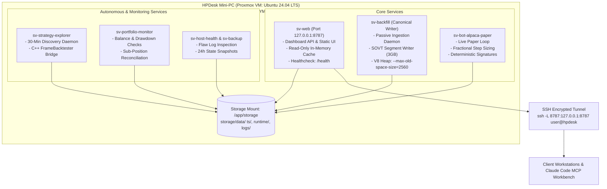

# Operational Soak Runbook & HPDesk Deployment Guide

## 1. Subsystem Purpose & Infrastructure Overview

This runbook defines the deployment topology, persistent soak monitoring, and operational protocols for running Sovereign trading bots, data backfill daemons, and web interfaces on a dedicated host (e.g. an HPDesk mini-PC running Ubuntu within a Proxmox VM).



---

## 2. Docker Compose Services & Profile Segmentation

All services are declared in `infra/docker/docker-compose.yml` and managed via Docker profiles:

| Service Name | Container Name | Profile | Resource Limits | Primary Purpose |
|---|---|---|---|---|
| `web` | `sv-web` | (default) | 1.0 CPU / 512MB RAM | Read-only REST API & Vite web dashboard bridge |
| `backfill` | `sv-backfill` | `writer` | 2.0 CPU / 3072MB RAM | Canonical market data ingestion daemon & binary writer |
| `bot-alpaca-paper` | `sv-bot-alpaca-paper` | `paper-alpaca` | 1.0 CPU / 512MB RAM | Continuous Alpaca paper trading loop & fractional execution |
| `strategy-explorer` | `sv-strategy-explorer` | `research` | 2.0 CPU / 2048MB RAM | Autonomous 30-minute AI strategy discovery & C++ backtest |
| `portfolio-monitor` | `sv-portfolio-monitor` | `monitoring` | 0.5 CPU / 256MB RAM | Reconciles broker holdings against sub-positions ledger |
| `host-health` | `sv-host-health` | `monitoring` | 0.5 CPU / 256MB RAM | Monitors disk space, memory pressure, and flaws |
| `host-backup` | `sv-host-backup` | `monitoring` | 0.5 CPU / 256MB RAM | Daily snapshots of `storage/data/` runtime state |

---

## 3. Operational Soak Procedures & Inspection

During extended soak runs on the HPDesk node, maintainers follow this verification protocol:

### 1. Starting the Full Paper Soak Stack
```bash
# On HPDesk host:
docker compose --profile paper-alpaca --profile writer --profile monitoring up -d
```

### 2. Inspecting Flaw Monitor & Strategy Logs
```bash
# Check runtime flaw monitor for anomalies or error bursts
tail -f storage/data/logs/flaw_monitor.log

# Check strategy automation audit logs
tail -f storage/data/logs/strategy_automation.jsonl

# Check live paper bot container logs
docker logs -f sv-bot-alpaca-paper
```

### 3. Verification Checklist
- **Binary TS Integrity**: Confirm `storage/data/ts/*.bin` files are updating monotonically without lock contention errors.
- **Sub-Position Ledger**: Verify `storage/data/runtime/ledger/sub_positions.json` maintains consistent reconciliation between broker physical quantities and active bot sub-positions.
- **Memory Stability**: Ensure `sv-backfill` and `sv-bot-alpaca-paper` containers remain well below their cgroup memory limits (< 300MB RSS).

---

## 4. Single-Writer Rule & Fail-Closed Safety

1. **Single Canonical Writer Policy**:
   - Only the designated `central-host` (HPDesk) is authorized to run `sv-backfill` or write to canonical binary storage.
   - Developer workstations and remote terminal clients operate in read-only mode (`canonical_writer: false`).
2. **Fail-Closed Execution Gating**:
   - Live real-money trading is permanently locked unless explicitly gated by `LIVE_TRADING=true`, `SOVEREIGN_EXECUTION_AUTHORIZED=true`, valid trade PIN authentication, and runtime pre-trade C++ risk engine approval.
   - `private-paper` deployment profiles are permanently non-executing on live broker APIs.
