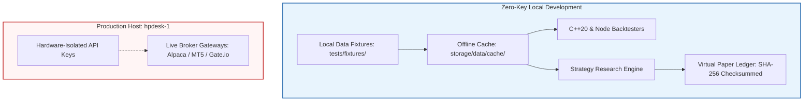
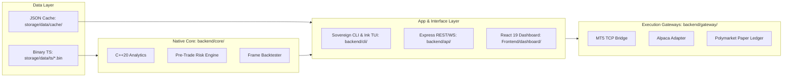

# Contributor Guide & Developer Onboarding

This guide provides an in-depth technical walkthrough for contributing to the **Sovereign Trading Platform**. It covers repository architecture, the zero-key offline workflow, subsystem extension points, testing contracts, and pull request qualification.

---

## 1. Architectural Philosophy & Zero-Key Invariants

Sovereign is engineered as a local-first, institutional-grade quantitative computing and execution environment. To ensure safety, reproducibility, and contributor accessibility, the codebase enforces strict boundaries:

### Zero-Key Development Invariant
1. **Fully Offline Local Development**: No external exchange API keys, brokerage secrets, or third-party paid subscriptions are required.
2. **Deterministic Data Fixtures**: All market feeds, historical regressions, and backtest tests run against static, version-controlled fixtures in `tests/fixtures/` and the master offline cache `storage/data/cache/last_fetch.json`.
3. **Cryptographic Virtual Ledger**: Prediction markets and paper trading execute against an in-memory or append-only journal (`backend/gateway/src/polymarket/paper_ledger.ts`) validated with SHA-256 state checksums.
4. **Isolated Live Credentials**: Live trading credentials and production order routing reside exclusively on the isolated production server (`hpdesk-1`). Local developer machines and pull request automated CI pipelines have zero live execution authority.
5. **No Python Virtual Environments**: The entire stack is built strictly with **Node.js (v20+)** and **C++20 (CMake 3.15+)**. Do not install or introduce Python `venv` environments.



---

## 2. Toolchain & Fast-Start Workspace Setup

### Prerequisites
- **Node.js**: `v20.0.0+` (`v22+` recommended for native `fs.globSync`).
- **C++ Compiler**: GCC `10+`, Clang `11+`, or MSVC `19.29+` (C++20 flag support).
- **Build Tools**: CMake `3.15+` and Make or Ninja.
- **Git**: Git `2.25+`.

### Fast Automated Setup
From the repository root, run:

```bash
npm run setup:dev
```

This single command:
1. Instantiates `.env` from `.env.example`.
2. Recursively installs dependencies across all workspaces (`.`, `backend/api`, `backend/gateway`, `backend/mcp_server`, `Frontend/dashboard`).
3. Compiles the native C++20 core engine (`backend/core/build/`).
4. Seeds the master offline market fixture (`storage/data/cache/last_fetch.json`).
5. Executes preliminary verification gates (`test:data`, `test:structure`, `test:core`).

### Manual Step-by-Step Setup
If you prefer fine-grained control:

```bash
# 1. Environment template initialization
cp .env.example .env

# 2. Workspace dependencies installation
npm install
npm install --prefix backend/api
npm install --prefix backend/gateway
npm install --prefix backend/mcp_server
npm install --prefix Frontend/dashboard

# 3. Compile C++20 core analytics engine
npm run native:build

# 4. Prepare master test fixture
npm run test:prepare

# 5. Verify local build
npm run test:core
```

---

## 3. Subsystem Architecture & Extension Walkthroughs



### 3.1 Native C++20 Core (`backend/core/`)

The native engine is located in `backend/core/`. It compiles into the static library `sovereign_core` and provides low-latency math, rolling statistics, technical indicators, and deterministic risk limits.

#### Extending C++ Analytics: Adding an Indicator
1. **Create Header**: Add `backend/core/src/indicators/keltner_channel.hpp`:
   ```cpp
   #pragma once
   #include <vector>
   #include <cmath>
   #include <cstddef>
   #include <limits>

   namespace sovereign::indicators {
   struct KeltnerBands {
       std::vector<double> upper;
       std::vector<double> middle;
       std::vector<double> lower;
   };

   inline KeltnerBands calculateKeltnerChannels(
       const std::vector<double>& closes,
       const std::vector<double>& atr,
       std::size_t period,
       double multiplier
   ) {
       std::size_t n = closes.size();
       KeltnerBands bands{std::vector<double>(n, std::numeric_limits<double>::quiet_NaN()),
                          std::vector<double>(n, std::numeric_limits<double>::quiet_NaN()),
                          std::vector<double>(n, std::numeric_limits<double>::quiet_NaN())};
       if (n < period || period == 0U) return bands;
       
       // Windowed calculation
       for (std::size_t i = period - 1; i < n; ++i) {
           double sum = 0.0;
           for (std::size_t j = 0; j < period; ++j) sum += closes[i - j];
           bands.middle[i] = sum / static_cast<double>(period);
           bands.upper[i] = bands.middle[i] + (multiplier * atr[i]);
           bands.lower[i] = bands.middle[i] - (multiplier * atr[i]);
       }
       return bands;
   }
   } // namespace sovereign::indicators
   ```

2. **Connect to Indicator Engine**: In `backend/core/src/indicators/indicator_engine.cpp`, include the header and attach the output to the `IndicatorRow`:
   ```cpp
   #include "keltner_channel.hpp"
   // Inside frame builder:
   row.set("kc:upper", bands.upper[i]);
   row.set("kc:lower", bands.lower[i]);
   ```

3. **Register Unit Test in CMake**: In `backend/core/CMakeLists.txt`:
   ```cmake
   add_sovereign_test(keltner_channel_test test/keltner_channel_test.cpp)
   ```

4. **Verify Native Tests**:
   ```bash
   npm run test:core
   ```

---

### 3.2 Broker Gateways (`backend/gateway/`)

Broker adapters implement the common `BrokerAdapter` interface defined in `backend/gateway/src/adapters/types.ts`.

#### Implementing a New Broker Adapter
1. Create `backend/gateway/src/adapters/<broker>_adapter.ts`:
   ```typescript
   import { BrokerAdapter, TradeOrder, Position } from './types';

   export class CustomBrokerAdapter implements BrokerAdapter {
     async placeOrder(order: TradeOrder): Promise<{ orderId: string; status: string }> {
       // Validate order and dispatch to broker API or paper simulation
       return { orderId: 'ord_' + Date.now(), status: 'filled' };
     }

     async cancelOrder(orderId: string): Promise<boolean> {
       return true;
     }

     async getPortfolioBalance(): Promise<Record<string, number>> {
       return { USD: 10000.0 };
     }

     async getPositions(): Promise<Position[]> {
       return [];
     }
   }
   ```
2. Re-export in `backend/gateway/src/adapters/index.ts`.
3. Register capabilities in `config/system/broker_capabilities.json`.

---

### 3.3 Strategy & Technical Indicators (`shared/lib/`)

- **Technical Indicators**: Located in `shared/lib/market/indicators.js`. Add new math functions to `IndicatorMethods` and describe default inputs in `config/system/indicator_manifest.yaml`.
- **Strategy Manifests**: Declarative strategies live in `config/strategies/curated/` and `config/strategies/automated/`. Each strategy defines hypothesis, features, indicators, and risk boundaries.
- **Social Alpha Research**: Research algorithms in `shared/lib/analysis/social_alpha.js` implement exponential decay, Bayesian credibility weighting, and contrarian rules strictly isolated from live order routing.

---

### 3.4 CLI & Ink Terminal Dashboard (`backend/cli/`)

The platform provides a unified CLI and a reactive 3-pane terminal UI built with **Ink 5** (React for CLI).

- **Adding a CLI Command**:
  1. Add handler in `backend/cli/commands/<category>/<command_name>.js`.
  2. Map the command in `backend/cli/sovereign_cli.js`.
  3. Declare flags and descriptions in `backend/cli/tui/manifest.js`.
- **Terminal Hygiene Invariant**:
  When exiting interactive terminal prompts, always invoke `exitTerminal(130)` (`backend/cli/tui/engine/engine.js`) to restore standard cursor visibility and disable terminal raw mode:
  ```javascript
  function exitTerminal(code = 130) {
    if (process.stdin.setRawMode) {
      try { process.stdin.setRawMode(false); } catch {}
    }
    process.stdout.write('\x1b[?2026l\x1b[?25h\x1b[0m\n');
    process.exit(code);
  }
  ```

---

### 3.5 Web Dashboard (`Frontend/dashboard/`)

The web UI is built with **React 19**, **TypeScript**, **Vite**, and **Tailwind CSS**.

- **Adding a Panel**:
  1. Create `Frontend/dashboard/src/components/panels/MyPanel.tsx`.
  2. Add identifier to `TabId` in `Frontend/dashboard/src/types.ts`.
  3. Add lazy loader in `Frontend/dashboard/src/App.tsx`.
  4. Add tab trigger in `Frontend/dashboard/src/components/layout/TopBar.tsx`.
- **Headless Viewport Testing**:
  UI tests in `Frontend/dashboard/tests/` verify responsive rendering across mobile (`375px`), tablet (`768px`), and desktop (`1440px`) using the zero-key mock session header (`sovereign_test_mock_session`).

---

## 4. Test Suites & Verification Contracts

All pull requests must pass the platform verification matrix prior to review:

| Command | Entrypoint | Verification Scope |
|---|---|---|
| `npm run test:data` | `tests/run_node_tests.js` | Ingestion pipelines, indicator math, backfill integrity |
| `npm run test:structure` | `tests/run_node_tests.js` | Repo structural contracts, skills mirror sync, documentation manifest |
| `npm run test:core` | Native CTest Runner | 34 CTest suites in `backend/core/build/` |
| `npm run test:api` | `tests/run_node_tests.js` | REST endpoints, WebSocket auth, route safety guards |
| `npm run test:safety` | `tests/run_node_tests.js` | Trade PIN validation, kill switch fail-closed assertions |
| `npm test` | `tests/run_node_tests.js` | Full Node.js integration suite |
| `npm run hygiene` | `scripts/dev/check_hygiene.js` | Git noise, broken symlinks, TODO markers, merge conflicts |
| `npm run audit:documentation` | `scripts/dev/audit_documentation.js` | Relative link validity, Atlas frontmatter schemas, manifest sync |
| `node scripts/dev/filter_docs.js --strict` | `scripts/dev/filter_docs.js` | Zero-tolerance docs audit (unregistered docs, broken links, stale paths) |

### Zero False-Positive Gate Protocol
- **No Speculative Defects**: Never report offline fixture defaults, intentional test mocks, or expected telemetry warnings as system bugs.
- **Empirical Proof**: Every bug fix requires reproduction logs, a failing test assertion, or a verified runtime trace before applying code changes.
- **Test Integrity**: Do not remove, suppress, or artificially mock tests to achieve green status.

---

## 5. Documentation Architecture (Diátaxis Framework)

Documentation is organized according to the **Diátaxis 4-Quadrant Framework**:

1. **Tutorials (`docs/tutorials/`)**: Learning-oriented, step-by-step lessons (`00_quick_onboarding.md` through `07_testing_methodology.md`).
2. **How-To Guides (`docs/how_to/`)**: Task-oriented procedures, operational runbooks, and recovery workflows (`contributing_and_pr_hygiene.md`, `proxmox_vm_deployment.md`, `operational_soak_runbook.md`).
3. **Reference (`docs/reference/`)**: Technical specifications, API catalog, data schemas, and Code Atlas.
4. **Explanation (`docs/explanation/`)**: Deep-dive conceptual architecture, financial primers, and algorithmic trade-offs.

### Registering New Documentation
Any new markdown document created under `docs/` must be registered in `docs/documentation_manifest.json`:

```json
{
  "path": "docs/community/contributing.md",
  "type": "how-to",
  "audience": ["contributors", "maintainers"],
  "owner": "documentation",
  "status": "canonical",
  "source_paths": ["CONTRIBUTING.md"],
  "review_triggers": ["contributor-guide", "developer-onboarding"]
}
```

Validate documentation with:
```bash
npm run audit:documentation
node scripts/dev/filter_docs.js --strict
```

---

## 6. Git, PR Hygiene & Conventional Commits

### Git Branch & Worktree Workflow
Always work on dedicated branches or isolated git worktrees:

```bash
# Create feature worktree
git worktree add .claude/worktrees/feature-name -b feat/feature-name
cd .claude/worktrees/feature-name
```

### Commit Standards
Follow Conventional Commits:
- `feat(<scope>): <description>`: New feature or capability.
- `fix(<scope>): <description>`: Defect fix.
- `docs(<scope>): <description>`: Documentation additions.
- `refactor(<scope>): <description>`: Structural code improvements.
- `test(<scope>): <description>`: Test suite updates or fixtures.

When collaborating with Claude, append:
```text
Co-Authored-By: Claude <noreply@anthropic.com>
```

### Pull Request Submission
1. Complete all sections of `.github/PULL_REQUEST_TEMPLATE.md`.
2. Disclose exact commands run and test outputs in the evidence block.
3. Verify that safety and operational boundaries remain unaltered.
4. Complete the contribution attestation confirming authority under repository `LICENSE`.
