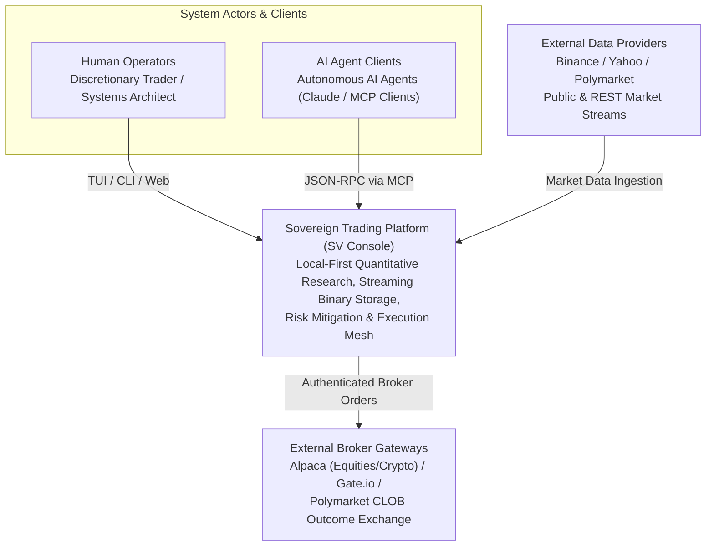
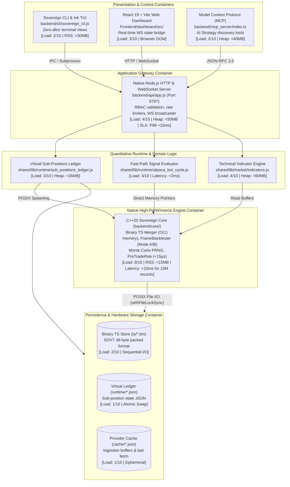
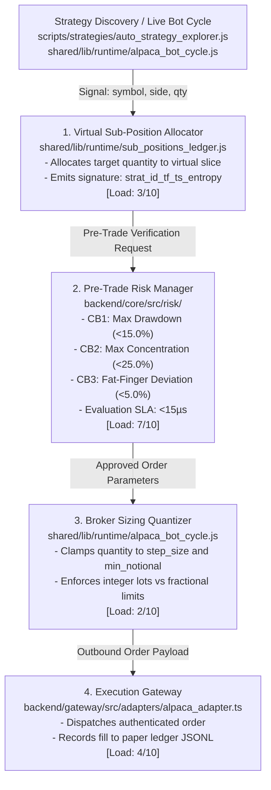

# 01. Sovereign System Architecture & Codebase Organization

This document establishes the canonical top-level architecture, subsystem boundaries, directory taxonomy, C4 container & component topologies, and fundamental runtime invariants for the Sovereign Trading Platform (SV Console).

---

## 1. Architectural Standards & Meta-Framework Synthesis

The Sovereign engineering documentation suite synthesizes four industry architectural standards:

| Framework | Core Focus | Integration Layer | Sovereign Platform Mapping |
|---|---|---|---|
| **ISO/IEC/IEEE 42010** | Architecture Description | Meta-Framework | Stakeholders, architectural viewpoints, invariants |
| **arc42** | Structural Pattern | Document Sections | Context, building blocks, runtime, deployment, risks |
| **C4 Model** | Hierarchical Zoom | Diagrammatic Model | Context (L1), Containers (L2), Components (L3), Code |
| **Diátaxis** | Information Needs | Documentation Type | High-density "Explanation" + "Reference" synthesis |

### Stakeholder Concerns & Quality Attributes
- **Quantitative Researchers**: High-fidelity backtesting, zero lookahead bias, parameter exploration with 6D novelty filters.
- **Systems & Core Engineers**: Sub-millisecond binary timeseries processing, zero-allocation C++20 routines, and bounded memory footprints.
- **Platform Operators**: Single-writer integrity, zero-key development ergonomics, double-entry audit trails, and fail-closed risk circuit breakers.

---

## 2. C4 Architecture Topologies

### C4 Level 1: System Context Diagram



### C4 Level 2: Container Diagram (Inter-Process Topology)



### C4 Level 3: Component Diagram (Execution & Risk Subsystem)



---

## 3. Directory Taxonomy & Domain Ownership

The repository enforces strict module separation and unidirectional dependency flow:

```text
personal_finance_draft/
├── backend/
│   ├── api/                 # Authenticated Express REST API & WebSocket bridge
│   ├── cli/                 # Sovereign CLI entrypoints, Ink TUI, and command handlers
│   │   ├── commands/        # Domain subcommands (strategy, data, backtest, broker)
│   │   └── tui/             # Terminal User Interface manifests & views
│   ├── core/                # C++20 Sovereign Core native analytics & risk library
│   │   ├── src/             # Source: binary TS merger, backtester, Monte Carlo, risk
│   │   └── tests/           # 34 CTest verification suites
│   ├── gateway/             # Broker adapters (Alpaca, Polymarket, Gate.io) & paper ledger
│   └── mcp_server/          # Model Context Protocol (MCP) server for AI agent integration
├── config/                  # System environment manifests, risk policies, strategies
│   ├── strategies/          # Canonical YAML strategy registries (`automated/`, `curated/`, `fixtures/`)
│   └── system/              # `environment_manifest.json` (strict variable whitelisting)
├── docs/                    # Master documentation corpus (Schema: `sovereign.documentation_manifest/v1`)
│   └── engineering/         # Modular 8-section canonical engineering specifications
├── Frontend/
│   └── dashboard/           # React 19 + Vite dashboard (source in `src/`, `dist/` generated)
├── infra/
│   └── docker/              # Multi-service `docker-compose.yml` for HPDesk Proxmox VM
├── scripts/
│   ├── dev/                 # Hygiene checks, documentation auditors, test runners
│   ├── mcp/                 # Model Context Protocol operational scripts
│   ├── ml/                  # Machine learning training & feature generation routines
│   ├── strategies/          # `auto_strategy_explorer.js` (autonomous 30-min discovery daemon)
│   └── tools/               # Operational utilities & diagnostic scripts
├── shared/
│   └── lib/                 # Shared TypeScript/JavaScript domain logic
│       ├── brokers/         # Broker environment wrappers & tradability checks
│       ├── market/          # Binary TS storage, quote router, rolling indicators
│       ├── runtime/         # Virtual sub-positions ledger & deterministic signatures
│       └── settings/        # Deployment profiles & fail-closed runtime policy
├── storage/                 # Local data directory (excluded from git tracking)
│   └── data/
│       ├── cache/           # Provider HTTP response caches & temporary buffers
│       ├── runtime/         # Active sub-positions virtual ledger (`ledger/sub_positions.json`)
│       └── ts/              # High-density binary time-series files (`*.bin`)
├── tests/                   # Native Node.js test suites (`run_node_tests.js`)
└── workspace/               # Project state tracking (`STATE.md`, `PROMPT_LOG.md`, handoffs)
```

---

## 4. End-to-End Runtime Call Sequence

```text
[Trader/CLI]       [Express API]       [SubPositions]      [C++ PreTradeRisk]   [Broker Gateway]     [Storage Disk]
     │                   │                   │                     │                   │                   │
     │── 1. Execute ────►│                   │                     │                   │                   │
     │   CLI Command     │── 2. Route ──────►│                     │                   │                   │
     │                   │   Strategy Order  │── 3. Acquire Lock ─────────────────────────────────────────►│
     │                   │                   │      & Mutate Slice │                   │                   │
     │                   │                   │◄─ 4. Lock Released ─────────────────────────────────────────│
     │                   │                   │                     │                   │                   │
     │                   │                   │── 5. Verify Risk ──►│                   │                   │
     │                   │                   │      Parameters     │                   │                   │
     │                   │                   │                     │ (Drawdown Check,  │                   │
     │                   │                   │                     │  Concentration,   │                   │
     │                   │                   │                     │  Fat-Finger <15μs)│                   │
     │                   │                   │◄─ 6. Risk Pass ─────│                   │                   │
     │                   │                   │                     │                   │                   │
     │                   │                   │── 7. Dispatch Order ───────────────────►│                   │
     │                   │                   │      (Clamped Qty)  │                   │                   │
     │                   │                   │                     │                   │── 8. REST/WS ────► [Exchange]
     │                   │                   │                     │                   │      Execution    │
     │                   │                   │                     │                   │◄─ 9. Execution ───│
     │                   │                   │                     │                   │      Confirmation │
     │                   │                   │                     │                   │                   │
     │                   │                   │◄─ 10. Fill Event ───────────────────────│                   │
     │                   │                   │── 11. Append Ledger ───────────────────────────────────────►│
     │                   │◄─ 12. Success ────│       Double-Entry  │                   │   (`ledger.jsonl`)│
     │◄─ 13. Render ─────│   JSON Status     │                     │                   │                   │
     │   TUI State       │                   │                     │                   │                   │
```

---

## 5. Fundamental Architectural Invariants

### 1. Single-Writer Authority
Only the node designated with `SOVEREIGN_DEPLOYMENT_PROFILE=central-host` has authority to write to disk (`canonical_writer: true`). Read-only replica nodes and UI clients fail closed upon write attempts.

### 2. Zero-Key Local Development
The repository operates locally without external API keys or cloud services:
- Unit, safety, and integration tests execute against recorded fixtures (`tests/fixtures/`).
- Market data ingestion uses public endpoints (Binance, Yahoo) or mock generators.
- Prediction market execution uses the internal virtual paper ledger (`backend/gateway/src/paper_ledger.js`).
- Real-money API credentials exist solely on the isolated production host (`hpdesk-1`).

### 3. Fail-Closed Execution Policy
Live trading execution is blocked by default. Promotion to real execution requires three explicit gates:
1. `SOVEREIGN_EXECUTION_AUTHORIZED=true` in environment.
2. Operator PIN authentication.
3. Real-time C++ `PreTradeRisk` clearance (drawdown $< \text{max\_drawdown}$, concentration $< 25\%$, quantity step alignment).

### 4. Virtual Sub-Position Isolation
Automated trading strategies cannot mutate, close, or liquidate shares belonging to other strategies or manual operator positions (`[MANUAL]`). Position attribution is enforced by immutable client order signatures.

---

## 6. Master Subsystem Load Indices & Performance Matrix

| Subsystem Component | CPU Utilization | Memory / RSS | Latency / SLA | Disk / Network I/O | Complexity | Load Score (1–10) |
|---|---|---|---|---|---|:---:|
| **`BinaryTsMerger` (C++20)** | Single Core (0.1–0.3 CPU) | **`< 5.0 MB` RSS** ($O(1)$ 48KB buffer) | $1.2\text{M records/sec}$ throughput | $57.6\text{ MB/s}$ sequential I/O | $O(A + B)$ time, $O(1)$ space | **3/10** |
| **`BinaryTsReader` (C++20)** | Single Core (<0.1 CPU) | `< 2.0 MB` RSS | `< 0.5 ms` for 5,000 bars | Direct zero-copy file stream | $O(N)$ sequential | **2/10** |
| **`FrameBacktester::runNative`** | Single Core (0.8–1.0 CPU) | `< 12.0 MB` RSS | `< 1.8 ms` for 10,000 bars | $0\text{ B}$ disk I/O (in-memory span) | $O(N)$ linear pass | **7/10** |
| **`FrameBacktester::runFromAnnotated`**| Single Core (0.4–0.7 CPU) | `< 18.0 MB` RSS | $12–25\text{ ms}$ per fold | Read-only JSON frame parse | $O(N)$ linear pass | **5/10** |
| **Monte Carlo (1,000 resamples)** | Multi-thread / AVX2 | `< 8.0 MB` RSS | `< 4.5 ms` total execution | In-memory `xorshift64` PRNG | $O(\text{runs} \times N)$ | **6/10** |
| **`PreTradeRisk` Gate Verification** | < 0.01 CPU | `< 1.0 MB` RSS | **`< 15 μs`** per order | Zero disk / network I/O | $O(1)$ constant | **1/10** |
| **6D Novelty Distance & Hash** | < 0.05 CPU | `< 2.0 MB` heap | `< 0.2 ms` calculation | Read-only state file parse | $O(D \times K)$ | **1/10** |
| **Market Bar Sourcing (5k bars)** | 0.2–0.5 CPU | $25–45\text{ MB}$ heap | $250–600\text{ ms}$ (remote API) | $180\text{ KB}$ network JSON | $O(N)$ network I/O | **4/10** |
| **Rolling Feature Frame Builder** | 0.8–1.0 CPU | $65–110\text{ MB}$ heap | $45–80\text{ ms}$ (5k bars × 8 inds)| Zero I/O (pure JS compute) | $O(N \times K)$ | **6/10** |
| **MCP `explore_strategy` Tool** | Async worker | `< 150 MB` Node RSS | `< 1.2 s` end-to-end SLA | Atomic YAML + State JSON write | Multi-stage pipeline | **5/10** |
| **Sub-Position Atomic Mutation** | < 0.02 CPU | `< 4.0 MB` heap | `< 1.5 ms` per transaction | Lock file creation + atomic rename | $O(1)$ atomic swap | **2/10** |
| **Broker Position Reconciliation** | 0.1 CPU | `< 8.0 MB` heap | $120–250\text{ ms}$ (broker REST) | 1 broker API request / cycle | $O(P + S)$ items | **3/10** |
| **Fast-Path Signal Evaluation** | 0.05 CPU | `< 15.0 MB` heap | **`< 2.0 ms`** internal latency| Zero disk I/O | $O(\text{bars})$ lookback | **2/10** |

---

## 7. Failure Domains, Circuit Breakers & Autonomous Recovery Matrix

The Sovereign platform implements an explicit failure isolation boundary across each functional domain:

| Subsystem Domain | Primary Failure | Circuit Breaker | Autonomous Recovery / Fail-Safe Behavior |
|---|---|---|---|
| **Market Data Ingest** | Upstream HTTP 429/503/Timeout | Exponential Backoff with 60s Jitter | Route to TTL disk cache (`storage/data/cache/`), synthesize bars from local lower-timeframe rollups |
| **Storage & I/O** | Lockfile Contention / Disk Full | `withFileLockSync` File Descriptor Lock | 5,000ms spin-wait timeout; abort transaction without partial state corruption; emit operational error alert |
| **C++ Analytics Engine** | NaN in TimeSeries / Invalid Span Range | Invariant Sanitizer & PreTradeRisk Gate | Reject malformed bar tuple; fall back to safe Mode B annotated evaluation or halt live order dispatch |
| **Broker Gateway** | Connection Drop / Order Rejection | Heartbeat Monitor & Step Sizer | Reconnect WebSocket with exponential backoff; pause strategy cycle; re-query physical broker positions |
| **Sub-Positions Ledger** | Allocation Mismatch with Broker Net Pos | Reconciliation Gate ($Q_{\text{Broker}}$) | Auto-attribute positive discrepancies to `[MANUAL]`; freeze bot order sizing on negative net discrepancy |
