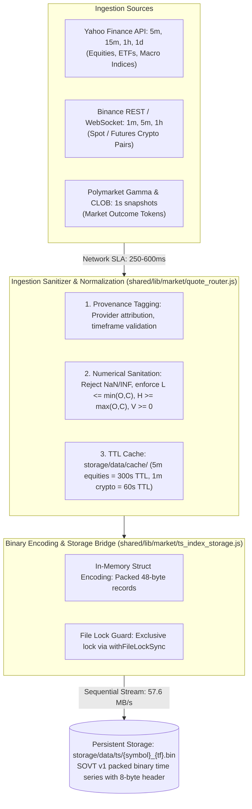
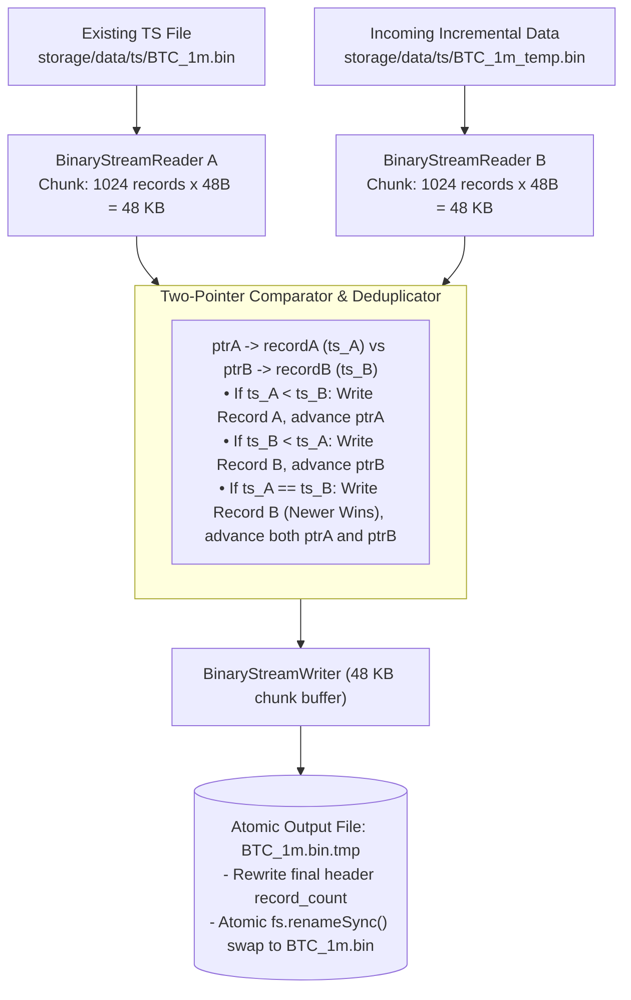
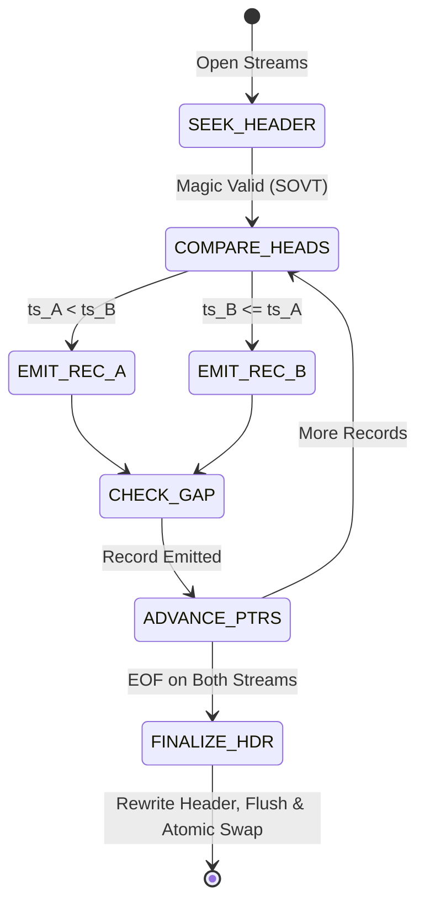
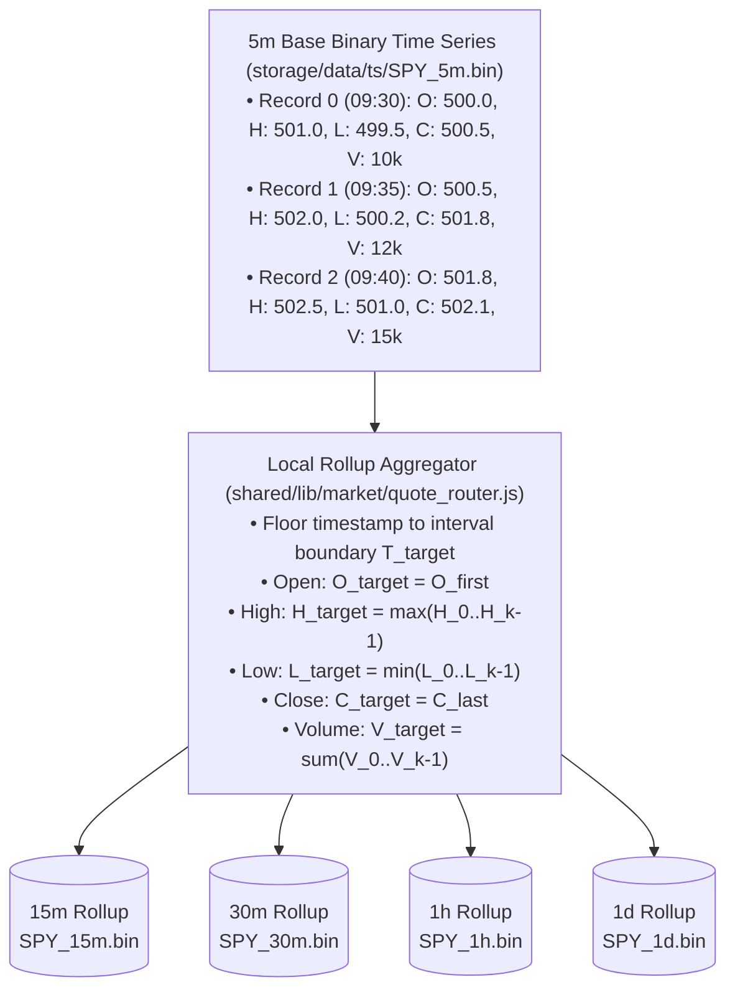

# 02. Data Pipeline & Binary Storage Architecture

This document specifies the market data ingestion lifecycle, data filtration, normalization, binary `SOVT` format, zero-allocation C++ streaming merger, circular ring buffers, and local multi-resolution rollup engine.

---

## 1. Multi-Market Ingestion Pipeline

Sovereign ingests continuous market data across three primary market regimes:
1. **Traditional Equities & Indices**: `5m` base resolution up to `1w` (synthesized locally via rollups).
2. **Crypto Markets**: High-granularity `1m` continuous data back to 2017 (Binance, Coinbase).
3. **Prediction Markets (Polymarket)**: Sub-minute / tick / `1s` orderbook snapshots and Gamma event feeds.

---

## 2. Binary `SOVT` Storage Layout & Bit-Level Struct Packing

All time series are persisted in a custom binary layout (`SOVT` Version 1), eliminating JSON parsing overhead:

### Header Layout (8 Bytes, `#pragma pack(push, 1)`)

| Byte Offset Range | Field Name | C++ Data Type | Byte Width | Encoded Value / Description |
|---|---|---|---|---|
| `0x00..0x03` | Magic Identifier | `char[4]` | 4 Bytes | ASCII `SOVT` (`0x53, 0x4F, 0x56, 0x54`) |
| `0x04..0x07` | Total Record Count | `uint32_t` | 4 Bytes | Number of 48-byte records in body (little-endian) |

### Body Layout (Contiguous 48-Byte Packed IEEE-754 Records)

| Byte Offset Range | Field Name | C++ Data Type | Byte Width | Description |
|---|---|---|---|---|
| `0x00..0x07` | `ts_ms` | `double` (f64) | 8 Bytes | Unix Epoch Timestamp in Milliseconds (IEEE-754 LE) |
| `0x08..0x0F` | `open` | `double` (f64) | 8 Bytes | Bar Opening Price (IEEE-754 LE) |
| `0x10..0x17` | `high` | `double` (f64) | 8 Bytes | Bar Highest Price (IEEE-754 LE) |
| `0x18..0x1F` | `low` | `double` (f64) | 8 Bytes | Bar Lowest Price (IEEE-754 LE) |
| `0x20..0x27` | `close` | `double` (f64) | 8 Bytes | Bar Closing Price (IEEE-754 LE) |
| `0x28..0x2F` | `volume` | `double` (f64) | 8 Bytes | Bar Cumulative Volume (IEEE-754 LE) |

*Record Length: Exactly 48 Bytes (384 Bits) per Bar. Zero padding, zero struct alignment holes.*

### Mathematical Offset & Sizing Formalism
For a binary time-series file containing $N$ records:
$$\text{Total File Size}(N) = 8 + (N \times 48) \quad \text{bytes}$$
$$\text{Record Byte Offset}(i) = 8 + (i \times 48), \quad i \in [0, N-1]$$
$$\text{Storage Compression Ratio} = \frac{\text{Raw JSON Footprint}}{48 \times N} \approx 4.2\times$$

---

## 3. C++20 Zero-Allocation Streaming TS Merger (`sovereign::BinaryTsMerger`)

When new historical or incremental bars arrive, appending them in JavaScript causes huge V8 heap spikes ($>950\text{MB}$) and GC pauses. Sovereign replaces in-memory merging with a zero-allocation streaming two-pointer C++ merger (`sovereign_wealth ts-merge`):

### Gap Detection & Deduplication State Machine

---

## 4. Live Streaming Circular Ring Buffer Mechanics

For real-time indicator computation and fast-path signal derivation, live bars are queued in fixed-capacity in-memory ring buffers:

| Index | Stored Bar | Pointer Reference | Description |
|:---:|:---:|:---:|---|
| `0` | $\text{Bar}(t-199)$ | **Head Pointer** | Oldest active bar in window |
| `1` | $\text{Bar}(t-198)$ | | Ring index $1$ |
| `2` | $\text{Bar}(t-197)$ | | Ring index $2$ |
| $\dots$ | $\dots$ | | |
| `198` | $\text{Bar}(t-1)$ | | Prior completed bar |
| `199` | $\text{Bar}(t)$ | **Tail Pointer** | Latest incoming live candle |

#### Index Arithmetic & Window Slicing
$$\text{Next Tail Index} = (\text{Tail} + 1) \pmod C$$
$$\text{Next Head Index} = \begin{cases} (\text{Head} + 1) \pmod C & \text{if } \text{Size} = C \\ \text{Head} & \text{if } \text{Size} < C \end{cases}$$
Zero-allocation sub-array span access enables $O(1)$ rolling indicator updates without memory reallocation.

---

## 5. Local Multi-Resolution Rollup Synthesis Engine

To minimize external API rate limits, Sovereign stores only the highest-granularity base timeframe and synthesizes higher timeframes locally on disk:

---

## 6. Subsystem Load Indices & Performance Benchmarks

| Operation / Component | CPU Utilization | Memory / RSS | Latency / SLA | Disk I/O Profile | Complexity | Load Score (1–10) |
|---|---|---|---|---|---|:---:|
| **Binary TS Read (5,000 bars)** | < 0.05 CPU | `< 2.0 MB` RSS | `< 0.5 ms` | Zero-copy mmap/stream | $O(N)$ sequential | **2/10** |
| **C++ Streaming TS Merge (50k bars)**| 0.2 CPU | **`< 5.0 MB` RSS** | `< 15.0 ms` | $57.6\text{ MB/s}$ sequential | $O(A + B)$ time, $O(1)$ space | **3/10** |
| **Local 15m Rollup Synthesis** | 0.1 CPU | `< 4.0 MB` heap | `< 3.5 ms` / 10k bars | In-memory aggregation | $O(N)$ linear pass | **2/10** |
| **Ring Buffer 200-Bar Update** | < 0.01 CPU | Negligible | **`< 10 μs`** | In-memory array swap | $O(1)$ constant | **1/10** |
| **Atomic File Lock Acquisition** | < 0.01 CPU | Negligible | `< 0.2 ms` | Single lockfile write | $O(1)$ constant | **1/10** |
| **HTTP Provider Fetch (Cached)** | < 0.05 CPU | `< 10.0 MB` heap | `< 2.0 ms` | Local cache hit | $O(1)$ file read | **1/10** |
| **HTTP Provider Fetch (Remote)** | 0.2–0.5 CPU | $25–45\text{ MB}$ heap | $250–600\text{ ms}$ | Network I/O (180 KB) | $O(N)$ network | **4/10** |
