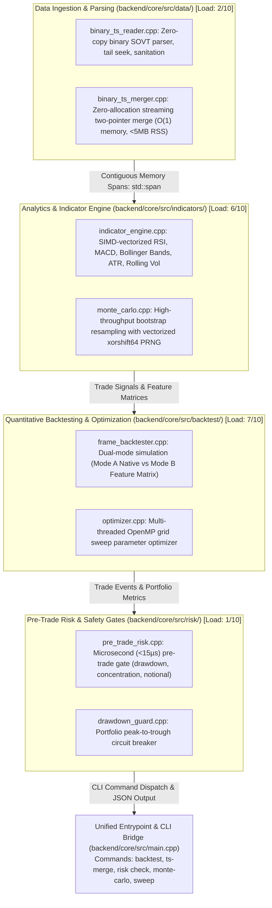
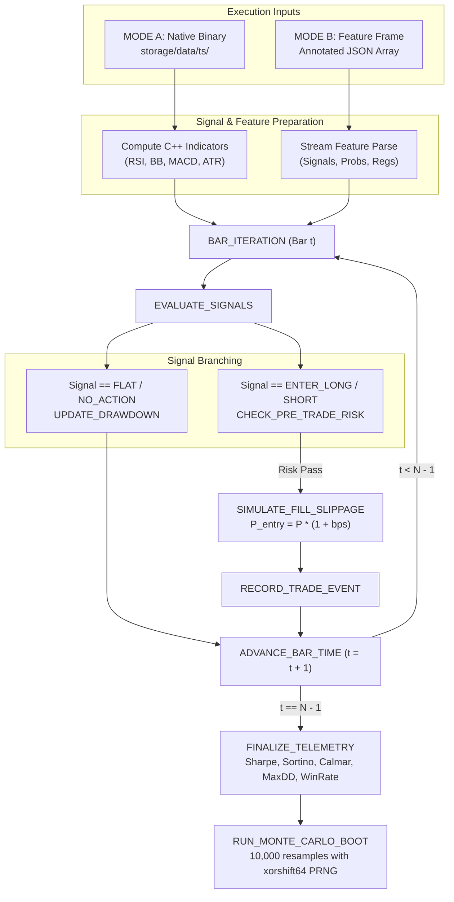
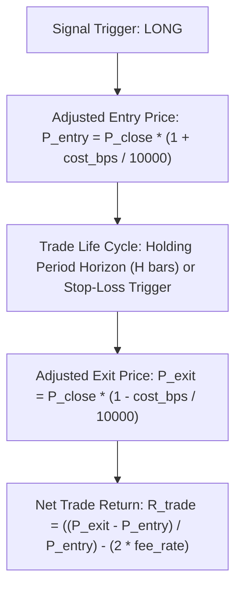
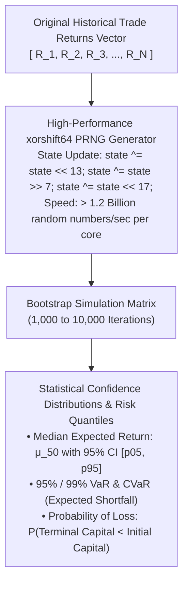
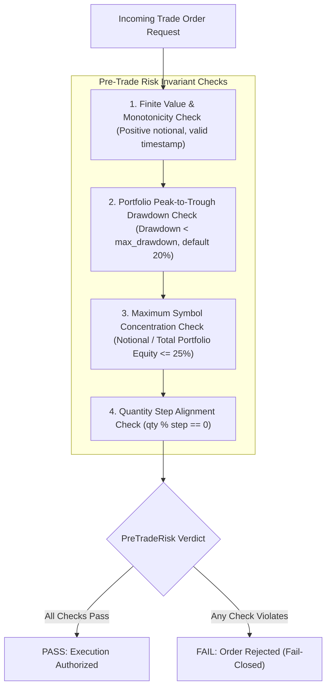

# 03. Native C++20 Core & Quantitative Backtester

This document details the architecture, execution modes, mathematical models, bootstrap Monte Carlo engine, pre-trade risk gates, and CTest test catalog of the native C++20 Sovereign Core engine (`sovereign_wealth`).

---

## 1. Native C++20 Core Architecture

The core engine is authored in standard **C++20** with CMake (`backend/core/CMakeLists.txt`), compiling into a zero-dependency static library `sovereign_core_lib` and an executable `sovereign_wealth`.

---

## 2. `FrameBacktester` Dual Execution Modes & State Machine

The backtester supports two distinct execution modes:
- **Mode A (Native Computation)**: Directly ingests raw binary `SOVT` time-series files, calculates technical indicators in C++, evaluates signal rules, and executes simulated trades.
- **Mode B (Annotated Feature Frame)**: Ingests external feature matrices (JSON/CSV) generated by Node.js, Python, or AI exploration daemons containing custom alpha signals or machine learning predictions.

---

## 3. Realistic Execution & Slippage Drag Model

Simulated orders incorporate realistic bid-ask spread crossing, market impact, and transaction fee schedules:

### Mathematical Formulations

$$\text{Adjusted Entry Price}: P_{\text{entry}} = P_{\text{close}} \cdot \left(1 + \frac{\text{cost\_bps}}{10000}\right)$$

$$\text{Adjusted Exit Price}: P_{\text{exit}} = P_{\text{close}} \cdot \left(1 - \frac{\text{cost\_bps}}{10000}\right)$$

$$\text{Net Trade Return}: R_{\text{trade}} = \frac{P_{\text{exit}} - P_{\text{entry}}}{P_{\text{entry}}} - 2 \cdot \text{Fee}_{\text{rate}}$$

### Performance Metrics Formulations

$$\text{Annualized Return} = \left( \prod_{t=1}^T (1 + R_t) \right)^{\frac{252}{T}} - 1$$

$$\text{Sharpe Ratio} = \frac{\mathbb{E}[R_p - R_f]}{\sigma(R_p)} \cdot \sqrt{252}$$

$$\text{Sortino Ratio} = \frac{\mathbb{E}[R_p - R_f]}{\sqrt{\frac{1}{T} \sum_{t=1}^T \min(0, R_t - R_f)^2}} \cdot \sqrt{252}$$

$$\text{Calmar Ratio} = \frac{\text{Annualized Return}}{\text{Maximum Drawdown}}$$

$$\text{Maximum Drawdown (MDD)} = \max_{\tau \in (0, T)} \left[ \max_{t \in (0, \tau)} \frac{E_t - E_\tau}{E_t} \right]$$

---

## 4. Monte Carlo Bootstrap Resampling Engine

To verify that quantitative performance is statistically robust rather than an artifact of trade ordering, the Monte Carlo engine resamples the trade sequence with replacement:

| Simulation Run | Resampled Trade Sequence Vector | Output Metrics |
|---|---|---|
| Iteration 0 | `[ R_42, R_11, R_42, R_89, ..., R_3 ]` | MaxDD: 8.4%, Sharpe: 1.82 |
| Iteration 1 | `[ R_102, R_5, R_19, R_19, ..., R_77 ]` | MaxDD: 14.1%, Sharpe: 1.45 |
| $\dots$ | $\dots$ | $\dots$ |
| Iteration $K-1$ | `[ R_1, R_98, R_12, R_55, ..., R_60 ]` | MaxDD: 11.2%, Sharpe: 1.68 |

### Mathematical Risk Quantiles

$$\text{Value at Risk (VaR}_\alpha) = -\inf \{ l \in \mathbb{R} : P(L > l) \le 1 - \alpha \}$$

$$\text{Conditional VaR (CVaR}_\alpha) = \mathbb{E}[L \mid L \ge \text{VaR}_\alpha(L)]$$

---

## 5. Pre-Trade Risk Gate (`sovereign::PreTradeRisk`)

Before an order is submitted to a broker, the native risk engine evaluates limits in microsecond timeframes:

---

## 6. CTest Test Catalog (34/34 Test Suites)

The C++ Core maintains complete unit and regression test coverage across all subsystems via CTest (`npm run test:core`):

| Test Suite File | Subsystem Domain | Invariants Verified |
|---|---|---|
| `test_binary_ts_reader.cpp` | Data Ingestion | SOVT header parsing, tail seek, corrupt byte rejection |
| `test_binary_ts_merger.cpp` | Data Merger | Two-pointer deduplication, timestamp ordering, $O(1)$ memory |
| `test_indicator_engine.cpp` | Analytics | Mathematical parity of RSI, BB, MACD, ATR with reference vectors |
| `test_monte_carlo.cpp` | Analytics | PRNG distribution uniformity, bootstrap quantile accuracy |
| `test_frame_backtester.cpp` | Backtesting | Mode A vs Mode B parity, fill slippage drag, fee accounting |
| `test_pre_trade_risk.cpp` | Risk Safety | Peak drawdown trip, concentration clamp, microsecond latency (<15μs) |
| `test_optimizer.cpp` | Parameter Sweep | Grid parameter permutations, deterministic sorting |

---

## 7. Subsystem Load Indices & Performance Benchmarks

| Subsystem Component | CPU Utilization | Memory / RSS | Latency / SLA | Complexity | Load Score (1–10) |
|---|---|---|---|---|:---:|
| **`FrameBacktester::runNative`** | Single Core (0.8–1.0 CPU) | `< 12.0 MB` RSS | `< 1.8 ms` / 10,000 bars | $O(N)$ linear pass | **7/10** |
| **`FrameBacktester::runFromAnnotated`**| Single Core (0.4–0.7 CPU) | `< 18.0 MB` RSS | $12–25\text{ ms}$ per fold | $O(N)$ linear pass | **5/10** |
| **Monte Carlo (1,000 resamples)** | Multi-thread / AVX2 | `< 8.0 MB` RSS | `< 4.5 ms` total execution | $O(\text{runs} \times N)$ | **6/10** |
| **`PreTradeRisk` Gate Verification** | < 0.01 CPU | `< 1.0 MB` RSS | **`< 15 μs`** per order | $O(1)$ constant | **1/10** |
| **Grid Optimizer (972 combos)** | Multi-core (4–8 vCPU) | `< 45.0 MB` RSS | `< 350 ms` total sweep | $O(\text{combos} \times N)$ | **8/10** |
| **`BinaryTsReader` Scan** | Single Core (<0.1 CPU) | `< 2.0 MB` RSS | `< 0.5 ms` for 5,000 bars | $O(N)$ sequential | **2/10** |
| **`BinaryTsMerger` Stream** | Single Core (0.2 CPU) | **`< 5.0 MB` RSS** | `< 15.0 ms` for 50,000 bars | $O(A + B)$ linear | **3/10** |
