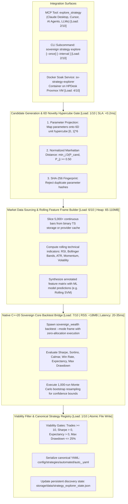
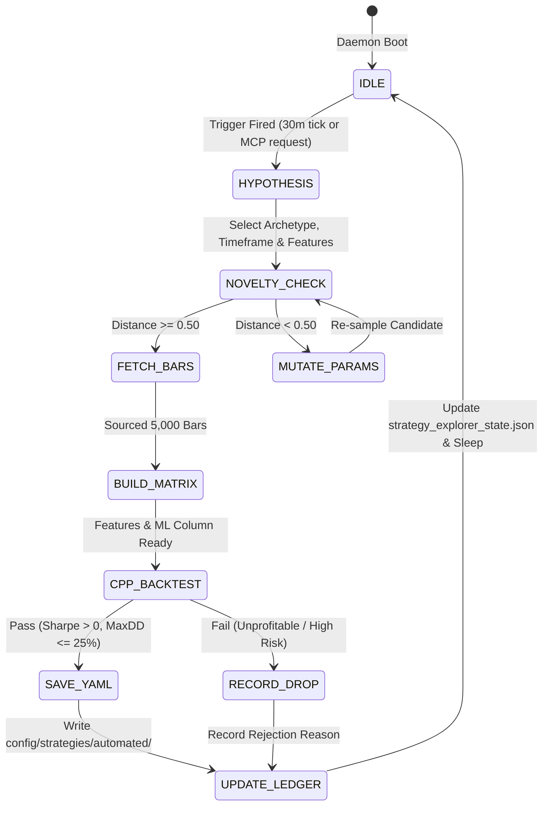
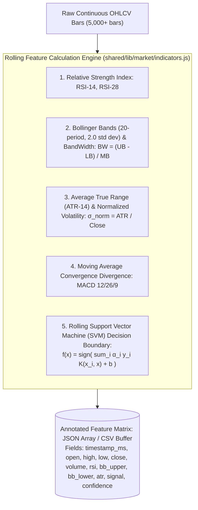
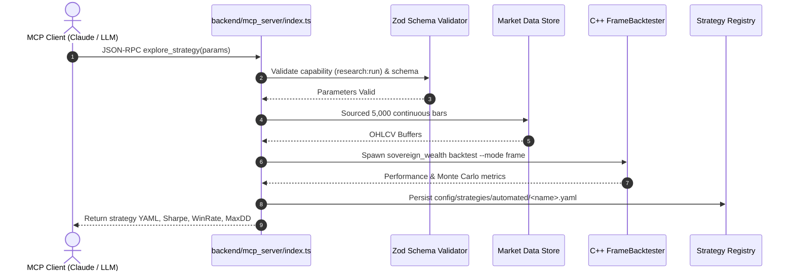

# 04. Quantitative Alpha, Machine Learning & AI Agent Workbench

This document specifies the architecture of the autonomous quantitative alpha discovery engine, 6D normalized parameter space exploration, novelty distance filtering, rolling feature matrix synthesis, and Model Context Protocol (MCP) AI agent workbenches.

---

## 1. Autonomous AI Strategy Explorer Architecture

Sovereign includes an autonomous discovery daemon (`scripts/strategies/auto_strategy_explorer.js`) that runs continuously (e.g. 30-minute interval on HPDesk) or on-demand via CLI and MCP tooling to research novel market anomalies, backtest them using the zero-allocation native C++20 engine, and automatically persist valid YAML strategy registries into `config/strategies/automated/`.



---

## 2. Autonomous Strategy Exploration State Machine



---

## 3. 6D Normalized Parameter Space & Novelty Distance Metric

To ensure the autonomous discovery engine explores structurally diverse alpha spaces rather than overfitting trivial variations, each candidate strategy is projected onto a 6-dimensional unit hypercube:

$$\vec{P} = \left[ P_1, P_2, P_3, P_4, P_5, P_6 \right] \in [0, 1]^6$$

| Dimension | Parameter Name | Normalized Value Metric | Range / Domain |
|:---:|---|---|---|
| $P_1$ | Timeframe Index | $\frac{\text{tf\_idx}}{5} \in [0, 1]$ | `5m`, `15m`, `30m`, `1h`, `4h`, `1d` |
| $P_2$ | Strategy Family | $\frac{\text{fam\_idx}}{4} \in [0, 1]$ | `momentum`, `mean_rev`, `breakout`, `trend`, `vol` |
| $P_3$ | ML Model | $\frac{\text{mod\_idx}}{4} \in [0, 1]$ | `svm`, `knn`, `rsi_div`, `macd`, `bb` |
| $P_4$ | Signal Threshold | $\frac{\theta - 0.50}{0.35} \in [0, 1]$ | $\theta \in [0.50, 0.85]$ |
| $P_5$ | Holding Horizon | $\frac{H - 1}{29} \in [0, 1]$ | $H \in [1, 30] \text{ days}$ |
| $P_6$ | Risk Weight | $\frac{w - 0.02}{0.23} \in [0, 1]$ | $w \in [0.02, 0.25]$ |

### Novelty Distance Formalism
The distance between candidate parameter vector $\vec{P}_{\text{cand}}$ and any previously evaluated strategy $\vec{P}_{\text{seen}}$ is given by the normalized Manhattan metric:

$$D(\vec{P}_{\text{cand}}, \vec{P}_{\text{seen}}) = \frac{1}{6} \sum_{i=1}^6 |P_{\text{cand}, i} - P_{\text{seen}, i}|$$

$$\text{Novelty Condition}: \min_{j \in \text{Seen}} D(\vec{P}_{\text{cand}}, \vec{P}_j) \ge 0.50 \quad (50\% \text{ structural shift})$$

### SHA-256 Fingerprinting
To guard against hash collisions and floating-point roundoff:
$$\text{Fingerprint} = \text{SHA-256}(\text{CanonicalJSON}(\text{SortedParams}))[0:16]$$

---

## 4. Rolling Feature Matrix Synthesis & SVM Classifier



---

## 5. Model Context Protocol (MCP) AI Agent Workbench

Any MCP-compatible client (Claude Desktop, Cursor, Cline, local LLMs) can call the registered `explore_strategy` tool:

```json
{
  "name": "crypto_vol_breakout_1h",
  "hypothesis": "High volatility regime combined with Bollinger upper band expansion produces persistent momentum continuation in crypto markets.",
  "family": "breakout",
  "model": "svm_margin_v0",
  "timeframe": "1h",
  "universe": ["BTCUSDT", "ETHUSDT"],
  "indicators": { "bollinger": true, "atr": true, "volatility": true, "rsi": true },
  "threshold": 0.65,
  "max_holding_days": 7,
  "risk_weight": 0.15,
  "entry_signal": "Price closes above 2-std dev upper Bollinger Band with ATR > 20-period median",
  "exit_signal": "Price touches 20-period moving average or holding horizon exceeds 7 days",
  "save_yaml": true
}
```



---

## 6. Subsystem Load Indices & Performance Benchmarks

| Subsystem Component | CPU Utilization | Memory / RSS | Latency / SLA | Disk I/O Bandwidth | Complexity | Load Score (1–10) |
|---|---|---|---|---|---|:---:|
| **Novelty Distance & SHA-256 Filter**| < 0.05 CPU | `< 2.0 MB` heap | `< 0.2 ms` | Read-only state parse | $O(D \times K)$ | **1/10** |
| **Market Data Ingestion (5k bars)**  | 0.2–0.5 CPU | $25–45\text{ MB}$ heap | $250–600\text{ ms}$ | $180\text{ KB}$ network JSON | $O(N)$ network | **4/10** |
| **Rolling Feature Frame Builder**    | 0.8–1.0 CPU | $65–110\text{ MB}$ heap | $45–80\text{ ms}$ (5k bars × 8 inds)| Zero disk I/O | $O(N \times K)$ | **6/10** |
| **Native C++ Backtest Dispatch**     | 1.0 CPU (spawn)| `< 18.0 MB` child RSS | $20–35\text{ ms}$ child exec | $1.2\text{ MB}$ temp frame write | $O(N)$ linear pass | **5/10** |
| **MCP `explore_strategy` Handler**   | Async worker| `< 150 MB` Node RSS | `< 1.2 s` end-to-end SLA | Atomic YAML + State write | Multi-stage pipeline | **5/10** |
