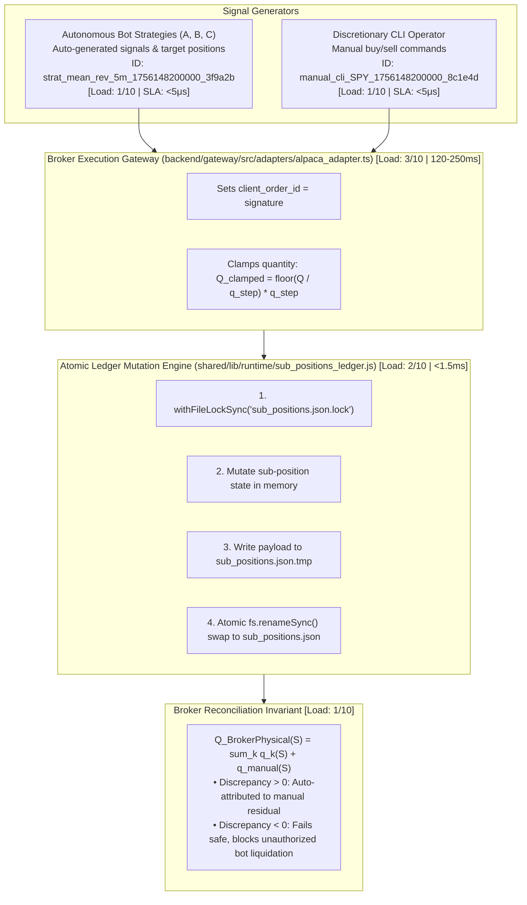
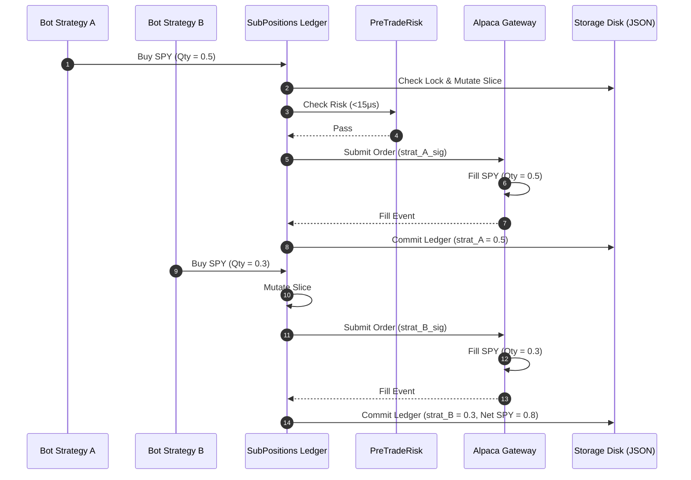
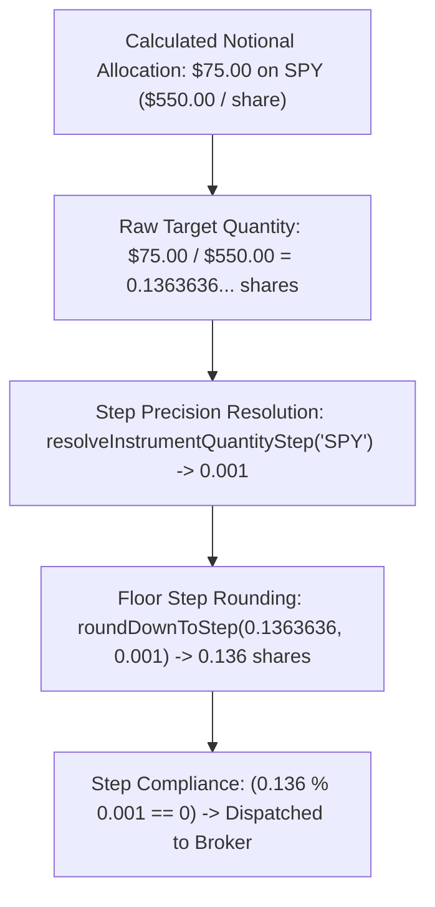
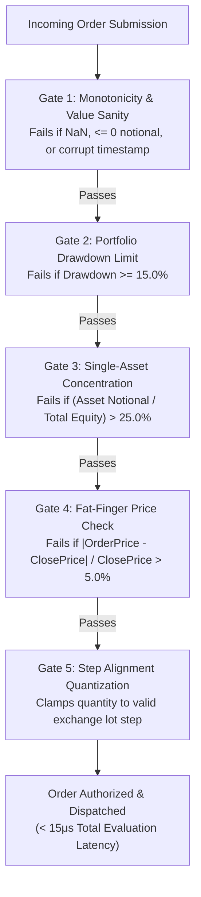

# 05. Execution, Sub-Positions Ledger & Risk Management

This document specifies the sub-position virtual accounting ledger, deterministic client order signatures, physical broker fill reconciliation algorithms, fractional quantity step enforcement, and pre-trade risk management.

---

## 1. Multi-Strategy Sub-Positions Virtual Ledger Architecture

When multiple automated quantitative strategies (or manual operator trades) trade the same physical instrument (e.g. `SPY`, `QQQ`, `BTC/USD`) on a single broker account (Alpaca / Gate.io / Polymarket), the broker tracks only one aggregate net position. 

Sovereign solves this multi-strategy attribution problem via the **Sub-Positions Virtual Ledger** (`storage/data/runtime/ledger/sub_positions.json`):

---

## 2. Multi-Strategy Concurrent Execution Sequence

---

## 3. Deterministic Client Order Signatures

All orders submitted to brokers carry an immutable client order ID encoding origin, strategy attribution, timeframe, and entropy:

### 1. Automated Strategy Order Signature
Format: `strat_<strategy_id>_<timeframe>_<timestamp_ms>_<entropy>`  
Example: `strat_auto_mean_reversion_knn_v0_1h_1756148200000_a9f1b4`

| Segment | Value in Example | Description |
|---|---|---|
| Prefix | `strat` | Identifies autonomous bot provenance |
| `strategy_id` | `auto_mean_reversion_knn_v0` | Canonical strategy registry identifier |
| `timeframe` | `1h` | Strategy operating timeframe (`1h`, `5m`, `1d`) |
| `timestamp_ms` | `1756148200000` | Epoch millisecond dispatch timestamp |
| `entropy` | `a9f1b4` | 6-character random hex string for collision prevention |

### 2. Manual Discretionary CLI Order Signature
Format: `manual_cli_<symbol>_<timestamp_ms>_<entropy>`  
Example: `manual_cli_SPY_1756148200000_c3e8d2`

| Segment | Value in Example | Description |
|---|---|---|
| Prefix | `manual_cli` | Identifies human CLI operator provenance |
| `symbol` | `SPY` | Target market symbol (`SPY`, `BTC/USD`) |
| `timestamp_ms` | `1756148200000` | Epoch millisecond dispatch timestamp |
| `entropy` | `c3e8d2` | 6-character random hex string |

### Signature Regex Decomposers
- **Strategy Parser**: `/^strat_(?<stratId>.+)_(?<tf>\d+[mhd])_(?<ts>\d+)_(?<entropy>[0-9a-f]{6})$/`
- **Manual CLI Parser**: `/^manual_cli_(?<symbol>[A-Z0-9_\/]+)_(?<ts>\d+)_(?<entropy>[0-9a-f]{6})$/`

---

## 4. Physical Broker Fill Reconciliation Algorithm

The reconciliation algorithm enforces exact physical-to-virtual balance equality:

$$Q_{\text{BrokerPhysical}}(S) = \sum_{k \in \text{BotStrategies}} q_k(S) + q_{\text{manual}}(S)$$

### Reconciliation Invariant Cases:
1. **Case A (Exact Match)**: $\sum q_k(S) = Q_{\text{BrokerPhysical}}(S) \implies q_{\text{manual}}(S) = 0$.
2. **Case B (Excess Physical Shares)**: $Q_{\text{BrokerPhysical}}(S) > \sum q_k(S)$.

   $$q_{\text{manual}}(S) := Q_{\text{BrokerPhysical}}(S) - \sum q_k(S)$$

   Excess shares are isolated under manual residual ownership so bots cannot liquidate them.
3. **Case C (Deficit / Under-Allocation)**: $Q_{\text{BrokerPhysical}}(S) < \sum q_k(S)$.
   Fails closed: flags an operational anomaly, pauses automated sell signals, and alerts the operator.

---

## 5. Fractional Unit Sizing & Step Precision Enforcement

To allow sub-$100 allocations on high-priced assets (SPY at $500+, BTC at $60,000+), Sovereign enforces step-precision rounding before order dispatch:

---

## 6. Pre-Trade Risk Multi-Tier Circuit Breaker

---

## 7. Subsystem Load Indices & Performance Benchmarks

| Subsystem Component | CPU Utilization | Memory / RSS | Latency / SLA | Disk I/O Profile | Complexity | Load Score (1–10) |
|---|---|---|---|---|---|:---:|
| **Signature Generation & Parsing**  | < 0.01 CPU | Negligible (<50 KB) | **`< 5 μs`** per signature | Zero disk I/O | $O(1)$ constant | **1/10** |
| **Ledger Atomic Lock & Commit**     | < 0.02 CPU | `< 4.0 MB` heap | `< 1.5 ms` per transaction | Lockfile write + atomic rename | $O(1)$ atomic swap | **2/10** |
| **Broker Position Reconciliation**  | 0.1 CPU | `< 8.0 MB` heap | $120–250\text{ ms}$ (REST API)| 1 broker API request / cycle | $O(P + S)$ items | **3/10** |
| **Fast-Path Signal Evaluation**     | 0.05 CPU | `< 15.0 MB` heap | **`< 2.0 ms`** internal latency| Zero disk I/O | $O(\text{bars})$ lookback | **2/10** |
| **Pre-Trade Risk Verification**     | < 0.01 CPU | `< 1.0 MB` RSS | **`< 15 μs`** per order | Zero disk / network I/O | $O(1)$ constant | **1/10** |
