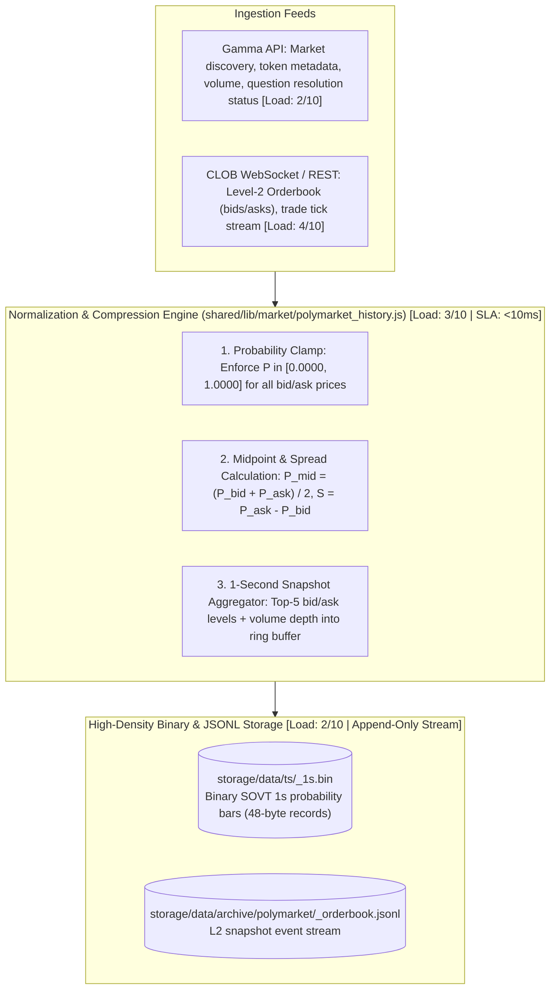
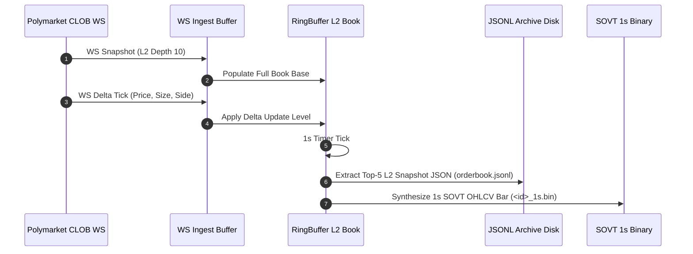
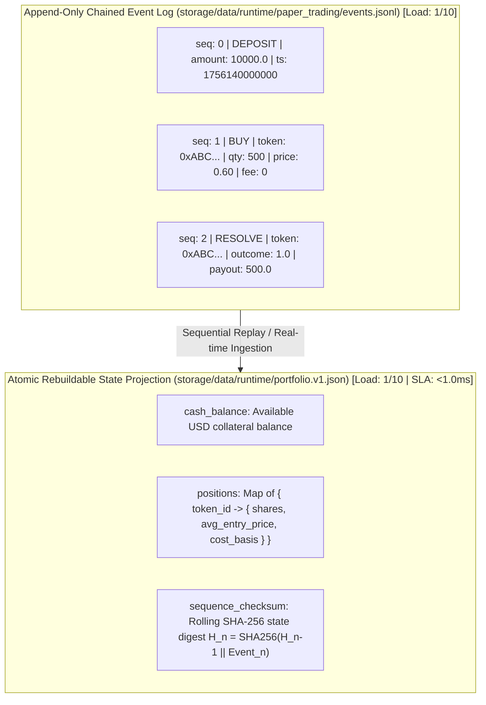
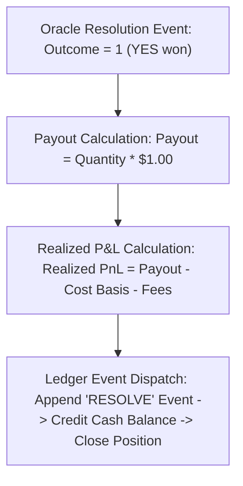

# 06. Prediction Markets & Polymarket Orderbook Archiving

This document specifies the prediction market data ingestion architecture, Polymarket CLOB and Gamma feeds, sub-second orderbook snapshot archiving, the virtual paper trading simulator, and oracle resolution settlement.

---

## 1. Polymarket Ingestion & Archiving Pipeline

Prediction markets present unique market dynamics: outcome tokens (e.g. `YES` / `NO`) trade bounded strictly between $\$0.00$ and $\$1.00$, representing implied probabilities, with high-frequency orderbook updates and discrete binary settlement.

---

## 2. Orderbook Data Model & Probability Pricing

Unlike equity continuous double auctions where prices can grow unboundedly, prediction market orderbooks model probability mass functions:

| Side | Level | Price | Size (Shares) | Implied Notional | Role |
|:---:|:---:|:---:|:---:|:---:|---|
| **ASK** | Level 3 | `$0.6200` | 15,000 | `$9,300` | Deep liquidity |
| **ASK** | Level 2 | `$0.6150` | 8,500 | `$5,227` | Mid liquidity |
| **ASK** | Level 1 | `$0.6100` | 4,200 | `$2,562` | **Best Ask ($P_{\text{ask}}$)** |
| **SPREAD** | — | **`$0.0150`** | — | **1.5% Implied Cost** | Bid-Ask Spread ($S$) |
| **BID** | Level 1 | `$0.5950` | 5,000 | `$2,975` | **Best Bid ($P_{\text{bid}}$)** |
| **BID** | Level 2 | `$0.5900` | 12,000 | `$7,080` | Mid liquidity |
| **BID** | Level 3 | `$0.5850` | 20,000 | `$11,700` | Deep liquidity |

### Mathematical Definitions

$$\text{Midpoint Probability}: P_{\text{mid}} = \frac{P_{\text{best\_bid}} + P_{\text{best\_ask}}}{2}$$

$$\text{Bid-Ask Spread}: S = P_{\text{best\_ask}} - P_{\text{best\_bid}}$$

$$\text{Implied Probability of Outcome}: \pi(\text{YES}) = P_{\text{mid}}, \quad \pi(\text{NO}) = 1.00 - P_{\text{mid}}$$

---

## 3. Orderbook Snapshot & Delta Reconstruction Sequence

---

## 4. Virtual Prediction Paper Trading Simulator (`backend/gateway/src/paper_ledger.js`)

To test prediction strategies locally without capital risk, Sovereign maintains an append-only, checksummed virtual paper ledger:

---

## 5. Oracle Resolution & Binary Payout Settlement

Upon market expiration, the oracle (e.g. UMA optimistic oracle or Polymarket resolution contract) reports the binary settlement outcome $Y \in \{0, 1\}$:

### Settlement Mathematics

$$\text{Binary Payout} = \begin{cases} Q \times 1.00 & \text{if Target Outcome} = \text{Resolved Outcome} \\ 0.00 & \text{otherwise} \end{cases}$$

$$\text{Realized P\&L} = \text{Payout} - (Q \times P_{\text{entry}}) - \text{Fees}$$

---

## 6. Subsystem Load Indices & Performance Benchmarks

| Subsystem Component | CPU Utilization | Memory / RSS | Latency / SLA | Disk I/O Profile | Complexity | Load Score (1–10) |
|---|---|---|---|---|---|:---:|
| **CLOB WebSocket Feed Ingest**     | 0.05–0.1 CPU | `< 25.0 MB` heap | `< 10 ms` frame parse | $15–40\text{ KB/s}$ network | $O(1)$ stream | **3/10** |
| **1s Orderbook Snapshot Archive**  | 0.1 CPU | `< 30.0 MB` heap | `< 2.0 ms` snapshot write | Append-only JSONL write | $O(\text{depth})$ | **3/10** |
| **Virtual Paper Order Execution**  | < 0.02 CPU | `< 5.0 MB` heap | **`< 1.0 ms`** per trade | JSONL log append | $O(1)$ constant | **1/10** |
| **Oracle Settlement Processing**   | < 0.01 CPU | `< 4.0 MB` heap | `< 3.0 ms` per market | Atomic projection update | $O(\text{positions})$ | **1/10** |
