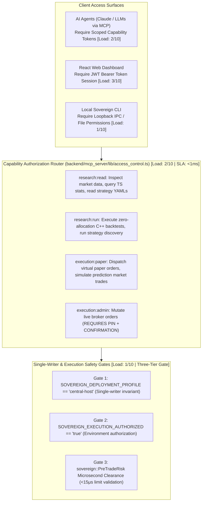
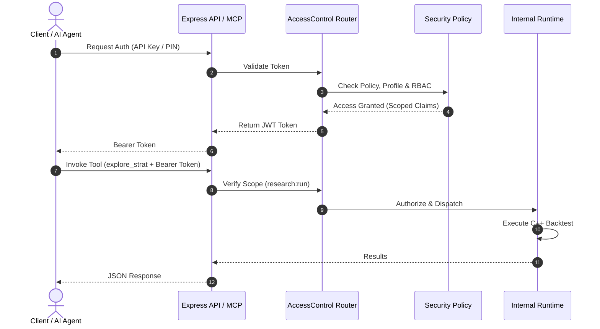
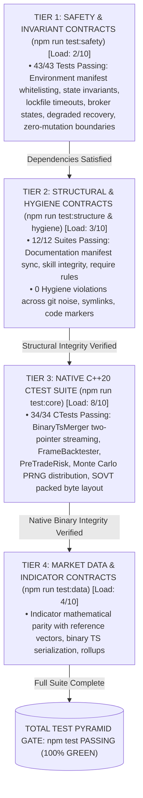

# 07. Security Model, APIs, Testing Strategy & Deployment Topology

This document specifies the platform security model, Role-Based Access Control (RBAC), Model Context Protocol (MCP) capabilities, Express REST and WebSocket APIs, zero-key local verification matrix, Docker Compose topology, and HPDesk Proxmox VM deployment runbooks.

---

## 1. Security Architecture & RBAC Capability Model

Sovereign enforces a strict least-privilege security model across human operators, automated daemons, and autonomous AI agents:



---

## 2. API Authentication & Token Lifecycle Sequence



---

## 3. 4-Tier Automated Test Execution DAG & Zero-Key Invariant

Sovereign enforces 100% keyless local development. Tests verify contracts without external cloud access:



---

## 4. Multi-Container Docker Compose & Proxmox VM Mesh Topology

The containerized stack is defined in `infra/docker/docker-compose.yml` with strict resource quotas:

```mermaid
flowchart TD
    subgraph Host["HPDesk Proxmox VM (hpdesk-1 / Ubuntu 24.04 LTS / 192.168.4.101 via Tailscale)"]
        WEB["sv-web (Default)<br/>Port 127.0.0.1:8787<br/>Read-Only API / UI<br/>Quota: 1.0 CPU, 512MB<br/>[Load: 2/10]"]
        BACKFILL["sv-backfill (Writer)<br/>Canonical Data Writer<br/>Ingestion & Rollup<br/>Quota: 2.0 CPU, 3072MB<br/>[Load: 5/10]"]
        BOT["sv-bot-alpaca-paper<br/>Alpaca Paper Bot<br/>Sub-Position Sizing<br/>Quota: 1.0 CPU, 512MB<br/>[Load: 3/10]"]
        EXPLORER["sv-strategy-explorer<br/>30-min AI Discovery<br/>C++ Backtest Bridge<br/>Quota: 2.0 CPU, 2048MB<br/>[Load: 5/10]"]
        PORTFOLIO["sv-portfolio-monitor<br/>Ledger Reconciliation<br/>Drawdown Monitoring<br/>Quota: 0.5 CPU, 256MB<br/>[Load: 2/10]"]
        HEALTH["sv-host-health & backup<br/>Disk / Flaw Sentinel<br/>24h State Snapshots<br/>Quota: 0.5 CPU, 256MB<br/>[Load: 1/10]"]
    end

    VOL[("Shared Persistent Volume: /app/storage -> storage/data/<br/>• ts/*.bin (Binary market bars)<br/>• runtime/sub_positions.json (Virtual ledger)<br/>• logs/*.log (Flaw monitor and audit trails)")]

    WEB -->|POSIX Mount| VOL
    BACKFILL -->|POSIX Mount (Writer)| VOL
    BOT -->|POSIX Mount| VOL
    EXPLORER -->|POSIX Mount| VOL
    PORTFOLIO -->|POSIX Mount| VOL
    HEALTH -->|POSIX Mount| VOL
```

---

## 5. Subsystem Load Indices & Resource Quotas

| Service Container | Profile | CPU Quota (Limit) | RAM Limit / Baseline RSS | Expected Latency / Cadence | Disk I/O Profile | Load Score (1–10) |
|---|---|---|---|---|---|:---:|
| **`sv-web`** | default | 1.0 vCPU | 512 MB / **~45 MB RSS** | Healthcheck: 30s (<5ms) | Read-only cache hits | **2/10** |
| **`sv-backfill`** | writer | 2.0 vCPU | 3072 MB / **~220 MB RSS** | Polling cycle: 60s | $15–30\text{ MB/min}$ writes | **5/10** |
| **`sv-bot-alpaca-paper`** | paper-alpaca | 1.0 vCPU | 512 MB / **~65 MB RSS** | Bot tick: 60s (<2ms signal)| Atomic ledger writes | **3/10** |
| **`sv-strategy-explorer`**| research | 2.0 vCPU | 2048 MB / **~140 MB RSS**| Interval: 30 mins | 1 YAML + State write / 30m | **5/10** |
| **`sv-portfolio-monitor`**| monitoring | 0.5 vCPU | 256 MB / **~35 MB RSS** | Reconcile: 60s | Read-only ledger audit | **2/10** |
| **`sv-host-health`** | monitoring | 0.5 vCPU | 256 MB / **~28 MB RSS** | Probe: 120s | Append-only flaw logs | **1/10** |
| **`sv-host-backup`** | monitoring | 0.5 vCPU | 256 MB / **~32 MB RSS** | Backup: 24h cron | Compressed archive snapshot | **1/10** |
