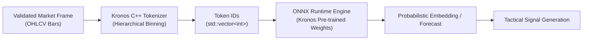

# Kronos ML Pipeline Roadmap

This document defines the planned Kronos data path for market prediction and signal generation.

## Goal
Integrate the Kronos foundation model for K-lines. The model consumes raw OHLCV sequences, tokenizes them using hierarchical quantization, and produces probabilistic future price paths.

## Feature Flow

## Tokenizer Contract
The C++ tokenizer must replicate the Kronos tokenization strategy:

- Inputs: Sequence of `OhlcvBar` (Open, High, Low, Close, Volume)
- Output: `std::vector<int>` (Token IDs)
- Binning: Quantizes continuous log-returns and price movements into discrete integer tokens.

## Model Artifacts
Planned model files:

- `models/kronos_base.onnx` (Exported PyTorch weights)
- `models/kronos_tokenizer.json` (Vocabulary and bin definitions)
