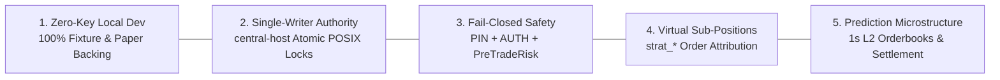

# Product Specification

> **Diátaxis Type**: Reference & Specification | **Status**: Canonical | **Owner**: Platform Engineering | **Review**: Continuous

## 1. Mission Statement

Sovereign is an institutional-grade, local-first quantitative research, backtesting, and algorithmic execution platform. It unifies streaming binary time-series ingestion, autonomous AI strategy discovery, deterministic sub-position attribution, prediction market orderbook archiving, and fail-closed multi-broker paper/live execution.

The platform prioritizes local computational sovereignty: entire research cycles, feature engineering passes, Monte Carlo simulations, and paper execution loops execute without external cloud dependencies, hosted databases, or proprietary vendor lock-in.

---

## 2. Five Core Architectural Invariants

Every subsystem in Sovereign adheres to five non-negotiable architectural invariants:

### Invariant 1: Zero-Key Local Development
- The full development, testing, and research lifecycle runs without external API keys or secret credentials.
- Unit and integration tests evaluate against static fixture recordings (`tests/fixtures/`, `storage/data/cache/last_fetch.json`).
- Prediction market evaluation uses the local virtual paper ledger (`backend/gateway/src/paper_ledger.js`).
- Public market data feeds (Binance public REST/WS, Yahoo Finance) operate without authentication.
- Live capital keys reside exclusively on isolated production hardware (`hpdesk-1`).

### Invariant 2: Single-Writer Authority (`central-host`)
- Exactly one primary process (`central-host`) possesses write privileges for binary time-series indices (`storage/data/ts/*.bin`) and portfolio state.
- Atomic POSIX locking (`withFileLockSync` with `O_EXCL`) protects disk records against race conditions.
- Read operations from CLI, web dashboard, and worker containers execute concurrently without blocking.

### Invariant 3: Fail-Closed Execution Safety
- Order dispatch requires three distinct authorization layers:

    1. Operator PIN verification matching salted sha256 environment hash.
    2. Environment variable flag `SOVEREIGN_EXECUTION_AUTHORIZED=true`.
    3. Pre-Trade Risk validation (`backend/core/src/risk/`) verifying drawdown (<15%), maximum position size, and stale quote fences (<15µs evaluation latency).

- Any ambiguity, missing quote, or heartbeat failure results in an immediate fail-closed state (`EMERGENCY_HALT`).

### Invariant 4: Virtual Sub-Positions Isolation
- Multiple autonomous strategies trade the same underlying physical asset (e.g., SPY, BTC/USD) without collision.
- The virtual sub-positions ledger (`shared/lib/runtime/sub_positions_ledger.js`) tracks inventory using deterministic signatures:
  - Automated Strategy: `strat_<id>_<timeframe>_<timestamp>_<entropy>`
  - Manual CLI Trader: `manual_cli_<symbol>_<timestamp>_<entropy>`
- Reconciles physical broker holdings while isolating strategy PnL, exits, and allocations.

### Invariant 5: Prediction Market & L2 Microstructure Archiving
- Ingests high-frequency prediction market liquidity from Polymarket Gamma/CLOB.
- Archives 1-second snapshots of full L2 orderbook depth to compressed JSONL storage.
- Evaluates discrete event probabilities, spread dynamics, and oracle resolution settlements.

---

## 3. Capabilities Matrix

| Subsystem | Feature | Status | Primary Component Path | Verification Command |
|---|---|---|---|---|
| **Data Pipeline** | Equities OHLCV Ingestion (5m, 15m, 1h, 1d) | **Implemented** | `backend/cli/commands/data/data.js` | `npm run test:data` |
| **Data Pipeline** | Crypto OHLCV Ingestion (1m historical) | **Implemented** | `shared/lib/providers/binance.js` | `npm run test:data` |
| **Data Pipeline** | SOVT v1 Binary Packed Storage | **Implemented** | `shared/lib/market/ts_index_storage.js` | `npm run test:contracts` |
| **Data Pipeline** | Streaming Two-Pointer TS Merger ($O(1)$ RAM) | **Implemented** | `backend/core/src/data/binary_ts_merger.cpp` | `npm run test:core` |
| **Native Core** | C++20 Analytics & Technical Indicators | **Implemented** | `backend/core/src/indicators/` | `npm run test:core` (34 CTests) |
| **Native Core** | Dual-Mode `FrameBacktester` (OpenMP) | **Implemented** | `backend/core/src/backtest/` | `npm run test:core` |
| **Native Core** | Execution Drag & Slippage Model | **Implemented** | `backend/core/src/risk/cost_model.cpp` | `npm run test:core` |
| **Native Core** | Monte Carlo Bootstrap Resampling (xorshift64) | **Implemented** | `backend/core/src/stats/stats_engine.cpp` | `npm run test:core` |
| **Alpha Research** | Autonomous AI Strategy Explorer (30m Loop) | **Implemented** | `scripts/strategies/auto_strategy_explorer.js` | `npm run test:safety` |
| **Alpha Research** | 6D Novelty Parameter Hypercube | **Implemented** | `scripts/strategies/auto_strategy_explorer.js` | `npm run test:structure` |
| **Alpha Research** | Rolling Feature Frame Engineering | **Implemented** | `backend/core/src/features/` | `npm run test:core` |
| **Execution** | Alpaca Broker Gateway (Paper & Live) | **Implemented** | `backend/gateway/src/adapters/alpaca_adapter.ts` | `npm run test:safety` |
| **Execution** | Fractional Step Sizing (0.001 eq, 0.0001 crypto) | **Implemented** | `shared/lib/trading/position_sizing.js` | `npm run test:safety` |
| **Execution** | Virtual Sub-Positions Ledger (`sub_positions.json`) | **Implemented** | `shared/lib/runtime/sub_positions_ledger.js` | `npm run test:safety` |
| **Prediction** | Polymarket Gamma/CLOB Ingestion | **Implemented** | `shared/lib/brokers/polymarket_env.js` | `npm run test:contracts` |
| **Prediction** | 1s L2 Orderbook Snapshot Archiving | **Implemented** | `shared/lib/market/polymarket_history.js` | `npm run test:contracts` |
| **Prediction** | Virtual Paper Settlement Simulator | **Implemented** | `backend/gateway/src/paper_ledger.js` | `npm run test:contracts` |
| **Presentation** | Ink v7 TUI with DEC Mode 2026 Sync Output | **Implemented** | `backend/cli/sovereign_dashboard.mjs` | `npm run test:structure` |
| **Presentation** | React 19 + Vite Web Dashboard | **Implemented** | `Frontend/dashboard/src/` | `npm run test:api` |
| **Presentation** | Native Node.js HTTP Server (40 Route Keys) | **Implemented** | `backend/api/app.js` | `npm run test:api` |
| **Presentation** | Model Context Protocol (MCP) Server | **Implemented** | `backend/mcp_server/index.ts` | `npm run test:api` |
| **Advanced Research**| Kronos CNN Multi-Asset Inference (ONNX) | *Research-Only* | `backend/core/src/ml/` | `npm run test:core` |
| **Advanced Research**| Macro & Alternative Sentiment Series | *Research-Only* | `shared/lib/data/macro_store.js` | `npm run test:macro` |

---

## 4. Operational Service Level Objectives (SLOs)

| Metric | Target SLA | Implementation Guarantee |
|---|---|---|
| Native C++ Backtest Throughput | $>100,000\text{ bars/sec}$ | Zero-allocation OpenMP vector parallelization in `FrameBacktester`. |
| TS Merger Peak Memory | $<5\text{ MB RSS}$ | Streaming two-pointer disk buffered merge algorithm. |
| Pre-Trade Risk Gate Latency | $<15\mu\text{s}$ | Inline C++ cache validation before order dispatch. |
| API Server Response Time (P95) | $<10\text{ ms}$ | Native `node:http` in-process event loop dispatch. |
| TUI Refresh Rate | $60\text{ FPS}$ Flicker-Free | DEC Mode 2026 BSU/ESU synchronized GPU buffer locking. |
