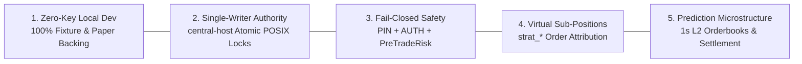

# Product Software Requirements Specification (SRS)

> **Document Standard**: IEEE 830-1998 / ISO/IEC/IEEE 29148:2018 | **Diátaxis Type**: Reference | **Status**: Canonical | **Owner**: Platform Engineering | **Review**: Continuous

---

## 1. Introduction

### 1.1 Purpose
This Software Requirements Specification (SRS) formally defines the functional requirements, architectural invariants, interface boundaries, and non-functional safety characteristics of the **Sovereign Local-First Quantitative Trading Platform**.

### 1.2 Document Conventions
- Requirements are uniquely identified using the convention `FR-PROD-xxx` for functional requirements and `NFR-PROD-xxx` for non-functional requirements.
- Requirement priority and constraint levels follow RFC 2119 keywords (`MUST`, `MUST NOT`, `SHOULD`, `MAY`).

### 1.3 Intended Audience & Reading Order
1. **Quantitative Researchers**: Sections 1, 2, 3.2, 3.4 (Alpha exploration, feature engineering, backtest modeling).
2. **Systems Engineers**: Sections 1, 2, 3.1, 4, 5 (Architecture invariants, native engine, fail-closed execution).
3. **Auditors & Operators**: Sections 2.1, 3.1, 5.2, 6 (Safety gates, PIN validation, verification matrix).

### 1.4 Project Scope
Sovereign provides an air-gapped, institutional-grade quantitative engineering station that unifies streaming binary time-series ingestion, autonomous AI strategy exploration, deterministic sub-position attribution, prediction market orderbook archiving, and fail-closed multi-broker paper/live execution.

### 1.5 References
- [Technical Architecture Specification](technical_spec.md)
- [Broker & Execution Gateway Specification](../../reference/specifications/execution_gateway_spec.md)
- [Pre-Trade Risk & Virtual Sub-Positions Specification](../../reference/specifications/sub_positions_risk_spec.md)
- [SOVT v1 Binary Storage Specification](../../reference/specifications/sovt_storage_spec.md)
- [Web REST & WebSocket API Specification](web_api.md)

---

## 2. Overall Description

### 2.1 Product Perspective & Five Core Architectural Invariants
Sovereign operates as a self-contained local-first station governed by five non-negotiable architectural invariants:

1. **Zero-Key Local Development**: Development, unit testing, and backtesting run keyless against recorded fixtures (`tests/fixtures/`, `storage/data/cache/last_fetch.json`) and virtual paper ledgers (`backend/gateway/src/paper_ledger.js`).
2. **Single-Writer Authority (`central-host`)**: Exactly one primary host holds write privileges for binary TS files (`storage/data/ts/*.bin`) protected by atomic POSIX locking (`O_EXCL`).
3. **Fail-Closed Execution Safety**: Live capital order dispatch strictly requires three layers: salted SHA-256 PIN matching, `SOVEREIGN_EXECUTION_AUTHORIZED=true`, and Pre-Trade Risk validation (<15µs evaluation latency).
4. **Virtual Sub-Positions Isolation**: Multi-strategy position inventory is segregated on single physical broker assets using deterministic attribution keys (`strat_<id>_<timeframe>_<timestamp>_<entropy>`).
5. **Prediction Market & L2 Microstructure Archiving**: High-frequency orderbook depth (Polymarket Gamma/CLOB) is archived to compressed 1-second JSONL snapshots with discrete oracle settlement.

### 2.2 Product Functions Summary
- High-speed ingestion and streaming two-pointer merging of tick/bar market data.
- Dual-mode C++20 vector backtesting (OpenMP accelerated) and Monte Carlo bootstrap resampling (`xorshift64`).
- Multi-broker trade execution across US Equities (Alpaca), Crypto, Prediction Markets (Polymarket), and Forex/Futures (MetaTrader 5).
- Dual-interface presentation via React-based Ink v7 TUI (DEC Mode 2026 synchronized) and React 19 web dashboard.

### 2.3 User Classes & Personas
- **Operator / Manual Trader**: Interactive portfolio monitoring, manual order dispatch via PIN gate, TUI operations.
- **Autonomous Strategy Agent**: Continuous loop parameter exploration, backtesting, and virtual paper execution.
- **Verification Agent / Auditor**: Structural contract checking, hygiene enforcement, zero-false-positive audit execution.

### 2.4 Operating Environment
- **Host OS**: POSIX-compliant Linux (Ubuntu 24.04 LTS on Proxmox VM / bare metal `hpdesk-1`).
- **Runtime**: Node.js v20 LTS / v22 LTS and Native C++20 (GCC 11+ / Clang 14+, CMake 3.20+).
- **Network**: Local airgapped loopback (`127.0.0.1:8787` for HTTP/WS; `127.0.0.1:8282` for MT5 TCP bridge).

### 2.5 Design & Implementation Constraints
- **Zero Python Runtime**: No Python virtual environments (`venv`) or Python runtimes in the core execution path.
- **Zero Cloud Lock-in**: All storage resides in local binary SOVT files, SQLite WAL warehouses, and local JSON caches.

---

## 3. Specific Functional Requirements

### 3.1 Platform Invariants & Execution Security
- **FR-PROD-001 (Zero-Key Offline Guarantee)**:
  - *Description*: The platform MUST execute all test suites, indicator computations, and backtests without network access or API credentials.
  - *Input*: Recorded fixture JSON files or synthetic bar feeds.
  - *Processing*: Route provider queries through `storage/data/cache/last_fetch.json` or in-memory fixtures.
  - *Output*: Verified backtest metrics or synthetic execution fills.
  - *Error Handling*: Throw explicit `ZeroKeyViolationError` if an unauthenticated external outbound request is made during offline mode.

- **FR-PROD-002 (Fail-Closed Execution Gate)**:
  - *Description*: Real-money order dispatch MUST fail closed unless all three authorization gates succeed simultaneously:
    1. Operator PIN matches salted SHA-256 environment hash.
    2. Environment flag `SOVEREIGN_EXECUTION_AUTHORIZED=true` is set.
    3. Pre-Trade Risk validation passes with evaluation latency <15µs.
  - *Error Handling*: Transition immediately to `EMERGENCY_HALT` state on missing quotes, heartbeat loss, or PIN failure.

- **FR-PROD-003 (Virtual Sub-Positions Attribution)**:
  - *Description*: The system MUST attribute trades to individual strategy instances using deterministic IDs: `strat_<id>_<timeframe>_<timestamp>_<entropy>`.
  - *Processing*: Segregate strategy PnL, drawdowns, and exits while reconciling consolidated net broker holdings.

### 3.2 Data Ingestion & Storage
- **FR-PROD-004 (Binary SOVT v1 Storage)**:
  - *Description*: Market bars MUST be stored in 48-byte packed IEEE-754 binary records under `storage/data/ts/*.bin`.
  - *Processing*: Sequential seek and binary search random access with $O(1)$ RAM streaming merger ($<5\text{MB}$ RSS).

- **FR-PROD-005 (Single-Writer POSIX Lock)**:
  - *Description*: Writes to storage indices MUST acquire an exclusive POSIX lock (`O_CREAT | O_EXCL | O_RDWR`) with exponential backoff on contention.

### 3.3 Quantitative Engine & Backtesting
- **FR-PROD-006 (Native Dual-Mode Vector Backtester)**:
  - *Description*: The C++20 engine MUST evaluate historical price series at $>100,000\text{ bars/sec}$ per core using OpenMP.
  - *Processing*: Factor execution drag (spread bps, maker/taker fees, linear slippage) and compute Sharpe, Sortino, and MaxDD metrics.

- **FR-PROD-007 (Monte Carlo Resampling)**:
  - *Description*: The system MUST compute 95th/99th percentile CVaR and drawdown distributions across 1,000–10,000 bootstrap iterations via `xorshift64`.

### 3.4 Broker Gateways & Order Execution
- **FR-PROD-008 (Multi-Broker Adaptation)**:
  - *Description*: Gateways MUST support Alpaca (Equities/Crypto), Polymarket (Prediction CLOB), MetaTrader 5 (NDJSON TCP bridge), and Paper Simulation.

---

## 4. External Interface Requirements

### 4.1 User Interfaces
- **TUI Dashboard**: Ink v7 React terminal interface running DEC Mode 2026 synchronized output (60 FPS flicker-free).
- **Web Dashboard**: React 19 + Vite + TailwindCSS running on native `node:http` (port 8787).

### 4.2 Hardware Interfaces
- x86_64 CPU with AVX2 SIMD extensions for vector backtesting acceleration.

### 4.3 Software Interfaces
- **Operating System**: POSIX file locking APIs (`O_EXCL`).
- **SQLite Engine**: SQLite 3 with WAL mode enabled for Social Alpha transcript storage.

### 4.4 Communication Protocols
- **HTTP/1.1 REST**: Native `node:http` router handling 40 routes with RBAC access control tiers (`public`, `read`, `trade`, `admin`).
- **WebSocket / SSE**: Real-time ticker streaming, portfolio updates, and telemetry feeds.
- **TCP NDJSON Bridge**: MetaTrader 5 terminal communication over local port 8282.

---

## 5. Non-Functional Requirements

### 5.1 Performance Requirements
- **NFR-PROD-001 (Pre-Trade Risk Latency)**: Pre-Trade Risk validation MUST complete in $<15\mu\text{s}$ in native C++20.
- **NFR-PROD-002 (Backtest Throughput)**: FrameBacktester MUST achieve $>100,000\text{ bars/sec}$ per CPU thread.
- **NFR-PROD-003 (TS Merger Memory Footprint)**: Binary time-series merger RSS MUST NOT exceed $5\text{MB}$ regardless of dataset size.

### 5.2 Safety & Security Requirements
- **NFR-PROD-004 (Airgapped Key Storage)**: Live API keys MUST NEVER be committed to version control and MUST reside solely on isolated production hardware (`hpdesk-1`).
- **NFR-PROD-005 (Fail-Closed Default)**: Any unhandled exception, missing quote feed, or lock contention timeout MUST default to an order rejection or trade halt.

### 5.3 Software Quality & Test Integrity
- **NFR-PROD-006 (Zero-False-Positive Test Gate)**: 100% of test suites (`npm test`, `npm run test:core`, `npm run test:structure`) MUST pass without skipped or mocked-away assertions.

---

## 6. Other Requirements & Verification Matrix

### 6.1 Data Dictionary & Schemas
- **`OhlcvBar`**: 48-byte packed struct (`ts_ms`, `open`, `high`, `low`, `close`, `volume` as IEEE-754 `f64` Little-Endian).
- **`SubPosition`**: In-memory and persisted position entity with fields: `id`, `strategy_id`, `symbol`, `qty`, `entry_price`, `timeframe`, `created_at`.

### 6.2 Verification & Acceptance Matrix
| Requirement ID | Description | Verification Method | Target Command / Suite |
|---|---|---|---|
| `FR-PROD-001` | Zero-Key Invariant | Automated Test | `npm run test:data` |
| `FR-PROD-002` | Fail-Closed Safety | Automated Test | `npm run test:structure` |
| `FR-PROD-003` | Virtual Sub-Positions | Integration Test | `node tests/run_node_tests.js tests/runtime/sub_positions.test.js` |
| `FR-PROD-004` | SOVT v1 Storage | Binary Contract Test | `npm run test:data` |
| `FR-PROD-005` | Single-Writer POSIX Lock | Concurrency Test | `npm run test:structure` |
| `FR-PROD-006` | Native Vector Backtester | CTest Benchmark | `npm run test:core` (34 CTests) |
| `FR-PROD-007` | Monte Carlo Resampling | CTest Unit Test | `npm run test:core` |
| `FR-PROD-008` | Multi-Broker Adaptation | Gateway Suite | `npm run test:api` |
| `NFR-PROD-001` | Risk Gate Latency (<15µs) | CTest Performance Test | `backend/core/tests/test_pre_trade_risk.cpp` |
| `NFR-PROD-002` | Backtest Throughput | CTest Performance Test | `backend/core/tests/test_frame_backtester.cpp` |
| `NFR-PROD-003` | TS Merger Memory ($<5\text{MB}$) | C++ Memory Test | `backend/core/tests/test_binary_ts_merger.cpp` |
| `NFR-PROD-006` | Zero-False-Positive Gate | Integrity Scanner | `npm run hygiene && npm run test:structure` |
