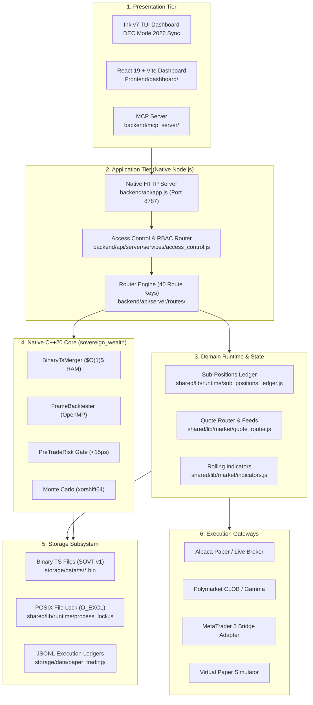
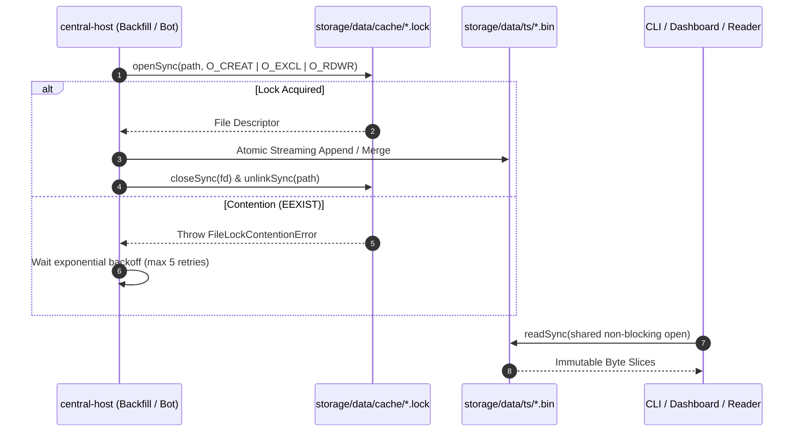

# Technical Architecture Specification

> **Diátaxis Type**: Reference & Specification | **Status**: Canonical | **Owner**: Core Engineering | **Review**: Continuous

## 1. Multi-Tier System Boundaries

Sovereign is structured into six strictly bounded functional tiers:

---

## 2. Binary Time-Series Format (SOVT Version 1)

All high-density historical and streaming market data is serialized to fixed-width IEEE-754 binary records on disk under `storage/data/ts/*.bin`.

### Header Layout (8 Bytes)

| Byte Offset | Field | Type | Encoded Value | Purpose |
|---|---|---|---|---|
| `0x00..0x03` | Magic Bytes | 4 bytes ASCII | `0x53 0x4F 0x56 0x54` (`SOVT`) | File type identification |
| `0x04` | Version | `uint8_t` | `0x01` | SOVT format version |
| `0x05..0x07` | Reserved | 3 bytes | `0x00 0x00 0x00` | Header padding & alignment |

- **Offset `0x00..0x03`**: Magic identifier ASCII `SOVT` (`0x53, 0x4F, 0x56, 0x54`).
- **Offset `0x04`**: Version byte (`0x01` for Version 1).
- **Offset `0x05..0x07`**: 3 reserved padding zero bytes (`0x00, 0x00, 0x00`).

### Record Layout (48 Bytes per Bar)
Each bar record is exactly 48 bytes packed, 8-byte aligned, little-endian:

| Field Name | Offset (Bytes) | Length | Data Type | Description |
|---|---|---|---|---|
| `timestamp` | `0x00..0x07` | 8 | `uint64_t` | Epoch timestamp (milliseconds or seconds) |
| `open` | `0x08..0x0F` | 8 | `double` | Opening bar price (IEEE-754) |
| `high` | `0x10..0x17` | 8 | `double` | Maximum bar price (IEEE-754) |
| `low` | `0x18..0x1F` | 8 | `double` | Minimum bar price (IEEE-754) |
| `close` | `0x20..0x27` | 8 | `double` | Closing bar price (IEEE-754) |
| `volume` | `0x28..0x2F` | 8 | `double` | Cumulative bar volume (IEEE-754) |

### Memory & File Calculations
- 1 year of 1-minute bars: $375 \times 252 = 94,500\text{ bars} \times 48\text{ bytes} \approx 4.53\text{ MB}$.
- 10 years of 1-minute crypto bars: $5,256,000\text{ bars} \times 48\text{ bytes} \approx 252.28\text{ MB}$.
- Seek complexity: $O(1)$ random access via binary search on timestamp offsets:

  $$\text{Offset}(i) = 8 + (i \times 48)$$

---

## 3. Concurrency & POSIX File Locking Architecture

To guarantee single-writer authority without external database daemons, Sovereign implements POSIX file locks via `node:fs` open flags:

---

## 4. Quantitative Engine & Drag Modeling

### Execution Drag Formulation
Simulated fills compute realistic transaction drag factoring bid-ask spread, linear market impact slippage, and broker maker/taker fees:

$$\text{Effective Price}_{\text{long}} = P_{\text{close}} \times \left(1 + \frac{\text{Spread}_{\text{bps}}}{20,000}\right) \times \left(1 + \text{Slippage}\right)$$

$$\text{Cost}_{\text{total}} = \text{Notional} \times \left(\frac{\text{Fee}_{\text{bps}}}{10,000} + \frac{\text{Spread}_{\text{bps}}}{20,000} + \text{Slippage}\right)$$

Where default cost parameters:

- Equities (Liquid ETF): $\text{Spread} = 2\text{ bps}$, $\text{Fee} = 0\text{ bps}$ (Alpaca zero-commission), $\text{Slippage} = 3\text{ bps}$.
- Crypto (Spot): $\text{Spread} = 5\text{ bps}$, $\text{Fee} = 10\text{ bps}$ (Gate.io taker), $\text{Slippage} = 5\text{ bps}$.

### Monte Carlo Bootstrap Resampling
- Algorithm: `xorshift64` pseudo-random number generator seeded with entropy.
- Execution: 1,000 to 10,000 independent trade-sequence permutations with replacement.
- Metrics: 95th and 99th percentile conditional Value-at-Risk (CVaR), maximum drawdown distribution, and Sharpe ratio confidence intervals.

---

## 5. Toolchain & Runtime Baseline

| Component | Minimum Version | Verified Toolchain | Purpose |
|---|---|---|---|
| Node.js | `v20.0.0+` | `v20.x`, `v22.x` | Application server, TUI, CLI, broker gateways |
| C++ Compiler | `C++20` | `clang++ 14+`, `g++ 11+` | Native core engine compilation |
| CMake | `3.20.0+` | `3.25.1+` | Build system configuration (`CMakeLists.txt`) |
| OpenMP | Standard OpenMP | `libgomp`, `libomp` | Multi-threaded backtesting & grid search |
| OS Platform | POSIX / Linux | Ubuntu 24.04 LTS (Proxmox) | Production deployment host (`hpdesk-1`) |

---

## 6. Broker Execution & Gateway Specifications

| Gateway Adapter | Protocol / Transport | Supported Instruments | Position Accounting | Strategy Attribution |
|---|---|---|---|---|
| **Alpaca** (`AlpacaAdapter`) | REST + WebSocket | US Equities, Crypto | Broker Net Holdings | `client_order_id` (36 chars) |
| **Polymarket** (`PolymarketAdapter`) | REST (CLOB) | Binary Prediction Contracts | Virtual Paper Ledger | Salted Nonce / Proxy Wallet |
| **MetaTrader 5** (`Mt5Adapter`) | TCP Server 8282 (NDJSON) | FX, Commodities, Indices, CFDs | Broker Net/Hedged Tickets | 64-bit `ORDER_MAGIC` Bitmask |
| **Simulation** (`SimulationAdapter`) | In-Memory Engine | All Synthetic Feeds | Local Ledger State | Synthetic Nonce |

