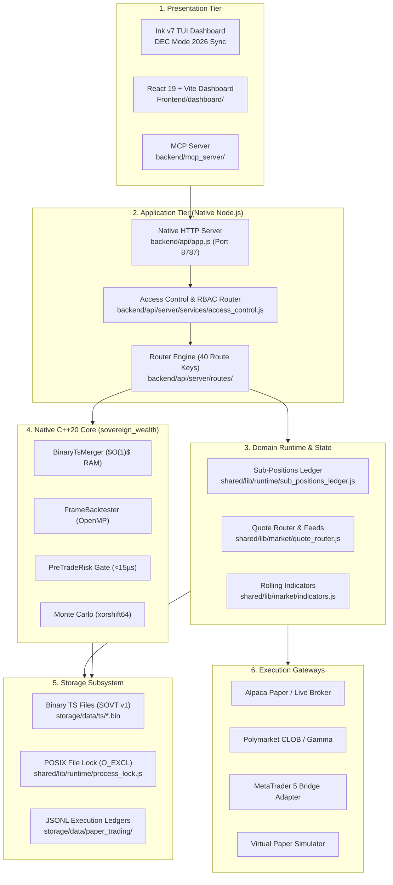

# Technical Architecture Software Requirements Specification (SRS)

> **Document Standard**: IEEE 830-1998 / ISO/IEC/IEEE 29148:2018 | **Diátaxis Type**: Reference | **Status**: Canonical | **Owner**: Core Engineering | **Review**: Continuous

---

## 1. Introduction

### 1.1 Purpose
This Software Requirements Specification (SRS) specifies the architectural constraints, subsystem boundaries, binary serialization formats, concurrency rules, and performance envelopes for the **Sovereign C++20 / Node.js Hybrid Engine**.

### 1.2 Document Conventions
- Functional requirements are tagged `FR-TECH-xxx` and non-functional requirements are tagged `NFR-TECH-xxx`.
- Normative requirements follow RFC 2119 keyword semantics (`MUST`, `MUST NOT`, `SHOULD`, `MAY`).

### 1.3 Intended Audience
Systems architects, C++20 core engineers, Node.js runtime developers, and devops engineers.

### 1.4 System Scope
Encompasses the 6-tier functional architecture: Presentation Tier, Native HTTP Application Tier, Domain Runtime, Native C++20 Core (`sovereign_wealth`), Storage Subsystem (SOVT v1 binary files and SQLite WAL), and Execution Broker Gateways.

### 1.5 References
- [Product Software Requirements Specification](product_spec.md)
- [SOVT v1 Binary Storage Specification](../../reference/specifications/sovt_storage_spec.md)
- [Pre-Trade Risk & Sub-Positions Specification](../../reference/specifications/sub_positions_risk_spec.md)
- [Broker & Execution Gateway Specification](../../reference/specifications/execution_gateway_spec.md)

---

## 2. Overall Description

### 2.1 Multi-Tier System Boundaries & Data Flow
Sovereign enforces a strict directional dependency flow across six functional tiers:

### 2.2 Subsystem Functions Summary
- **Tier 1 (Presentation)**: Interactive command entry, streaming telemetry visualization, agent tool interfaces.
- **Tier 2 (Application)**: Lightweight in-process route dispatch without heavyweight web frameworks.
- **Tier 3 (Domain Runtime)**: In-memory market indicator caches, quote routing, and virtual sub-position accounting.
- **Tier 4 (Native Core)**: High-performance vectorized analytics, Monte Carlo simulation, and microsecond risk checks.
- **Tier 5 (Storage)**: Packed binary time-series files (`.bin`) and SQLite databases in WAL mode.
- **Tier 6 (Execution)**: Broker protocol adapters with fail-closed safety circuits.

---

## 3. Specific Functional Requirements

### 3.1 Binary Time-Series Format (SOVT Version 1)
- **FR-TECH-001 (SOVT v1 Header Contract)**:
  - *Description*: Every binary time-series file MUST begin with an 8-byte header:
    - Offset `0x00..0x03`: ASCII magic identifier `SOVT` (`0x53, 0x4F, 0x56, 0x54`).
    - Offset `0x04..0x07`: Unsigned 32-bit Little-Endian integer (`uint32_t`) storing the contiguous record count.
  - *Error Handling*: Files with invalid magic bytes MUST be rejected immediately with `InvalidBinaryHeaderError`.

- **FR-TECH-002 (48-Byte Packed Bar Record Layout)**:
  - *Description*: Contiguous market records MUST be stored as packed 48-byte slices (`#pragma pack(push, 1)`), 8-byte aligned, little-endian IEEE-754:

| Offset | Length | Data Type | Field | Description |
|---|---|---|---|---|
| `0x00..0x07` | 8 bytes | `double` (LE) | `ts_ms` | Epoch millisecond timestamp (UTC) |
| `0x08..0x0F` | 8 bytes | `double` (LE) | `open` | Opening price |
| `0x10..0x17` | 8 bytes | `double` (LE) | `high` | Maximum price |
| `0x18..0x1F` | 8 bytes | `double` (LE) | `low` | Minimum price |
| `0x20..0x27` | 8 bytes | `double` (LE) | `close` | Closing price |
| `0x28..0x2F` | 8 bytes | `double` (LE) | `volume` | Cumulative bar volume |

- **FR-TECH-003 (Random Access Seek & Stream Merger)**:
  - *Description*: Sequential and binary search seeks MUST compute record offsets in $O(1)$ time: $\text{Offset}(i) = 8 + (i \times 48)$.
  - *Processing*: The streaming two-pointer merger (`BinaryTsMerger`) MUST merge multiple time-series files in a single pass with $O(1)$ RAM overhead ($<5\text{MB}$ RSS).

### 3.2 Single-Writer Concurrency & Locking
- **FR-TECH-004 (POSIX Atomic File Lock)**:
  - *Description*: Writers to time-series and cache files MUST acquire an atomic POSIX lock using `openSync(path, O_CREAT | O_EXCL | O_RDWR)`.
  - *Concurrency*: Readers MUST open files with shared non-blocking read flags (`O_RDONLY`).
  - *Error Handling*: On contention (`EEXIST`), the writer MUST back off exponentially up to 5 retries before throwing `FileLockContentionError`.

### 3.3 Quantitative Engine & Drag Modeling
- **FR-TECH-005 (Execution Drag Computation)**:
  - *Description*: Backtester fills MUST incorporate spread, broker fees, and linear slippage:

$$\text{Effective Price}_{\text{long}} = P_{\text{close}} \times \left(1 + \frac{\text{Spread}_{\text{bps}}}{20,000}\right) \times \left(1 + \text{Slippage}\right)$$

$$\text{Cost}_{\text{total}} = \text{Notional} \times \left(\frac{\text{Fee}_{\text{bps}}}{10,000} + \frac{\text{Spread}_{\text{bps}}}{20,000} + \text{Slippage}\right)$$

- **FR-TECH-006 (Monte Carlo Resampling)**:
  - *Description*: Resampling MUST use `xorshift64` to generate 1,000–10,000 trade sequence permutations with replacement to derive 95th/99th percentile CVaR.

---

## 4. External Interface Requirements

### 4.1 Native Application Server Interface
- Native `node:http` server running on port `8787` with zero Express framework dependencies.
- Supports 40 discrete route keys categorized into RBAC capability tiers (`public`, `read`, `trade`, `admin`).

### 4.2 Broker Protocol Adapters
| Adapter | Transport Protocol | Instruments | Attribution Signature |
|---|---|---|---|
| `AlpacaAdapter` | HTTPS / WSS | Equities, Crypto | `client_order_id` (36 chars) |
| `PolymarketAdapter` | HTTPS CLOB / Gamma | Prediction Markets | EIP-712 Salted Nonce |
| `Mt5Adapter` | TCP Port 8282 (NDJSON) | Forex, Indices, CFDs | 64-bit `ORDER_MAGIC` |
| `PaperLedger` | In-Memory / JSONL | All Instruments | Synthetic Nonce |

---

## 5. Non-Functional Requirements

### 5.1 Performance & Latency Requirements
- **NFR-TECH-001 (Pre-Trade Risk Latency)**: Native C++ PreTradeRisk gate evaluation latency MUST be $<15\mu\text{s}$.
- **NFR-TECH-002 (Backtest Throughput)**: FrameBacktester MUST achieve $>100,000\text{ bars/sec}$ per CPU core.
- **NFR-TECH-003 (Sequential Read Speed)**: Binary TS reader MUST achieve $>50,000,000\text{ bars/sec}$ via memory-mapped sequential scan.
- **NFR-TECH-004 (API Response Latency)**: P95 response time on REST endpoints MUST be $<10\text{ms}$.

### 5.2 System Reliability & Portability
- **NFR-TECH-005 (Toolchain Baseline)**: The C++ codebase MUST compile warning-free with `C++20` on GCC 11+ and Clang 14+ via CMake 3.20+.
- **NFR-TECH-006 (Node.js Portability)**: All JavaScript/TypeScript modules MUST run natively on Node.js LTS v20.x and v22.x without binary native addons outside the pre-compiled `sovereign_wealth` executable.

---

## 6. Other Requirements & Verification Matrix

### 6.1 Data Dictionary
- `SOVT_Header`: `[char magic[4], uint32_t record_count]` (8 bytes).
- `SOVT_Record`: `[double ts_ms, double open, double high, double low, double close, double volume]` (48 bytes).

### 6.2 Verification Matrix
| Requirement ID | Description | Verification Method | Target Command / Test |
|---|---|---|---|
| `FR-TECH-001` | SOVT v1 Header Magic | Binary Format Test | `npm run test:data` |
| `FR-TECH-002` | 48-byte Packed Bar | CTest Unit Test | `backend/core/tests/test_binary_ts_reader.cpp` |
| `FR-TECH-003` | Two-Pointer TS Merger | Memory & Speed CTest | `backend/core/tests/test_binary_ts_merger.cpp` |
| `FR-TECH-004` | Atomic POSIX Lock | Concurrency Stress Test | `npm run test:structure` |
| `FR-TECH-005` | Cost & Drag Model | CTest Drag Test | `backend/core/tests/test_cost_model.cpp` |
| `FR-TECH-006` | Monte Carlo Resampling | CTest Stats Test | `backend/core/tests/test_stats_engine.cpp` |
| `NFR-TECH-001` | Risk Gate Latency (<15µs) | Benchmark Test | `backend/core/tests/test_pre_trade_risk.cpp` |
| `NFR-TECH-002` | Backtest Throughput | Vector Benchmark | `backend/core/tests/test_frame_backtester.cpp` |
| `NFR-TECH-003` | Sequential Read Speed | Reader Benchmark | `backend/core/tests/test_binary_ts_reader.cpp` |
| `NFR-TECH-005` | C++20 Toolchain Build | Native Compilation | `npm run native:build` (34/34 CTests) |
