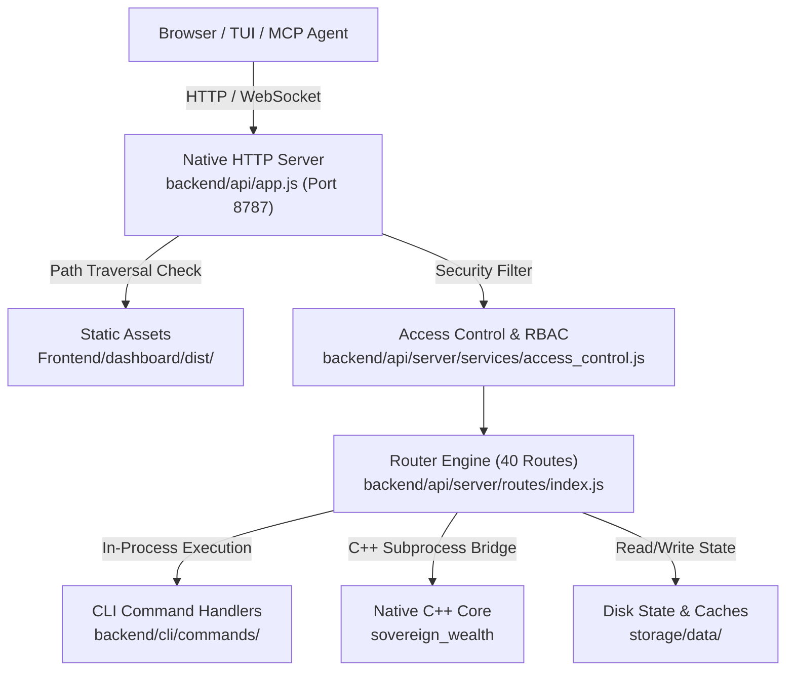

# Web & API Bridge Specification

> **Diátaxis Type**: Reference & Specification | **Status**: Canonical | **Engine**: Native `node:http` (Not Express) | **Review**: Continuous

## 1. Runtime Architecture

The Sovereign Web & API Bridge runs as a standalone daemon or containerized service bridging browser clients, automated CLI commands, Model Context Protocol (MCP) agents, and the native C++ engine.

### Server Characteristics
- **Entrypoint**: `backend/api/app.js` instantiated via standard `node:http.createServer()`.
- **Default Port**: `8787` (configurable via `SOVEREIGN_PORT` or `PORT`).
- **Zero Express Dependency**: Uses native URL parsing, manual body consumption buffers with prototype pollution guards, and explicit streaming response writers.
- **Static Asset Serving**: When a route does not match the active API route table, requests fall through to `serveStatic()`, serving the built React 19 dashboard from `Frontend/dashboard/dist/` guarded by strict path containment (`filePath.startsWith(WEB_PUBLIC_ROOT)`).

---

## 2. Security & RBAC Capability Model

The API enforces strict route protection, token gating, and Model Context Protocol (MCP) restrictions:

| Capability Tier | Authentication Requirement | Allowed Route Patterns |
|---|---|---|
| **Public (`*`)** | None (Unauthenticated) | `/health`, `/api/status`, `/api/client/status`, `/api/public/*` |
| **`research:read`** | `x-sovereign-token` or valid Supabase session | `/api/data/*`, `/api/universe`, `/api/indicators`, `/api/market/*`, `/api/quotes/*`, `/api/cache/*` |
| **`research:run`** | `x-sovereign-token` with write capability | `/api/backtest`, `/api/signal/promote`, `/api/combined-analysis/*` |
| **`execution:paper`** | `x-sovereign-token` with paper trade capability | `/api/bot/status`, `/api/bot/cycle`, `/api/combined-analysis/paper-cycle` |
| **`execution:admin`** | Signed admin bearer token + salted PIN | `/api/bot/sell`, `/api/kill-switch`, `/api/system/*`, `/api/auth/*` |

### MCP Agent Gating (`isMcpAllowed`)
AI agents accessing the platform via MCP are restricted from invoking dangerous operational endpoints (`/api/kill-switch`, `/api/bot/sell`) without explicit human confirmation.

---

## 3. Complete Route Catalog (All 40 Active Route Keys)

The canonical route map is declared in `backend/api/server/routes/index.js`, routing requests across 39 specialized handler modules:

### Category 1: Status & System Health (6 Routes)

#### `GET /health`
- **Handler**: `backend/api/server/routes/status/health.js`
- **Capability**: Public
- **Description**: Lightweight health probe for Docker Compose, Kubernetes, and load balancers.
- **Response**: `{ "ok": true, "status": "healthy", "uptime_s": 12450.2, "memory": { "heap_used_mb": 42.1, "rss_mb": 78.4 } }`

#### `GET /api/status`
- **Handler**: `backend/api/server/routes/status/status.js`
- **Capability**: Public
- **Description**: Aggregated system status summary covering quote feed freshness, CLI availability, and core engine status.
- **Response**: `{ "ok": true, "degraded": false, "core_engine": "available", "quotes": { "stale": false } }`

#### `GET /api/client/status`
- **Handler**: `backend/api/server/routes/status/client_status.js`
- **Capability**: Public
- **Description**: Browser client handshake route returning web interface build version and active configuration capabilities.

#### `GET /api/run/status`
- **Handler**: `backend/api/server/routes/status/run_status.js`
- **Capability**: `research:read`
- **Description**: Returns execution status of background backtests, mass-bt jobs, and strategy exploration routines.

#### `GET /api/system/status`
- **Handler**: `backend/api/server/routes/system/system.js`
- **Capability**: `execution:admin`
- **Description**: Comprehensive system telemetry including disk usage across `storage/data/ts/`, active file locks, and container cgroup utilization.

#### `GET /api/system/service-health`
- **Handler**: `backend/api/server/routes/system/service_health.js`
- **Capability**: `execution:admin`
- **Description**: Multi-service soak test health monitor checking `sv-web`, `sv-bot-alpaca-paper`, `sv-backfill`, and `sv-strategy-explorer`.

---

### Category 2: Market Data & Storage Subsystem (10 Routes)

#### `GET /api/data/summary`
- **Handler**: `backend/api/server/routes/data/data_summary.js`
- **Capability**: `research:read`
- **Query Parameters**: `symbol` (e.g. `AAPL`), `timeframe` (default `1d`), `max_bars` (default `100`).
- **Description**: Returns validated OHLCV bar summaries, latest close, volatility, and volume indicators.

#### `GET /api/universe`
- **Handler**: `backend/api/server/routes/data/universe.js`
- **Capability**: `research:read`
- **Description**: Returns canonical asset universe split into Equities, Crypto, and Prediction Markets.

#### `GET /api/cache/universe`
- **Handler**: `backend/api/server/routes/data/universe.js`
- **Capability**: `research:read`
- **Description**: Returns cached universe metadata and last ingestion timestamp.

#### `GET /api/indicators`
- **Handler**: `backend/api/server/routes/data/indicators.js`
- **Capability**: `research:read`
- **Query Parameters**: `symbol`, `timeframe`, `indicators` (comma-separated: `rsi,macd,bollinger,atr`).
- **Description**: Computes and streams rolling technical indicators calculated over the requested binary TS dataset.

#### `GET /api/quotes/status`
- **Handler**: `backend/api/server/routes/data/quotes.js`
- **Capability**: `research:read`
- **Description**: Reports real-time quote feed latency, websocket connection states, and fallback status across Yahoo and Binance.

#### `GET /api/cache/list`
- **Handler**: `backend/api/server/routes/data/cache_list.js`
- **Capability**: `research:read`
- **Description**: Inspects disk storage under `storage/data/cache/`, returning file sizes and modification timestamps.

#### `GET /api/market/monitor`
- **Handler**: `backend/api/server/routes/market/market_monitor.js`
- **Capability**: `research:read`
- **Description**: Real-time ticker monitor snapshot delivering bid/ask spreads, daily percent changes, and volume surges.

#### `GET /api/analytics`
- **Handler**: `backend/api/server/routes/market/analytics.js`
- **Capability**: `research:read`
- **Description**: Cross-asset return distributions, annualized volatility, and beta against benchmark (SPY).

#### `GET /api/public/market-summary`
- **Handler**: `backend/api/server/routes/public/public_market_summary.js`
- **Capability**: Public
- **Description**: Unauthenticated market overview for landing page and monitoring dashboards.

#### `GET /api/public/freshness`
- **Handler**: `backend/api/server/routes/public/public_freshness.js`
- **Capability**: Public
- **Description**: Public timestamp reporting data ingestion freshness and SLA compliance.

---

### Category 3: Quantitative Alpha, Strategy & Backtesting (14 Routes)

#### `GET /api/backtest`
- **Handler**: `backend/api/server/routes/market/backtest.js`
- **Capability**: `research:run`
- **Query Parameters**: `strategy`, `symbol`, `timeframe`, `cost_bps`, `engine` (`native` | `fallback`).
- **Description**: Dispatches backtest run to C++20 `FrameBacktester` (or JS fallback), returning equity curve, Sharpe, Sortino, max drawdown, and trade log.

#### `GET /api/correlation`
- **Handler**: `backend/api/server/routes/market/correlation.js`
- **Capability**: `research:read`
- **Query Parameters**: `symbols` (comma-separated), `timeframe`, `max_bars`.
- **Description**: Computes Pearson correlation matrix with clamped eigenvalues using C++ `correlation_engine`.

#### `GET /api/backend/stats`
- **Handler**: `backend/api/server/routes/market/stats.js`
- **Capability**: `research:read`
- **Description**: Surfaces high-performance stats from the C++ analytics engine.

#### `GET /api/backend/portfolio`
- **Handler**: `backend/api/server/routes/system/portfolio.js`
- **Capability**: `research:read`
- **Description**: Aggregated portfolio exposure, asset weights, and sector concentration.

#### `GET /api/signal`
- **Handler**: `backend/api/server/routes/market/signal.js`
- **Capability**: `research:read`
- **Description**: Evaluates latest bars across active strategies and produces tactical signal recommendations. Signals expire automatically after `SOVEREIGN_SIGNAL_REPORT_MAX_AGE_MS` (24h).

#### `POST /api/signal/promote`
- **Handler**: `backend/api/server/routes/market/signal_promote.js`
- **Capability**: `research:run`
- **Description**: Authenticated promotion of an exploratory candidate signal to paper-trading eligibility.

#### `GET /api/strategies`
- **Handler**: `backend/api/server/routes/market/strategies.js`
- **Capability**: `research:read`
- **Description**: Returns all registered strategies from `config/strategies/` and `config/strategies/automated/`.

#### `GET /api/sigma-band`
- **Handler**: `backend/api/server/routes/market/sigma_band.js`
- **Capability**: `research:read`
- **Description**: Computes rolling standard deviation envelopes and dynamic mean-reversion bands.

#### `GET /api/bias`
- **Handler**: `backend/api/server/routes/market/bias.js`
- **Capability**: `research:read`
- **Description**: Evaluates directional multi-timeframe trend bias.

#### `GET /api/scorecard`
- **Handler**: `backend/api/server/routes/market/scorecard.js`
- **Capability**: `research:read`
- **Description**: Quantitative scorecard grading strategies on win rate, profit factor, drawdown recovery, and Sharpe ratio.

#### `GET /api/combined-analysis`
- **Handler**: `backend/api/server/routes/market/combined_analysis.js`
- **Capability**: `research:read`
- **Description**: Multi-model ensemble analysis combining technical indicators, macro regime filters, and statistical bias.

#### `POST /api/combined-analysis/promote`
- **Handler**: `backend/api/server/routes/market/combined_promote.js`
- **Capability**: `research:run`
- **Description**: Promotes combined analysis candidates into registered strategy YAML configurations.

#### `POST /api/combined-analysis/paper-cycle`
- **Handler**: `backend/api/server/routes/market/combined_paper_cycle.js`
- **Capability**: `execution:paper`
- **Description**: Triggers an on-demand paper trading cycle for the combined analysis candidate.

#### `GET /api/public/research-summary`
- **Handler**: `backend/api/server/routes/public/public_research_summary.js`
- **Capability**: Public
- **Description**: Public summary of active research hypotheses and benchmark returns.

---

### Category 4: Bot Execution & Risk Gating (4 Routes)

#### `GET /api/bot/status`
- **Handler**: `backend/api/server/routes/bot/bot_status.js`
- **Capability**: `execution:paper`
- **Description**: Live status of trading bots (`alpaca_paper`, `polymarket_paper`), including sub-position ledger holdings, open orders, and cash balances.

#### `POST /api/bot/cycle`
- **Handler**: `backend/api/server/routes/bot/bot_cycle.js`
- **Capability**: `execution:paper`
- **Description**: Forces immediate execution cycle for paper trading bot. Validates pre-trade risk before submitting fractional orders.

#### `POST /api/bot/sell`
- **Handler**: `backend/api/server/routes/bot/bot_sell.js`
- **Capability**: `execution:admin`
- **Body**: `{ "symbol": "AAPL", "quantity": 10, "pin": "..." }`
- **Description**: Emergency order to close or trim sub-position for a specific symbol. Requires admin PIN verification.

#### `POST /api/kill-switch`
- **Handler**: `backend/api/server/routes/system/kill_switch.js`
- **Capability**: `execution:admin`
- **Body**: `{ "action": "HALT" | "RESUME", "pin": "..." }`
- **Description**: Emergency platform circuit breaker. Cancels all open orders across brokers, sets execution state to suspended, and locks ledger.

---

### Category 5: Account & Infrastructure Operations (6 Routes)

#### `GET /api/auth/status`
- **Handler**: `backend/api/server/routes/account/auth.js`
- **Capability**: Public
- **Description**: Returns current operator authentication status and active role permissions.

#### `POST /api/auth/session/reauth`
- **Handler**: `backend/api/server/routes/account/session_reauth.js`
- **Capability**: Public
- **Description**: Reauthenticates session with refreshed bearer token.

#### `GET /api/database/status`
- **Handler**: `backend/api/server/routes/account/database.js`
- **Capability**: `execution:admin`
- **Description**: Checks Supabase sync status, local paper ledger integrity, and checksum validation.

#### `GET /api/supabase/config`
- **Handler**: `backend/api/server/routes/account/supabase_config.js`
- **Capability**: Public
- **Description**: Returns safe, unprivileged public Supabase client configuration for dashboard telemetry.

#### `GET /api/config`
- **Handler**: `backend/api/server/routes/account/config.js`
- **Capability**: `research:read`
- **Description**: Returns sanitized system runtime configuration parameters.

#### `GET /api/system/infra`
- **Handler**: `backend/api/server/routes/system/infra.js`
- **Capability**: `execution:admin`
- **Description**: Streams Docker container operational logs and runtime status without shell interpolation.
