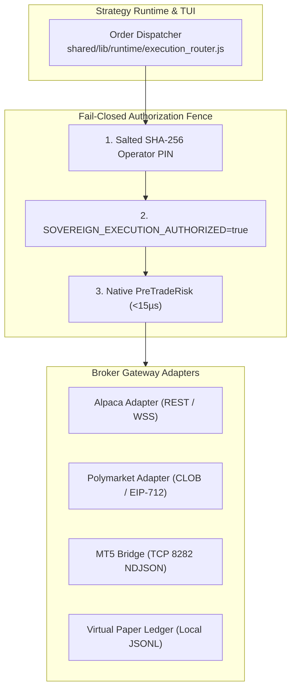

# Broker & Execution Gateway Software Requirements Specification (SRS)

> **Document Standard**: IEEE 830-1998 / ISO/IEC/IEEE 29148:2018 | **Diátaxis Type**: Reference & Specification | **Status**: Canonical | **Owner**: Platform Engineering | **Review**: Continuous

---

## 1. Introduction

### 1.1 Purpose
This Software Requirements Specification (SRS) defines the functional requirements, communication protocols, order lifecycle state machines, authorization gates, and fail-closed safety circuits for the **Sovereign Multi-Broker Execution Gateway Subsystem**.

### 1.2 Document Conventions
- Requirements are uniquely identified using `FR-GW-xxx` (Functional) and `NFR-GW-xxx` (Non-Functional).
- RFC 2119 keywords (`MUST`, `MUST NOT`, `SHOULD`, `MAY`) define mandatory architectural contracts.

### 1.3 Intended Audience
Execution engineers, broker integration specialists, algorithmic trading developers, and compliance auditors.

### 1.4 System Scope
Encompasses the four primary execution adapters:
1. **Alpaca Gateway** (`AlpacaAdapter`): US Equities and Crypto via REST and WebSocket.
2. **Polymarket Gateway** (`PolymarketAdapter`): Prediction market CLOB via Gamma and EIP-712 signing.
3. **MetaTrader 5 Gateway** (`Mt5Adapter`): Forex, commodities, and index CFDs via local TCP port 8282 NDJSON bridge.
4. **Virtual Paper Simulator** (`PaperLedger`): Local-first keyless simulation ledger with deterministic fill modeling.

### 1.5 References
- [Product Software Requirements Specification](product_specification.md)
- [Technical Architecture Specification](technical_specification.md)
- [Pre-Trade Risk & Sub-Positions Specification](sub_positions_risk_spec.md)

---

## 2. Overall Description

### 2.1 System Topology & Gateway Architecture
Execution gateways isolate strategy logic from broker-specific protocols while enforcing platform-wide fail-closed invariants:

### 2.2 Product Functions Summary
- Order dispatch, status reconciliation, and cancel-replace workflows.
- Dynamic fractional step sizing (0.001 for equities, 0.0001 for crypto).
- Heartbeat monitoring and automatic cancel-on-disconnect protection.
- Checksummed paper trading ledger maintaining virtual balances and fills.

### 2.3 Operating Environment
- POSIX Linux host with secure environment credential storage.
- Local TCP loopback (`127.0.0.1:8282`) for the MT5 Windows VM bridge.

---

## 3. Specific Functional Requirements

### 3.1 Authorization & Safety Circuits
- **FR-GW-001 (Three-Tier Fail-Closed Execution Gate)**:
  - *Description*: Live order submission to external brokers MUST fail closed unless all three authorization checks succeed:
    1. Operator PIN validation matches salted SHA-256 hash in process environment.
    2. Process environment variable `SOVEREIGN_EXECUTION_AUTHORIZED` evaluates strictly to string `"true"`.
    3. C++ PreTradeRisk gate validates drawdown (<15%), position limits, and quote freshness (<15µs).
  - *Error Handling*: Failure of any tier MUST abort the order and raise `ExecutionAuthorizationError`.

- **FR-GW-002 (Emergency Kill Switch)**:
  - *Description*: Activation of `/api/kill-switch` or CLI `sovereign kill-switch` MUST send immediate mass-cancel signals to all active broker gateways and freeze local ledgers.

### 3.2 Order Lifecycle & Attribution
- **FR-GW-003 (Deterministic Order Attribution Tagging)**:
  - *Description*: Every submitted order MUST carry a deterministic client order identifier mapping to its parent strategy:
    - Alpaca: `client_order_id = strat_<id>_<timeframe>_<timestamp>_<entropy>` (max 36 chars).
    - MT5: 64-bit `ORDER_MAGIC` bitmask encoding strategy ID and timeframe.
    - Polymarket: Salted nonce mapping to local order metadata.

- **FR-GW-004 (Idempotent Order Submission)**:
  - *Description*: Gateways MUST reject duplicate client order IDs to prevent duplicate execution during network retry cycles.

### 3.3 Broker Protocol Adapters
- **FR-GW-005 (Alpaca REST & Streaming Gateway)**:
  - *Description*: Ingest account portfolio balance, buying power, and position inventory. Stream trade fill updates via WebSocket.
- **FR-GW-006 (Polymarket EIP-712 Gateway)**:
  - *Description*: Sign binary prediction market limit orders via Ethereum wallet EIP-712 structured data standards and dispatch to CLOB REST endpoint.
- **FR-GW-007 (MetaTrader 5 NDJSON TCP Bridge)**:
  - *Description*: Maintain non-blocking TCP client connection to port 8282, dispatching framed NDJSON commands (`TRADE_OPEN`, `TRADE_CLOSE`, `ACCOUNT_INFO`).
- **FR-GW-008 (Virtual Paper Ledger)**:
  - *Description*: Simulate fills locally against real-time bid/ask quotes with simulated execution drag (spread and slippage), writing checksummed records to `storage/data/paper_trading/`.

---

## 4. External Interface Requirements

### 4.1 Broker Protocols
| Gateway | Transport Protocol | Authentication | Supported Asset Classes |
|---|---|---|---|
| `AlpacaAdapter` | HTTPS / WSS | `APCA-API-KEY-ID` + Secret | US Equities, Spot Crypto |
| `PolymarketAdapter` | HTTPS REST | EIP-712 Signature + API Key | Binary Prediction Contracts |
| `Mt5Adapter` | TCP (NDJSON) | Localhost IP Fence | FX, Spot Metals, Index CFDs |
| `PaperLedger` | In-Process JS | Zero-Key Local | All Instruments |

### 4.2 Error Handling & State Transitions
Order status states MUST follow deterministic finite state machine:
`PENDING_SUBMIT` $\rightarrow$ `SUBMITTED` $\rightarrow$ `ACCEPTED` $\rightarrow$ (`FILLED` | `PARTIALLY_FILLED` | `CANCELLED` | `REJECTED`).

---

## 5. Non-Functional Requirements

### 5.1 Performance & Latency
- **NFR-GW-001 (Internal Dispatch Latency)**: Time from strategy signal emission to gateway network dispatch MUST be $<5\text{ms}$ on local loopback.
- **NFR-GW-002 (Reconciliation Frequency)**: Broker position reconciliation loop MUST synchronize physical holdings every 5 seconds.

### 5.2 Reliability & Fault Tolerance
- **NFR-GW-003 (Heartbeat Watchdog)**: Broker WebSocket disconnects persisting $>10\text{ seconds}$ MUST trigger automatic order submission suspension.
- **NFR-GW-004 (Credential Isolation)**: Live broker API keys MUST NEVER be loaded in browser processes, test runners, or non-production hosts.

---

## 6. Other Requirements & Verification Matrix

### 6.1 Verification Matrix
| Requirement ID | Description | Verification Method | Target Command / Test |
|---|---|---|---|
| `FR-GW-001` | 3-Tier Fail-Closed Auth | Automated Safety Test | `tests/safety/fail_closed.test.js` |
| `FR-GW-002` | Emergency Kill Switch | Integration Test | `tests/safety/kill_switch.test.js` |
| `FR-GW-003` | Strategy Attribution Tagging | Contract Test | `tests/gateway/order_tagging.test.js` |
| `FR-GW-004` | Order Idempotency | Unit Test | `tests/gateway/idempotency.test.js` |
| `FR-GW-005` | Alpaca Adapter | Fixture Test | `tests/gateway/alpaca_adapter.test.js` |
| `FR-GW-006` | Polymarket CLOB Bridge | Offline Fixture Test | `tests/gateway/polymarket.test.js` |
| `FR-GW-007` | MT5 NDJSON Protocol | TCP Mock Test | `tests/gateway/mt5_bridge.test.js` |
| `FR-GW-008` | Paper Trading Simulator | Ledger Test | `backend/gateway/src/paper_ledger.js` |
| `NFR-GW-001` | Dispatch Latency (<5ms) | Benchmark Test | `npm run test:api` |
| `NFR-GW-003` | Heartbeat Disconnect Safety | Reconnect Stress Test | `npm run test:safety` |
