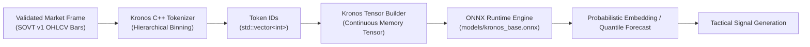

# Kronos K-Line Tokenizer & ML Inference Pipeline SRS

> **Document Standard**: IEEE 830-1998 / ISO/IEC/IEEE 29148:2018 | **Diátaxis Type**: Reference | **Status**: Canonical | **Owner**: Native Engineering | **Review**: Continuous

---

## 1. Introduction

### 1.1 Purpose
This Software Requirements Specification (SRS) defines the functional requirements, tokenizer algorithms, tensor formats, and runtime interfaces for the **Kronos K-Line Foundation Model Inference Pipeline** within the native C++20 core (`sovereign_wealth`).

### 1.2 Document Conventions
- Requirements are tagged `FR-KRN-xxx` (Functional) and `NFR-KRN-xxx` (Non-Functional).
- Normative requirements follow RFC 2119 keyword semantics (`MUST`, `SHOULD`, `MAY`).

### 1.3 Intended Audience
Quantitative researchers, machine learning engineers, and C++20 systems developers.

### 1.4 System Scope
Encompasses the C++20 hierarchical binning tokenizer (`kronos_tokenizer.cpp`), zero-copy tensor builder (`kronos_tensor_builder.cpp`), ONNX runtime execution bridge, and probabilistic future price trajectory embedding.

### 1.5 References
- [Technical Architecture Specification](technical_specification.md)
- [SOVT v1 Binary Storage Specification](sovt_storage_spec.md)

---

## 2. Overall Description

### 2.1 Product Perspective & Feature Flow
The Kronos pipeline provides native feature extraction and neural inference on contiguous historical and streaming OHLCV bar sequences:

### 2.2 Subsystem Functions
- **Hierarchical Tokenization**: Quantizes continuous log-returns, high-low ranges, and volume deltas into discrete vocabulary indices.
- **Continuous Tensor Construction**: Constructs zero-allocation input batches directly from SOVT v1 binary slices.
- **ONNX Model Inference**: Executes pre-trained transformer/CNN weights producing directional probability distributions.
- **Tactical Signal Dispatch**: Emits calibrated conviction scores to the strategy explorer and execution runtime.

### 2.3 Operating Environment
- Native C++20 compiled with AVX2/AVX-512 SIMD support.
- ONNX Runtime C/C++ API (v1.16+).

---

## 3. Specific Functional Requirements

### 3.1 Tokenization & Feature Engineering
- **FR-KRN-001 (Hierarchical Quantization Tokenization)**:
  - *Description*: The tokenizer MUST convert sequences of 48-byte `OhlcvBar` structs into discrete integer token sequences:
    - Return bin: Quantized log-return $\ln(P_t / P_{t-1})$.
    - Range bin: High-low spread ratio $(H_t - L_t) / C_t$.
    - Volume bin: Normalized volume quantile relative to 20-bar rolling average.
  - *Input*: `const std::vector<OhlcvBar>& bars`.
  - *Output*: `std::vector<int> token_ids`.
  - *Error Handling*: Reject input sequences with length $< 32$ bars with `InsufficientBarHistoryError`.

- **FR-KRN-002 (Vocabulary & Bin Serialization)**:
  - *Description*: Token boundaries MUST be loaded from declarative configuration `models/kronos_tokenizer.json` to ensure exact parity with offline training.

### 3.2 Tensor Construction & Memory Management
- **FR-KRN-003 (Zero-Copy Tensor Builder)**:
  - *Description*: The tensor builder MUST package token sequences into contiguous memory tensors matching ONNX shape `[batch_size, sequence_length, feature_dim]` without intermediate dynamic heap reallocation.

### 3.3 Model Inference & Signal Generation
- **FR-KRN-004 (ONNX Runtime Bridge)**:
  - *Description*: The pipeline MUST load `models/kronos_base.onnx` and execute inference on CPU using multi-threaded thread pools.
  - *Output*: Future trajectory return distributions ($\mu, \sigma$) and 10th/50th/90th percentile quantile targets.

- **FR-KRN-005 (Directional Conviction Scoring)**:
  - *Description*: Generate tactical directional bias (`BULLISH`, `BEARISH`, `NEUTRAL`) and continuous conviction $C \in [0.0, 1.0]$.

---

## 4. External Interface Requirements

### 4.1 Software Interfaces
- **C++ Tokenizer API**: `backend/core/src/ml/kronos_tokenizer.hpp`.
- **C++ Tensor Builder API**: `backend/core/src/ml/kronos_tensor_builder.hpp`.
- **Model Storage Assets**:
  - `models/kronos_base.onnx` (Pre-trained neural weights).
  - `models/kronos_tokenizer.json` (Token vocabulary definitions).

---

## 5. Non-Functional Requirements

### 5.1 Performance & Latency
- **NFR-KRN-001 (Tokenization Throughput)**: The C++ tokenizer MUST process $>1,000,000\text{ bars/sec}$ per CPU core.
- **NFR-KRN-002 (Inference Latency)**: Sub-5ms inference per 512-bar window on x86_64 CPU.
- **NFR-KRN-003 (Peak Memory Ceiling)**: Tokenizer and tensor builder RSS MUST remain $<20\text{MB}$ during active streaming inference.

---

## 6. Other Requirements & Verification Matrix

### 6.1 Data Dictionary
- `KronosToken`: 32-bit signed integer representing combined spatial and temporal bar attributes.
- `KronosForecast`: Struct containing `expected_return`, `confidence`, `p10_return`, `p50_return`, `p90_return`.

### 6.2 Verification Matrix
| Requirement ID | Description | Verification Method | Target Command / Test |
|---|---|---|---|
| `FR-KRN-001` | Hierarchical Tokenization | CTest Unit Test | `backend/core/tests/test_kronos_tokenizer.cpp` |
| `FR-KRN-002` | Vocabulary Parity | Configuration Test | `npm run test:core` |
| `FR-KRN-003` | Tensor Builder Contract | CTest Unit Test | `backend/core/tests/test_kronos_tensor_builder.cpp` |
| `FR-KRN-004` | ONNX Inference | Model Integration Test | `npm run test:core` |
| `NFR-KRN-001` | Tokenization Throughput | Benchmark Test | `backend/core/tests/test_kronos_tokenizer.cpp` |
| `NFR-KRN-002` | Sub-5ms Inference | Benchmark Test | `backend/core/tests/test_kronos_tensor_builder.cpp` |
