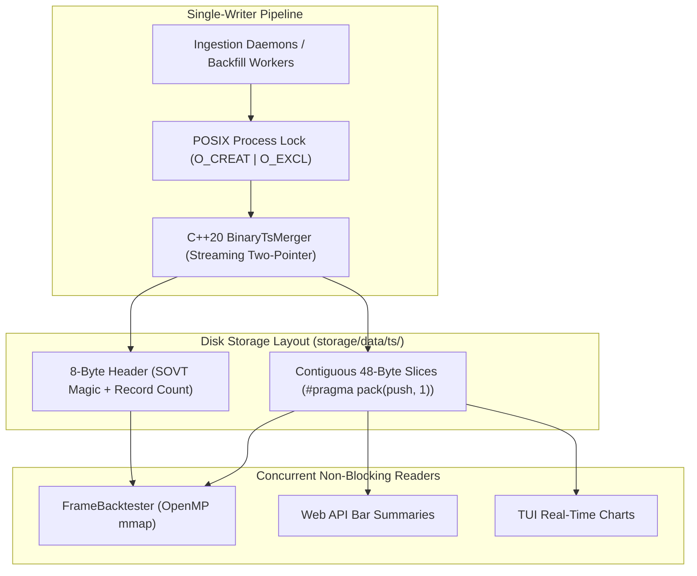

# SOVT v1 Binary Time-Series Storage Format Software Requirements Specification (SRS)

> **Document Standard**: IEEE 830-1998 / ISO/IEC/IEEE 29148:2018 | **Diátaxis Type**: Reference & Specification | **Status**: Canonical | **Owner**: Core Engineering | **Review**: Continuous

---

## 1. Introduction

### 1.1 Purpose
This Software Requirements Specification (SRS) formally defines the byte-level layout, serialization standards, memory-mapping contracts, streaming merger algorithms, and POSIX concurrency rules for the **Sovereign Time-Series Version 1 (SOVT v1) Binary Storage Subsystem**.

### 1.2 Document Conventions
- Requirements are uniquely identified using `FR-SOVT-xxx` (Functional) and `NFR-SOVT-xxx` (Non-Functional).
- RFC 2119 keywords (`MUST`, `MUST NOT`, `SHOULD`, `MAY`) establish mandatory binary format invariants.

### 1.3 Intended Audience
Systems programmers, C++20 engine developers, storage engineers, and database architects.

### 1.4 System Scope
Encompasses the packed binary time-series files (`storage/data/ts/*.bin`), C++ binary readers and validators (`binary_ts_reader.cpp`, `data_validator.cpp`), two-pointer streaming merger (`binary_ts_merger.cpp`), and Node.js storage lock manager (`process_lock.js`).

### 1.5 References
- [Product Software Requirements Specification](product_specification.md)
- [Technical Architecture Specification](technical_specification.md)

---

## 2. Overall Description

### 2.1 Storage Subsystem Architecture
The SOVT v1 format provides dense, zero-deserialization binary storage optimized for high-speed sequential vector backtests and $O(1)$ random access:



### 2.2 Storage Format Invariants
1. **Zero Heap De-serialization**: Memory-mapped binary slices cast directly to C++ structs (`reinterpret_cast<const OhlcvBar*>`).
2. **Deterministic Alignment**: All bar attributes are 64-bit IEEE-754 double precision floats aligned to 8-byte boundaries.
3. **Single-Writer Authority**: Multi-process concurrent reads execute without locks; writes require exclusive POSIX file locks.

---

## 3. Specific Functional Requirements

### 3.1 Header Layout Contract
- **FR-SOVT-001 (8-Byte Fixed Header)**:
  - *Description*: Every `.bin` file MUST begin with an 8-byte fixed header:

| Byte Offset | Field | Type | Encoded Value | Description |
|---|---|---|---|---|
| `0x00..0x03` | Magic Bytes | `char[4]` (ASCII) | `0x53 0x4F 0x56 0x54` (`SOVT`) | File format identification magic |
| `0x04..0x07` | Record Count | `uint32_t` (LE) | Little-Endian Integer | Total contiguous bar records in file |

  - *Error Handling*: Readers MUST abort immediately if magic bytes do not equal `SOVT`.

### 3.2 Record Layout & Alignment
- **FR-SOVT-002 (48-Byte Packed Bar Slices)**:
  - *Description*: Records MUST be packed without compiler padding (`#pragma pack(push, 1)`):

| Byte Range | Field | Data Type | Representation |
|---|---|---|---|
| `0x00..0x07` | `ts_ms` | `double` | Epoch timestamp in milliseconds (UTC) |
| `0x08..0x0F` | `open` | `double` | Opening bar price |
| `0x10..0x17` | `high` | `double` | Maximum bar price |
| `0x18..0x1F` | `low` | `double` | Minimum bar price |
| `0x20..0x27` | `close` | `double` | Closing bar price |
| `0x28..0x2F` | `volume` | `double` | Cumulative bar volume |

### 3.3 Data Integrity & Validation
- **FR-SOVT-003 (IEEE-754 Price & Monotonicity Invariants)**:
  - *Description*: All bar records MUST satisfy price/volume integrity fences:
    1. $P_{\text{low}} \le \min(P_{\text{open}}, P_{\text{close}})$ and $P_{\text{high}} \ge \max(P_{\text{open}}, P_{\text{close}})$.
    2. $P_{\text{open}}, P_{\text{high}}, P_{\text{low}}, P_{\text{close}} > 0.0$ (finite positive floats; zero or NaN forbidden).
    3. $V \ge 0.0$.
    4. Bar timestamps MUST be strictly monotonically increasing: $t_i > t_{i-1}$.

### 3.4 Ingestion & Streaming Merge
- **FR-SOVT-004 (Streaming Two-Pointer TS Merger)**:
  - *Description*: Merging overlapping or backfilled time-series datasets MUST use a stream-buffered two-pointer algorithm that sorts, deduplicates, and resolves timestamp collisions in $O(N)$ time with $O(1)$ memory consumption ($<5\text{MB}$ RSS).

### 3.5 Concurrency & File Locking
- **FR-SOVT-005 (POSIX Lock Protocol)**:
  - *Description*: Modifying a `.bin` file MUST acquire an exclusive POSIX lock:
    ```js
    const fd = fs.openSync(lockPath, fs.constants.O_CREAT | fs.constants.O_EXCL | fs.constants.O_RDWR);
    ```
  - *Concurrency*: Readers MUST open files using non-blocking shared read flags (`fs.constants.O_RDONLY`).

---

## 4. External Interface Requirements

### 4.1 Native C++20 Header (`backend/core/src/data/binary_ts_reader.hpp`)
```cpp
#pragma pack(push, 1)
struct OhlcvBar {
    double ts_ms;
    double open;
    double high;
    double low;
    double close;
    double volume;
};
#pragma pack(pop)

static_assert(sizeof(OhlcvBar) == 48, "OhlcvBar must be exactly 48 bytes");
```

---

## 5. Non-Functional Requirements

### 5.1 Performance & Latency
- **NFR-SOVT-001 (Sequential Scan Throughput)**: Memory-mapped sequential scans MUST sustain $>50,000,000\text{ bars/sec}$ on modern NVMe drives.
- **NFR-SOVT-002 (Random Access Seek Time)**: Record seeking by timestamp index MUST be $O(1)$: $\text{Offset}(i) = 8 + (i \times 48)$.
- **NFR-SOVT-003 (Merger Memory Ceiling)**: Peak memory consumption during multi-year bar merging MUST NOT exceed $5\text{MB}$ RSS.

### 5.2 Storage Density & Footprint
- **NFR-SOVT-004 (Storage Compression Factor)**: Raw OHLCV bars MUST consume exactly 48 bytes per bar (approx. $4.53\text{MB}$ per year of 1-minute US equity bars).

---

## 6. Other Requirements & Verification Matrix

### 6.1 Verification Matrix
| Requirement ID | Description | Verification Method | Target Command / Test |
|---|---|---|---|
| `FR-SOVT-001` | SOVT Header Format | CTest Unit Test | `backend/core/tests/test_binary_ts_reader.cpp` |
| `FR-SOVT-002` | 48-byte Packed Layout | C++ static_assert & CTest | `backend/core/tests/test_binary_ts_reader.cpp` |
| `FR-SOVT-003` | Price & Time Invariants | Data Validator Test | `backend/core/tests/test_data_validator.cpp` |
| `FR-SOVT-004` | Two-Pointer TS Merger | CTest Benchmark | `backend/core/tests/test_binary_ts_merger.cpp` |
| `FR-SOVT-005` | POSIX Atomic File Locking | Concurrency Stress Test | `npm run test:structure` |
| `NFR-SOVT-001` | Scan Speed (>50M bars/s) | CTest Performance Test | `backend/core/tests/test_binary_ts_reader.cpp` |
| `NFR-SOVT-003` | Merger RSS Memory (<5MB) | CTest Memory Test | `backend/core/tests/test_binary_ts_merger.cpp` |
