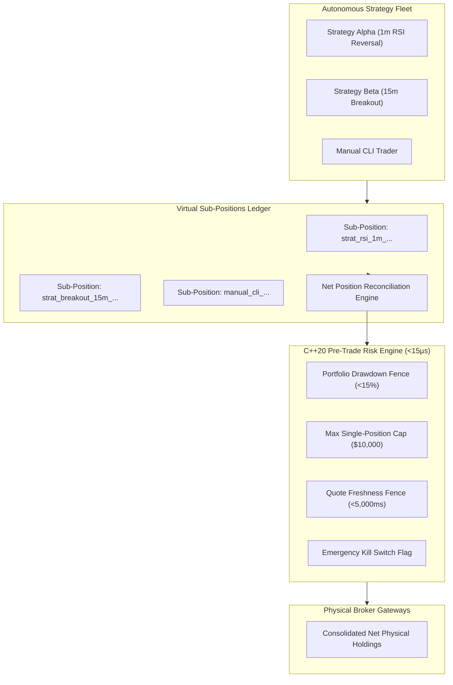

# Pre-Trade Risk & Virtual Sub-Positions Software Requirements Specification (SRS)

> **Document Standard**: IEEE 830-1998 / ISO/IEC/IEEE 29148:2018 | **Diátaxis Type**: Reference & Specification | **Status**: Canonical | **Owner**: Quantitative Risk & Core Engineering | **Review**: Continuous

---

## 1. Introduction

### 1.1 Purpose
This Software Requirements Specification (SRS) establishes the functional requirements, attribution protocols, mathematical invariants, and latency constraints for the **Sovereign Virtual Sub-Positions Ledger and Native Pre-Trade Risk Engine**.

### 1.2 Document Conventions
- Requirements are uniquely identified using `FR-RSK-xxx` (Functional) and `NFR-RSK-xxx` (Non-Functional).
- RFC 2119 keywords (`MUST`, `MUST NOT`, `SHOULD`, `MAY`) establish mandatory contracts.

### 1.3 Intended Audience
Risk managers, quantitative researchers, C++20 systems engineers, and algorithmic execution developers.

### 1.4 System Scope
Encompasses:
1. **Virtual Sub-Positions Ledger** (`shared/lib/runtime/sub_positions_ledger.js`): Multi-strategy position isolation, PnL attribution, and physical broker inventory reconciliation.
2. **Native Pre-Trade Risk Engine** (`backend/core/src/risk/pre_trade_risk.cpp`): Microsecond risk validation (<15µs) enforcing portfolio drawdown limits, position concentration caps, and stale quote fences.
3. **Emergency Kill Switch Circuit** (`backend/core/src/execution/kill_switch.hpp`): Immediate trading suspension and atomic risk state locking.

### 1.5 References
- [Product Software Requirements Specification](product_specification.md)
- [Technical Architecture Specification](technical_specification.md)
- [Broker & Execution Gateway Specification](execution_gateway_spec.md)

---

## 2. Overall Description

### 2.1 Subsystem Perspective & Architecture
The risk and position management layer sits between strategy signal emission and broker gateway dispatch:



### 2.2 Subsystem Functions Summary
- Segregates trade fills, entry prices, stop losses, and realized PnL across multiple strategy instances trading the same physical ticker.
- Validates every outbound trade against portfolio drawdown, single-position concentration, and price freshness limits before gateway dispatch.
- Provides immediate fail-closed circuit breaking via atomic memory flags.

---

## 3. Specific Functional Requirements

### 3.1 Virtual Sub-Positions & Attribution
- **FR-RSK-001 (Deterministic Strategy Attribution Signatures)**:
  - *Description*: The ledger MUST assign a unique deterministic attribution key to every sub-position:
    - Autonomous Strategy: `strat_<strategy_id>_<timeframe>_<timestamp>_<entropy>`
    - Manual Trader: `manual_cli_<symbol>_<timestamp>_<entropy>`
  - *Processing*: Segregates individual strategy high-water marks, trade history, and entry timestamps.

- **FR-RSK-002 (Consolidated Net Inventory Reconciliation)**:
  - *Description*: The ledger MUST compute net physical quantity across all virtual sub-positions:
    $$Q_{\text{physical}}(S) = \sum_{i=1}^{N} Q_{\text{sub\_pos}}(S, i)$$
  - *Processing*: Translates sub-position modifications into minimal delta orders dispatched to physical broker gateways.

- **FR-RSK-003 (Atomic Ledger Persistence)**:
  - *Description*: The sub-positions ledger state MUST be serialized to disk (`storage/data/paper_trading/sub_positions.json`) protected by POSIX atomic file locking.

### 3.2 Pre-Trade Risk Engine Invariants
- **FR-RSK-004 (Maximum Portfolio Drawdown Fence)**:
  - *Description*: If peak-to-trough portfolio drawdown exceeds 15.0% ($\text{Drawdown} \ge 0.15$), the risk gate MUST reject all buy/open orders and allow only position-reducing exit orders.

- **FR-RSK-005 (Maximum Single-Position Allocation)**:
  - *Description*: The engine MUST reject any order that causes single-asset notional exposure to exceed the configured ceiling (default: 25.0% of portfolio equity).

- **FR-RSK-006 (Stale Quote Fence)**:
  - *Description*: The engine MUST reject orders if the latest quote timestamp is older than 5,000ms relative to system clock.

- **FR-RSK-007 (Atomic Kill Switch Halt)**:
  - *Description*: When `kill_switch.is_halted()` evaluates to `true`, 100% of outbound order dispatch requests MUST be rejected immediately.

---

## 4. External Interface Requirements

### 4.1 Native C++20 Risk Gate Interface
```cpp
namespace sovereign::risk {
    struct RiskLimits {
        double max_drawdown_pct = 0.15;
        double max_position_notional = 10000.0;
        uint64_t max_quote_age_ms = 5000;
    };

    struct RiskCheckResult {
        bool approved;
        const char* rejection_reason;
        double current_drawdown;
    };

    RiskCheckResult evaluate_pre_trade_risk(
        const OrderRequest& order,
        const PortfolioState& portfolio,
        const MarketQuote& quote,
        const RiskLimits& limits
    );
}
```

---

## 5. Non-Functional Requirements

### 5.1 Performance & Latency
- **NFR-RSK-001 (Risk Evaluation Latency)**: The C++ `evaluate_pre_trade_risk()` function MUST execute in $<15\mu\text{s}$ under all market conditions.
- **NFR-RSK-002 (Zero Dynamic Heap Allocation)**: The native risk check path MUST NOT perform dynamic heap allocations (`malloc`, `new`) during evaluation.

### 5.2 Safety & Invariants
- **NFR-RSK-003 (Fail-Closed Default)**: If portfolio state, quote timestamp, or cash balance is undefined or corrupted, the risk engine MUST reject the order.
- **NFR-RSK-004 (Position Reconciliation Concurrency)**: Ledger modifications MUST be thread-safe and serialized across concurrent strategy ticks.

---

## 6. Other Requirements & Verification Matrix

### 6.1 Data Dictionary
- `SubPosition`: Entity containing `id`, `strategy_id`, `symbol`, `qty`, `entry_price`, `unrealized_pnl`, `realized_pnl`, `created_at`.
- `PortfolioState`: Entity containing `total_equity`, `cash_balance`, `peak_equity`, `open_drawdown_pct`.

### 6.2 Verification Matrix
| Requirement ID | Description | Verification Method | Target Command / Test |
|---|---|---|---|
| `FR-RSK-001` | Strategy Attribution Tagging | Integration Test | `node tests/run_node_tests.js tests/runtime/sub_positions.test.js` |
| `FR-RSK-002` | Physical Net Reconciliation | Unit Test | `tests/runtime/sub_positions.test.js` |
| `FR-RSK-003` | Atomic Ledger Persistence | Storage Test | `tests/runtime/sub_positions.test.js` |
| `FR-RSK-004` | Max Drawdown Fence (<15%) | CTest Unit Test | `backend/core/tests/test_pre_trade_risk.cpp` |
| `FR-RSK-005` | Max Single-Position Cap | CTest Unit Test | `backend/core/tests/test_pre_trade_risk.cpp` |
| `FR-RSK-006` | Stale Quote Fence (<5000ms) | CTest Unit Test | `backend/core/tests/test_pre_trade_risk.cpp` |
| `FR-RSK-007` | Kill Switch Circuit Breaker | Safety Test | `backend/core/tests/test_kill_switch.cpp` |
| `NFR-RSK-001` | Risk Gate Latency (<15µs) | CTest Benchmark | `backend/core/tests/test_pre_trade_risk.cpp` |
| `NFR-RSK-002` | Zero Heap Allocation | Memory Inspection | `backend/core/tests/test_pre_trade_risk.cpp` |
