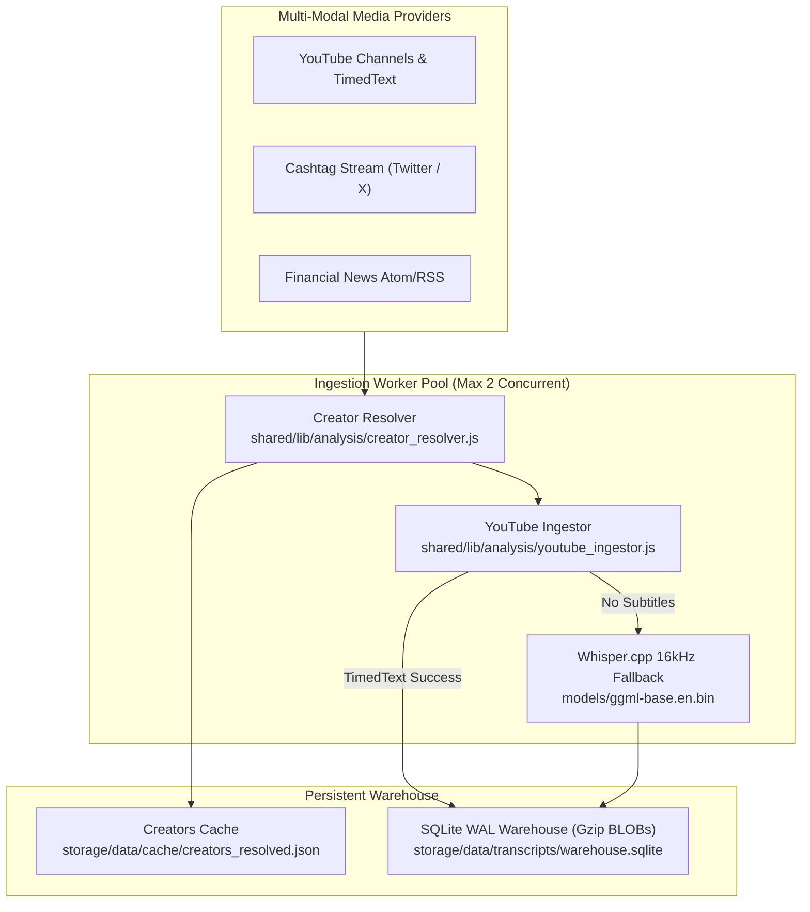

# Social Alpha Ingestion Subsystem SRS

> **Document Standard**: IEEE 830-1998 / ISO/IEC/IEEE 29148:2018 | **Diátaxis Type**: Reference & Specification | **Status**: Canonical | **Owner**: Quantitative Research | **Review**: Continuous

---

## 1. Introduction

### 1.1 Purpose
This Software Requirements Specification (SRS) establishes the architectural constraints, ingestion protocols, zero-key extraction standards, rate limits, and SQLite storage invariants for the **Social Alpha Alternative Data Ingestion Subsystem**.

### 1.2 Document Conventions
- Requirements are uniquely identified via `FR-SOC-xxx` (Functional) and `NFR-SOC-xxx` (Non-Functional).
- Normative compliance follows RFC 2119 keywords (`MUST`, `MUST NOT`, `SHOULD`, `MAY`).

### 1.3 Intended Audience
Quantitative researchers, data engineers, and audio/NLP processing developers.

### 1.4 System Scope
Encompasses creator YAML configuration resolution, zero-key YouTube RSS feed polling, TimedText subtitle extraction, Whisper.cpp local audio transcription fallback, rate-limited worker pooling, and SQLite WAL warehouse persistence.

### 1.5 References
- [Product Software Requirements Specification](../../reference/specifications/product_specification.md)
- [Financial NLP & Transcript Extraction Specification](02_TRANSCRIPT_NLP_EXTRACTION.md)
- [Sentiment Scoring & Signal Decay Specification](03_SENTIMENT_SCORING_AND_DECAY.md)

---

## 2. Overall Description

### 2.1 Subsystem Perspective & Topology
The ingestion tier aggregates asynchronous broadcasts from financial content creators, decoupling media acquisition from downstream NLP extraction:



### 2.2 Subsystem Functions
- **Declarative Creator Resolution**: Resolves creator handles and channel IDs from `config/research/creators.yaml`.
- **Zero-Key TimedText Captions**: Fetches timed subtitle tracks directly from public XML endpoints.
- **Local Audio Fallback**: Transcribes 16kHz mono audio using local `whisper.cpp` models when subtitles are disabled.
- **Transactional Warehouse**: Batches video metadata and compressed transcript BLOBs into SQLite WAL database.

---

## 3. Specific Functional Requirements

### 3.1 Creator Resolution & Format Validation
- **FR-SOC-001 (Channel ID Validation & Resolution)**:
  - *Description*: The creator resolver MUST validate YouTube channel IDs against regex `/^UC[A-Za-z0-9_-]{22}$/` and resolve custom handles (`@handle`) via zero-key HTML extraction.
  - *Input*: YAML declarations in `config/research/creators.yaml` and `config/research/creators/*.yaml`.
  - *Output*: Normalized metadata in `storage/data/cache/creators_resolved.json`.

### 3.2 Ingestion & Caption Extraction
- **FR-SOC-002 (Zero-Key Subtitle Extraction)**:
  - *Description*: Ingestion workers MUST extract English timed subtitle tracks using public TimedText endpoints via `yt-dlp` without requiring Google API credentials:
    ```bash
    yt-dlp --skip-download --write-auto-subs --sub-lang en --sub-format ttml -o "%(id)s" "https://www.youtube.com/watch?v=VIDEO_ID"
    ```
- **FR-SOC-003 (Local Audio Transcription Fallback)**:
  - *Description*: When subtitles are unavailable, the worker MUST extract 16kHz mono audio (`yt-dlp -x --audio-format wav --audio-quality 16K`) and transcribe locally using `whisper.cpp` (`models/ggml-base.en.bin`).

### 3.3 Persistence & Transaction Boundaries
- **FR-SOC-004 (Transactional SQLite WAL Storage)**:
  - *Description*: Video seeding (`seedVideos`), transcript storage (`saveTranscript`), and extracted signals (`saveSignals`) MUST execute within explicit SQLite transactions (`BEGIN TRANSACTION ... COMMIT`) in WAL mode with Gzip-compressed BLOBs.

---

## 4. External Interface Requirements

### 4.1 CLI Data Ops Commands
```bash
npm run data:social:resolve   # Resolve configured creators from YAML manifests
npm run data:social:ingest    # Fast RSS polling for latest videos
npm run data:social:backfill  # 5-year historical backfill and subtitle extraction
npm run data:social:stats     # Warehouse status and signal statistics
npm run test:social           # Run Social Alpha unit & benchmark tests
```

### 4.2 Storage Schema (`storage/data/transcripts/warehouse.sqlite`)
- `channels` table: `(channel_id TEXT PRIMARY KEY, creator_name TEXT, platform TEXT, updated_at INTEGER)`
- `videos` table: `(video_id TEXT PRIMARY KEY, channel_id TEXT, title TEXT, published_at INTEGER, duration_s INTEGER, status TEXT)`
- `transcripts` table: `(video_id TEXT PRIMARY KEY, language TEXT, full_text_gz BLOB, segments_gz BLOB, word_count INTEGER)`
- `signals` table: `(id TEXT PRIMARY KEY, video_id TEXT, symbol TEXT, direction TEXT, conviction REAL, created_at INTEGER)`

---

## 5. Non-Functional Requirements

### 5.1 Performance & Resource Constraints
- **NFR-SOC-001 (Worker Concurrency Ceiling)**: Active audio transcription MUST NOT exceed 2 concurrent workers to preserve CPU headroom.
- **NFR-SOC-002 (Database Write Throughput)**: Batch video seeding MUST process $>50,000\text{ records/sec}$ under SQLite WAL mode.
- **NFR-SOC-003 (Backoff & Rate Limiting)**: HTTP 429/503 rate limits MUST trigger jittered exponential backoff: $T_{\text{backoff}} = \min(300, 2^{\text{retries}} \times 5) \pm \text{jitter}$.

### 5.2 Storage Hygiene
- **NFR-SOC-004 (Raw Media Invalidation)**: Audio scratch files older than 72 hours MUST be purged automatically; compressed transcript BLOBs are retained permanently.

---

## 6. Other Requirements & Verification Matrix

### 6.1 Verification Matrix
| Requirement ID | Description | Verification Method | Target Command / Test |
|---|---|---|---|
| `FR-SOC-001` | Channel ID Regex Validation | Unit Test | `tests/analysis/creator_resolver.test.js` |
| `FR-SOC-002` | Zero-Key Subtitle Extraction | Integration Test | `npm run test:social` |
| `FR-SOC-003` | Audio Fallback Pipeline | Automated Mock Test | `npm run test:social` |
| `FR-SOC-004` | Transactional SQLite Storage | Benchmark Test | `tests/analysis/social_pipeline_bench.test.js` |
| `NFR-SOC-001` | Concurrency Limit (2 Workers) | Runtime Check | `backend/scripts/data_ops/ingest_social_data/worker_pool.js` |
| `NFR-SOC-002` | DB Throughput Benchmark | Benchmark Test | `tests/analysis/social_pipeline_bench.test.js` |
