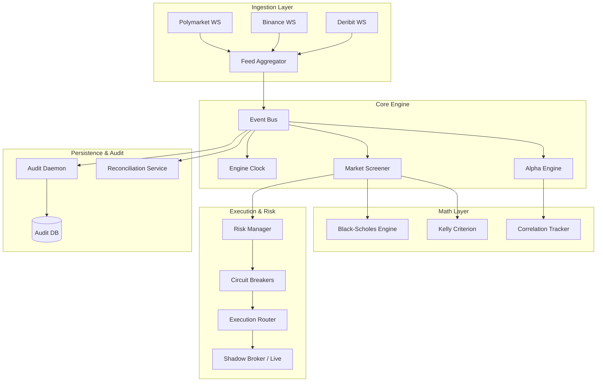

# Polymarket Screener Architecture

This document outlines the high-level architecture of the **Polymarket Screener**, a high-frequency quantitative engine designed to identify and execute on mispriced binary options on Polymarket using Black-Scholes and Kelly Criterion models.

---

## 🏗️ System Overview

The system is built on a **modular, event-driven architecture** (Phase 7.3) that separates data ingestion from quantitative analysis and risk-managed execution.

---

## 📂 Core Components

### 1. Ingestion Layer (`app/core/data_feed.py`)
*   **WebSocket Clients**: Real-time connections to Polymarket (binary options), Binance (spot price), and Deribit (implied volatility).
*   **Feed Aggregator**: Normalizes disparate data streams into a unified `MarketSnapshot`.

### 2. Quantitative Engine (`app/math/`)
*   **Black-Scholes (`black_scholes.py`)**: Vectorized engine that calculates "fair" probabilities (N(d2)) for binary options. Includes VRP (Volatility Risk Premium) discounting and Greek calculations.
*   **Kelly Criterion (`kelly.py`)**: Responsible for optimal position sizing. Calculates `full_k` and applies fractional scaling based on confidence.
*   **Slippage Model (`slippage.py`)**: Estimates impact of orderbook depth on expected entry price.

### 3. Alpha & Signal Generation (`app/core/alpha.py`, `signal_engine.py`)
*   **Correlation Tracker**: Detects lead-lag relationships between spot prices (Binance) and prediction markets (Polymarket).
*   **Orderbook Imbalance**: High-frequency filter that suppresses buy signals if there is extreme sell pressure in the book.
*   **Market Screener**: The central orchestrator that combines fair value, alpha filters, and liquidity scores to emit `SIGNAL_DETECTED` events.

### 4. Execution & Risk Management (`app/execution/`)
*   **Risk Manager**: Enforces global exposure limits, position caps, and drawdown stops.
*   **Circuit Breakers**: "Kill switches" that halt execution if latency spikes, connectivity is lost, or volatility exceeds safe thresholds.
*   **Shadow Broker**: A paper-trading executor that simulates fills against live orderbooks for strategy validation.

### 5. API & UI (`app/api/`, `frontend.html`)
*   **WS Bridge**: A FastAPI-powered WebSocket bridge that streams internal engine events (Snapshots, Signals, Audit logs) to the frontend.
*   **Dashboard**: A premium, real-time visualization tool for monitoring core metrics, heatmaps, and signal flow.

---

## 📡 Event Channels

The system communicates via an internal **Event Bus** (`app/core/event_bus.py`) using the following channels:

| Channel | Description | Payload |
| :--- | :--- | :--- |
| `MARKET_UPDATE` | Raw or aggregated market data tick | `MarketSnapshot` |
| `SIGNAL_DETECTED` | New trading opportunity identified | `TradeSignal` |
| `ORDER_SENT` | Order has been dispatched to broker | `Order` |
| `AUDIT_LOG` | System health or execution heartbeat | `AuditEntry` |
| `RISK_ALERT` | Limit breach or circuit breaker trip | `RiskEvent` |

---

## 🛡️ Safety Features
*   **VRP Haircut**: Automatically discounts Black-Scholes fair value to account for the typical "overpricing" of binary options.
*   **Correlation Lock**: Suppresses signals during periods of market divergence (e.g., Spot price dropping while Polymarket rises).
*   **Reconciliation Daemon**: Periodically validates internal state against exchange APIs to ensure zero drift.
